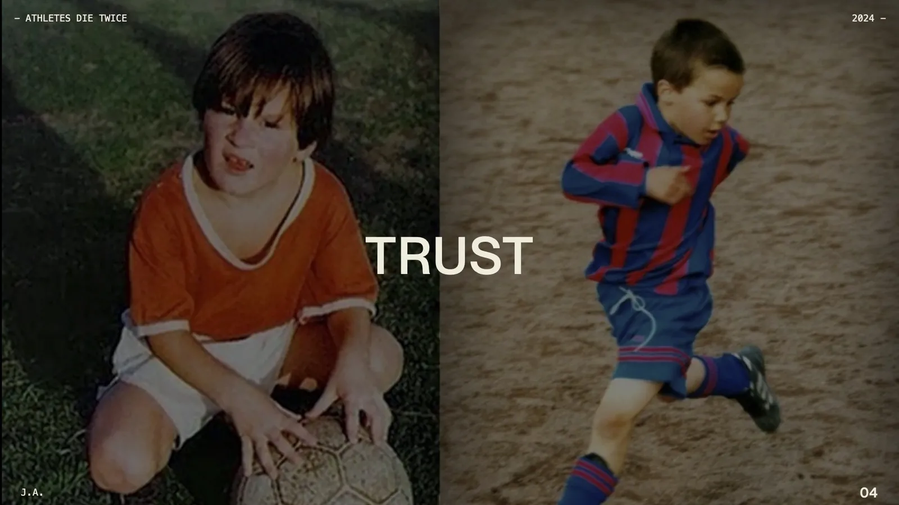
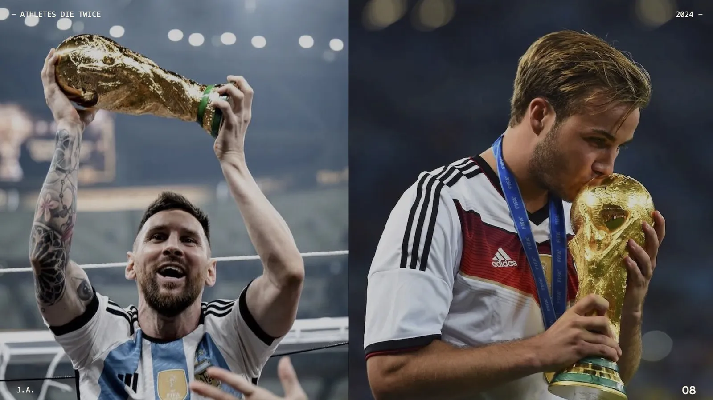
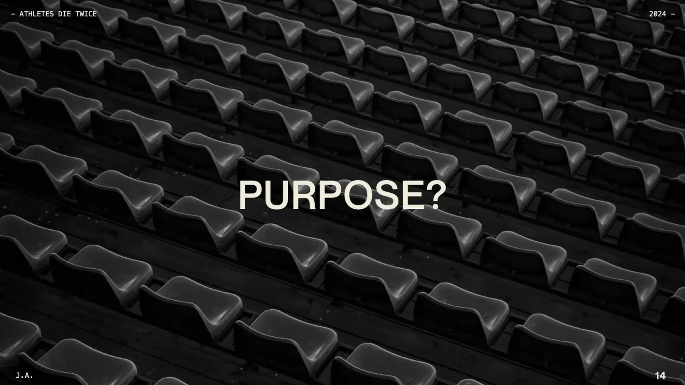
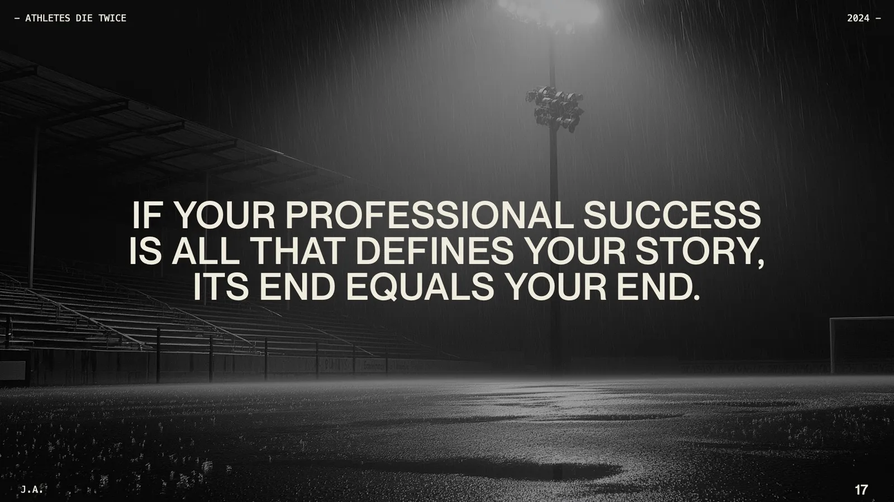
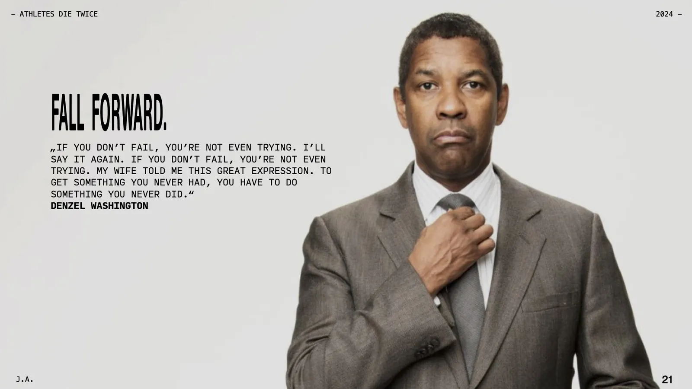
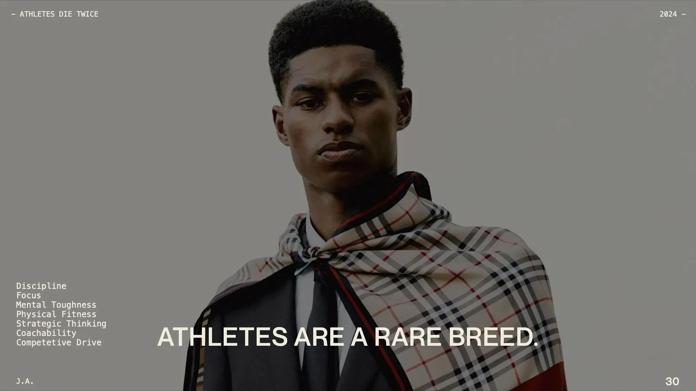
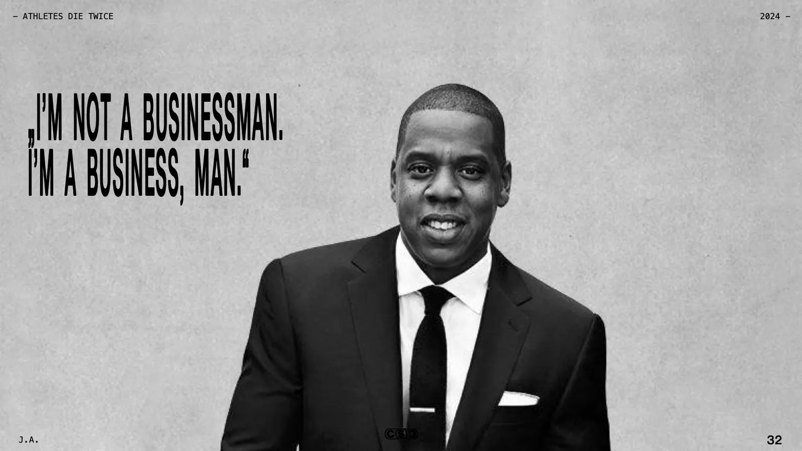
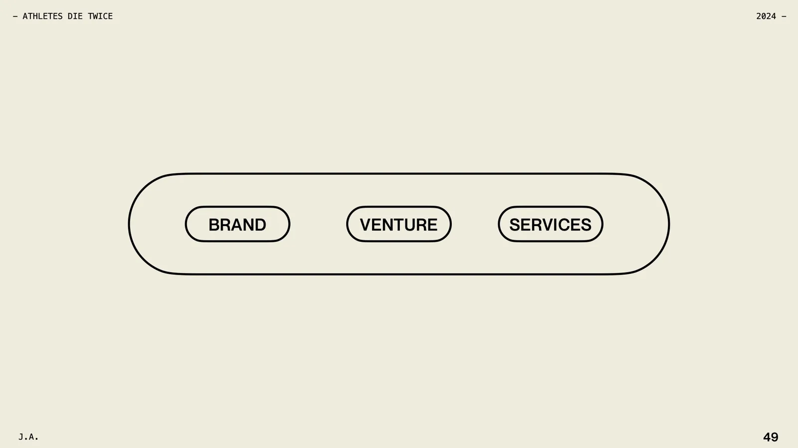
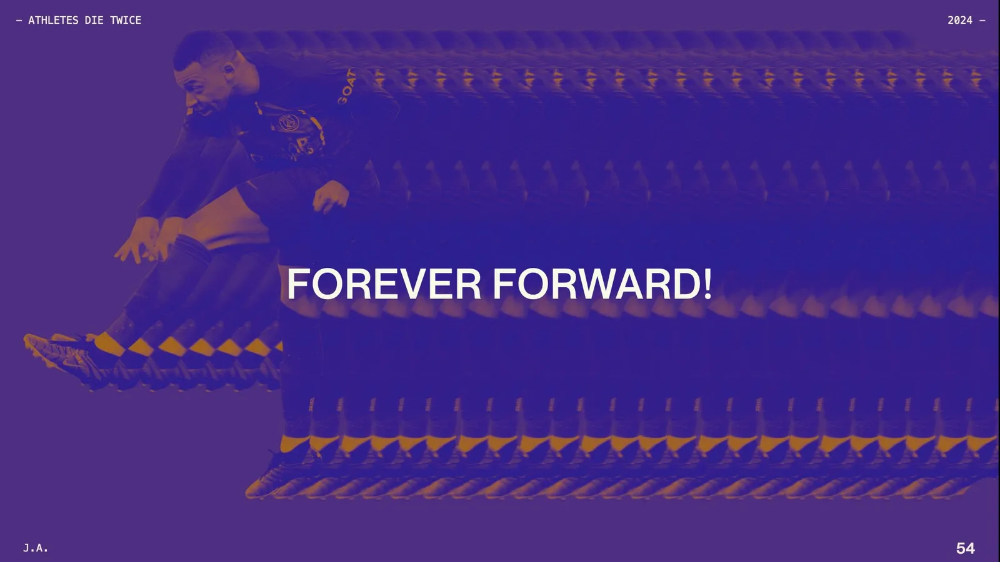

For years, athletes pour everything into their sport. But when it’s over, there’s no more training, no more competition, no more cheering fans. It’s a tough moment of identity loss, and many aren’t ready for what comes next.

But it doesn’t have to be that way. Athletes have amazing skills—discipline, focus, mental toughness, strategic thinking—that can be applied beyond the game.

I talked about how modern athletes can start building their second career even while they’re still playing. Whether it’s through starting a business, investing, or building a personal brand, there’s a whole world of opportunities out there.

## Key Takeaways
**Start early**: Think about your Plan B during your playing days.
**Find purpose beyond money**: Discover what really motivates you.
**Use your network**: Take advantage of your connections and opportunities before you retire
**Transfer your skills**: Apply the resilience and strategic thinking from sports to new ventures.

Athletes like Magic Johnson, Michael Jordan, [Kevin Durant](https://www.linkedin.com/in/easymoneysniper/) and David Beckham have shown it’s possible to turn a successful sports career into success off the field.

Today, more players are starting to build their Plan B. European footballers like [Mario Götze](https://www.linkedin.com/in/mario-goetze/) and [Cody Mathès Gakpo](https://www.linkedin.com/in/cody-math%C3%A8s-gakpo-a0169a305/) are already laying the groundwork for life after football.

The transition can be challenging, but with the right approach, it’s a journey worth taking.

Jürgen

PS: you can download the slides of my talk ***[here](https://drive.google.com/file/d/1wt9utiBTFWAJksBlNX7QI0BJ5MkgOn9t/view?usp=sharing)***.
