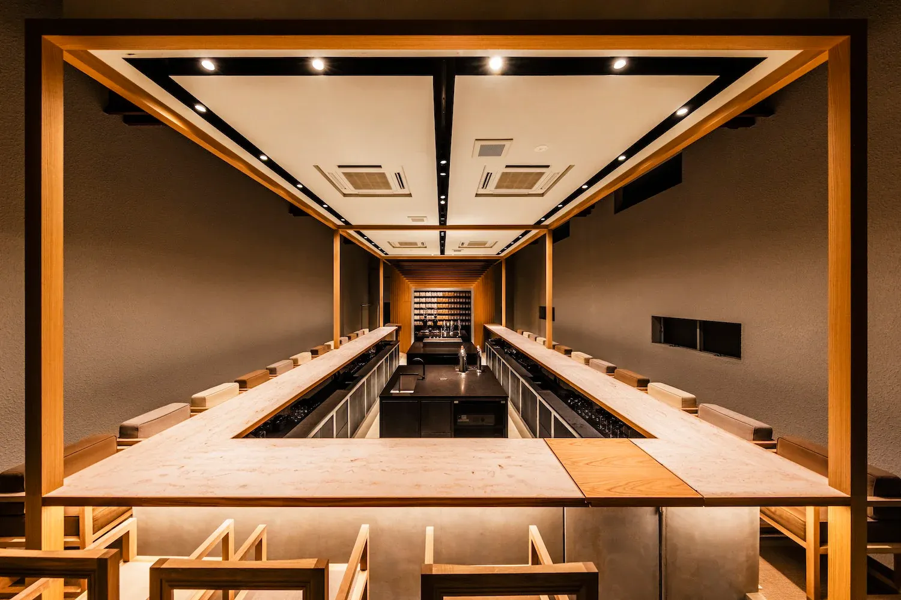
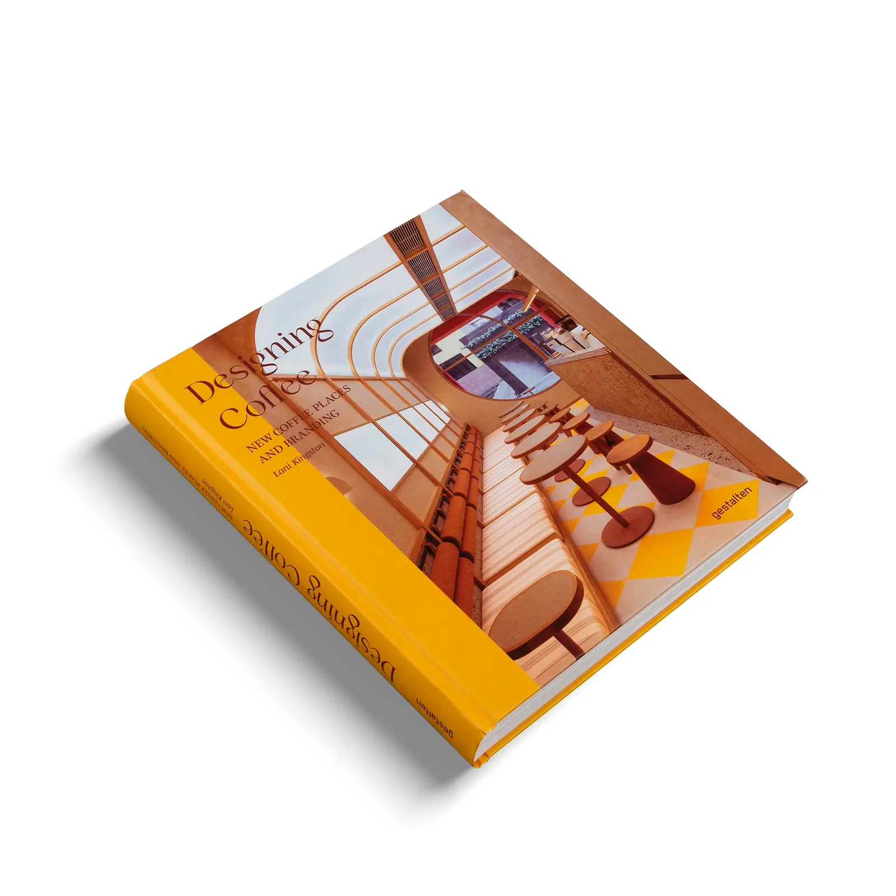
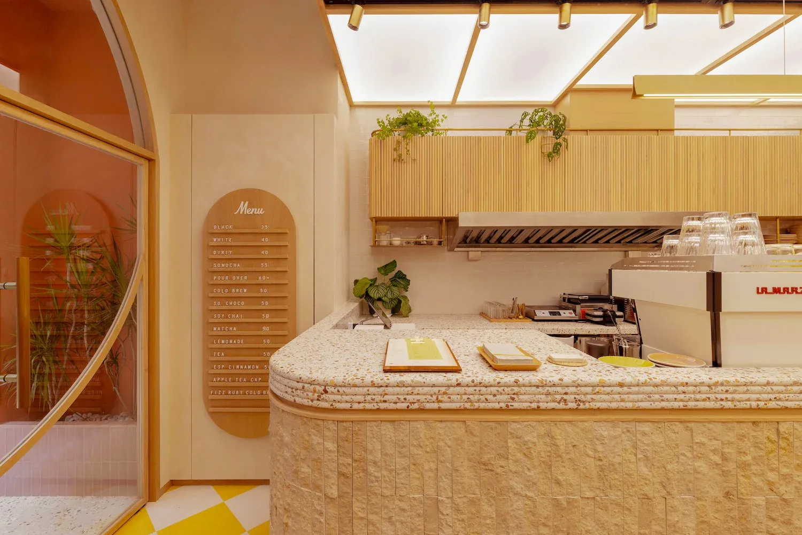
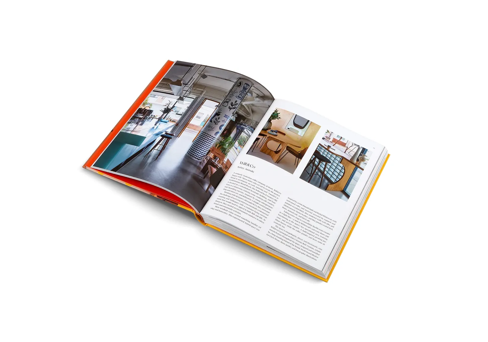
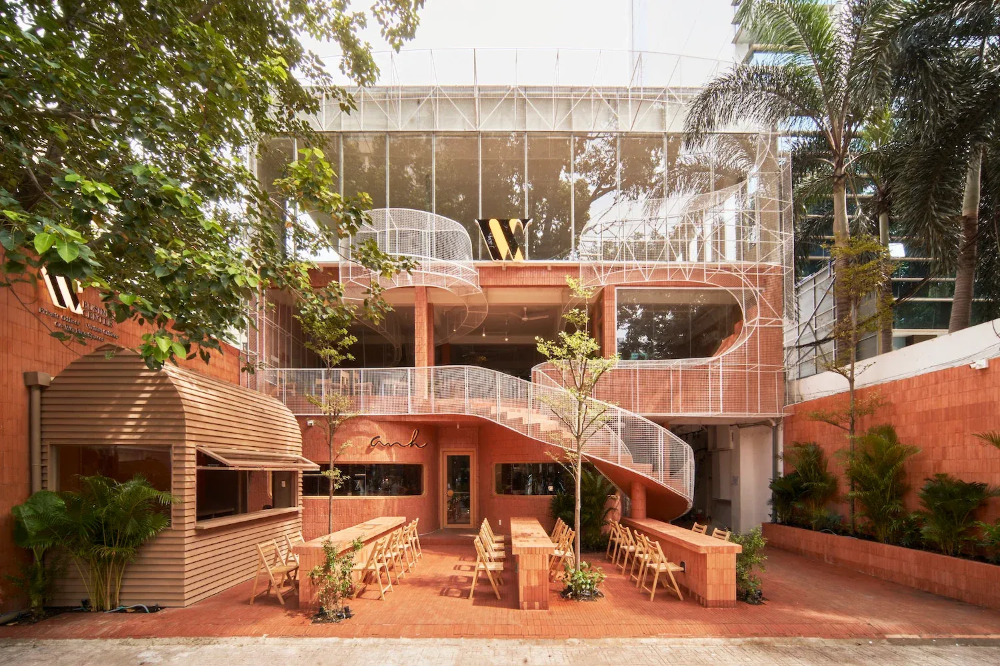
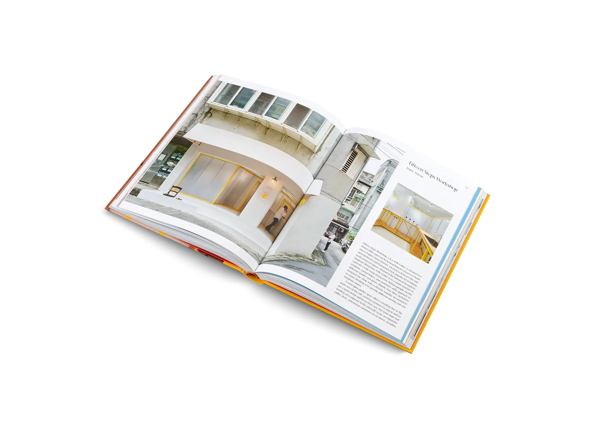

I love traveling to new cities and discovering their local cafés - how they look, how they feel, how they invite you to sit down and just be. From the architecture to the branding, the lighting to the little details, these places are often tiny masterpieces of design.

My love for coffee, though, came much later.

During the pandemic, I didn’t really drink coffee. But next to my office was this small café—the only place still open between all those virtual meetings. I started going there just to get a break. I wasn’t a customer at first, just a regular. The team there couldn’t really serve me anything… but we talked. Day by day, they slowly introduced me to the world of coffee—what makes a great one, how it’s made, what I might like or not like. That’s how it started.

Now, coffee is part of my daily routine. Not just for the energy, but for the moment it creates. A pause. A chance to sit, think, reflect. Ideally in a beautifully designed space.

So when I came across “Designing Coffee” by Lani Kingston, I had to order it immediately.

It brings together everything I love - great design, inspiring spaces, and coffee culture around the world. From minimalist, tea-house-like cafés in Japan to bold, communist-themed interiors in Vietnam—it’s all about how cafés use architecture, branding, and storytelling to create something special.

Can’t wait to get my hands on it.

Designing Coffee
By [Lani Kingston](https://www.linkedin.com/in/lanikingston/)
Published by [gestalten](https://www.linkedin.com/company/gestalten/) (April 2023)
256 pages, full color, hardcover
Photos by [Rhiannon Taylor](https://www.linkedin.com/in/rhiannon-taylor-3015b576/)
ISBN: 978-3-96704-097-5
*[Available at gestalten](https://us.gestalten.com/products/designing-coffee-lani-kingston)*

Oh, and if you remember that little *[LinkedIn post](https://www.linkedin.com/posts/juergenalker_drifting-into-my-daydreams-i-just-stumbled-activity-7300196076853088256-KcXd?utm_source=share&utm_medium=member_desktop&rcm=ACoAAAF6z84B9gLKCSQjZ3wFRIfUP-VQn3AEYe8)* of mine from a few weeks ago? That dream of a tiny café in Santanyí on Mallorca?

Who knows - maybe one day it ends up in Volume 2 of this book 😉
