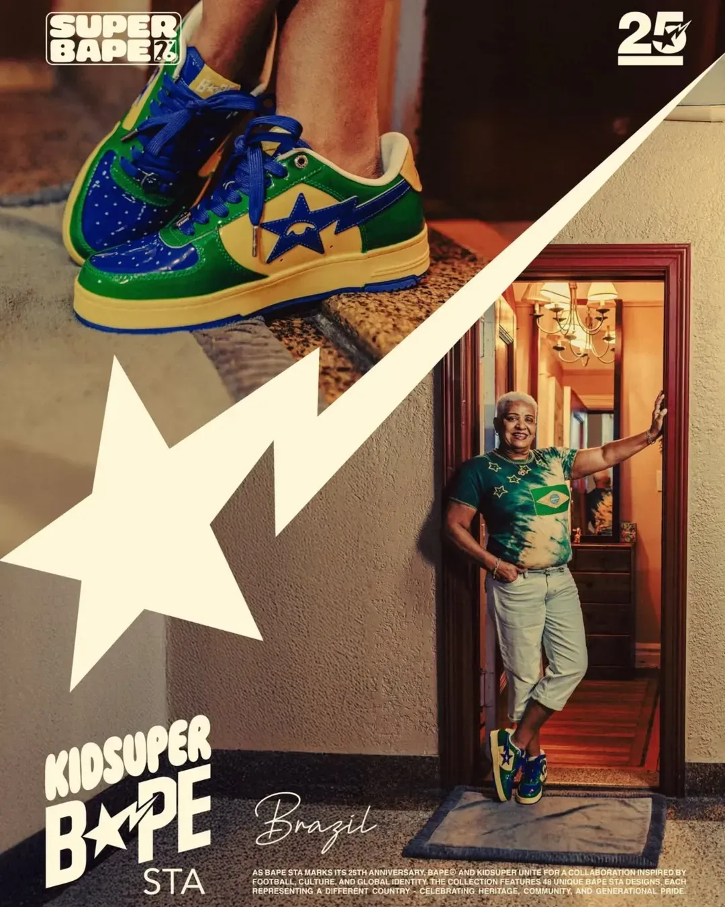
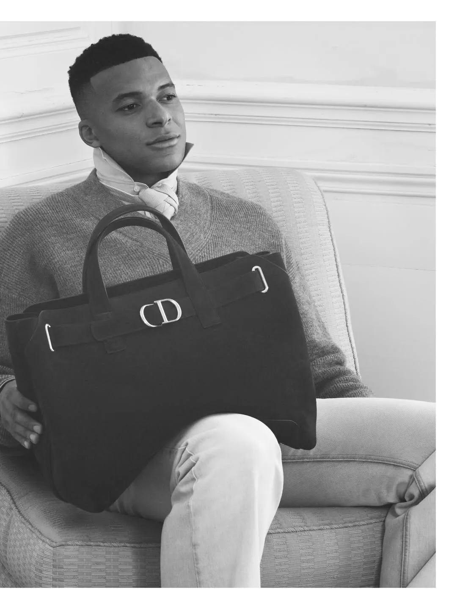
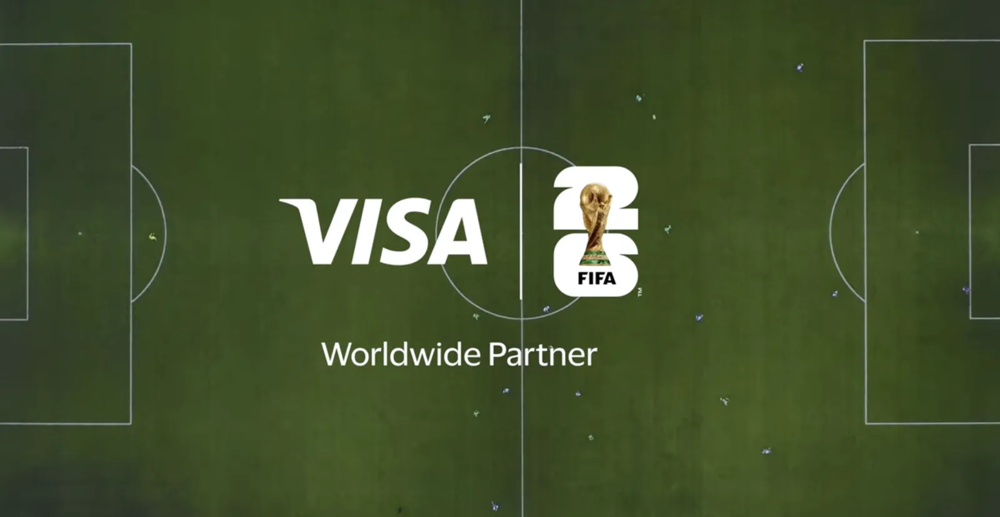

The biggest football moment in US history is happening right now, and a set of much smaller leagues spent the last year getting ready for the same window. Baller League USA launched in Miami this spring, a six-a-side game (six players a side instead of the usual eleven) with short halves and “gamechanger” rules that flip mid-match, like 3v3 spells and double points for long-range goals. It’s run by streamers as much as footballers. IShowSpeed is league president and runs a team. Kai Cenat and xQc manage sides. Ronaldinho and Usain Bolt are in the mix, the games aired on CBS Sports, and the betting brand Kalshi is on the front of the shirts. The debut drew a sold-out room and a reported 3.5 million viewers.

The Kings League, Gerard Piqué’s version of the same idea, raised $63m in February for a US launch and is still circling it, while running leagues in Spain, Italy, France, Germany and Brazil and a new one for the Middle East and North Africa.

None of that is this-week news on its own. The reason to look now is the calendar. The World Cup is the traditional game’s once-in-a-generation shot at the American audience, and the format leagues planted themselves right next to it on purpose.

The two products are chasing different people. The World Cup gets six weeks of enormous American attention and then has to hold whatever stayed. The streamer leagues are after the audience the tournament probably won’t keep: younger, online, watching football in clips and on Twitch rather than across a full 90 minutes. They’re building the watching habit year-round, through people who already have the audience, instead of hoping a summer converts anyone.

The format leagues understood early that distribution is the contest. A streamer with millions of daily viewers is a broadcast channel, a sponsor sales team and a youth-marketing department in one person. Putting IShowSpeed in charge buys the pipe to an audience the traditional broadcasters keep struggling to reach.

What’s still open is whether any of it sticks once the novelty wears off. Baller League USA had a loud first season. The honest test is the second one, and whether the numbers hold when the streamers move on to the next new thing. The World Cup will hand the US game a huge, brief crowd this summer. The quieter question is who’s set up to keep them watching in September, and the format leagues have a clearer answer to that than the sport’s incumbents do.

## ALSO ON MY RADAR

The football shirt trade climbed into luxury this week. Bape and KidSuper did 48 country-themed Bape Sta sneakers, Stone Island and New Balance brought back a technical capsule built on 1990s football, and Loewe and Drake’s Nocta joined in. *[The jersey now sits in the luxury and high-end streetwear](https://www.scmp.com/magazines/style/fashion/trends/article/3356311/9-fashion-forward-collabs-2026-fifa-world-cup-nike-and-adidas-loewe-and-drakes-nocta)* category rather than the team store.

Fashion houses are putting footballers at the *[centre of their campaigns](https://ww.fashionnetwork.com/news/Fifa-world-cup-why-are-fashion-brands-turning-to-footballers-as-brand-ambassadors-,1831497.html)*. João Neves fronted Ami Paris, Lewandowski took the lead in a Mackage campaign, Lamine Yamal became a global ambassador for American Eagle, and Mbappé ran in Dior’s summer campaign. Brands are paying for the player’s audience, and the sharper players are starting to price that for themselves.

FIFA sold out its global sponsorship packages, with the cycle *[reported around $2.8bn](https://www.thestreet.com/entertainment/brands-spending-billions-2026-fifa-world-cup-2-8-billion)* against roughly $1.8bn in 2022. A 48-team tournament across three countries is the most valuable single ad slot going right now, which is why every culture play this summer aims at the same window.

The money isn’t only coming from kit makers. Visa launched *[“Tap In”](https://youtu.be/SqnIhMjkdIg?si=YkKixFmWvo6i8umo)* with Jason Sudeikis, Lamine Yamal, Erling Haaland and Christian Pulisic, and by *[media mentions](https://signal-ai.com/insights/fifa-world-cup-2026-sponsors/)* Adidas and Bank of America led the sponsor field, level at roughly 14,000 each, with Coca-Cola, Visa and Hisense each past 8,000. When a payments brand and a bank are as loud as the boot brands, a distinct cultural angle is worth more than budget.

*[Puma went big](https://panamericanworld.com/en/magazine/sports/nike-adidas-puma-2026-world-cup/)* and a little wild. Reporting says it tripled its World Cup marketing spend versus 2024, took Portugal off Nike, and used AI in parts of its kit design, all under a “Go Wild” campaign aimed at Gen Z. Spend buys visibility, though owning a culture format tends to outlast a campaign.

That’s it for today.
