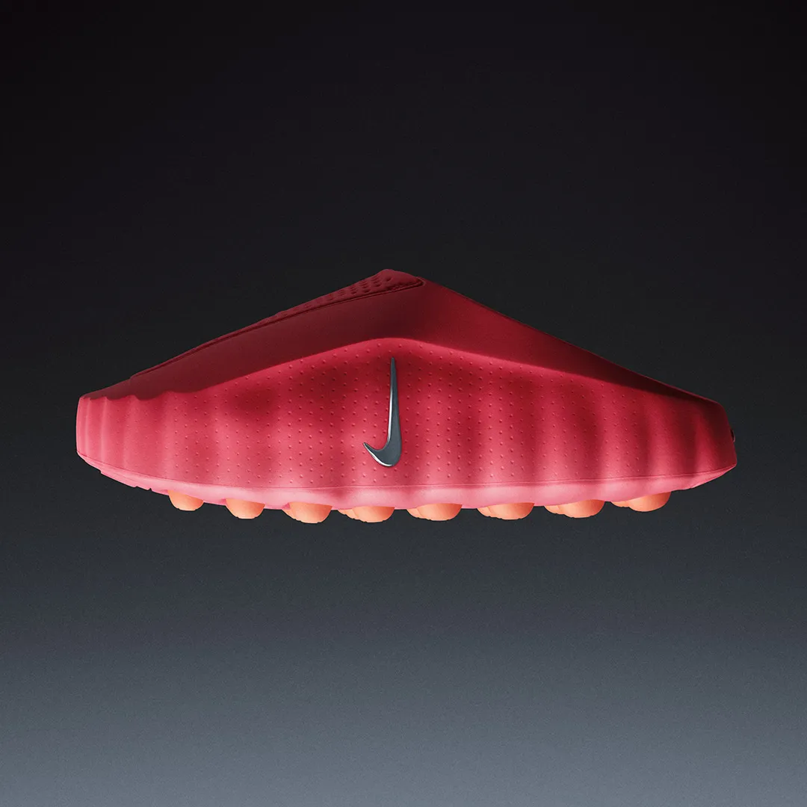
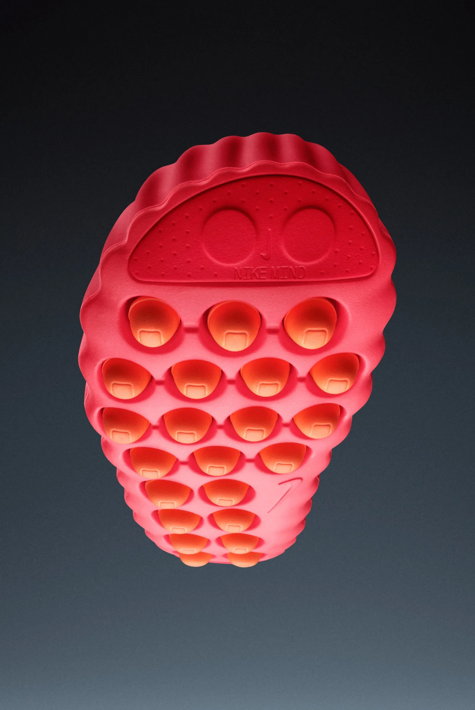
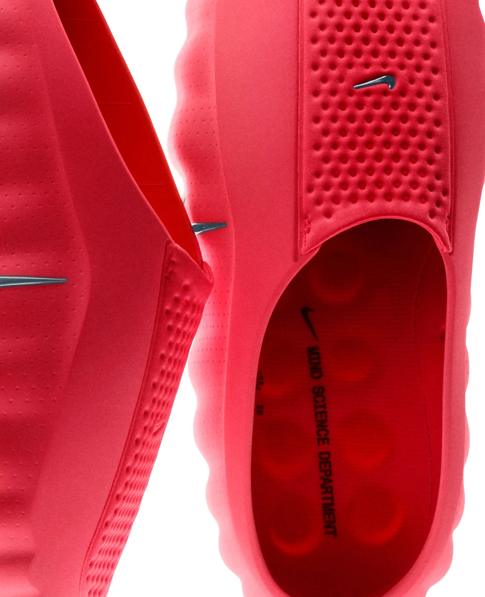
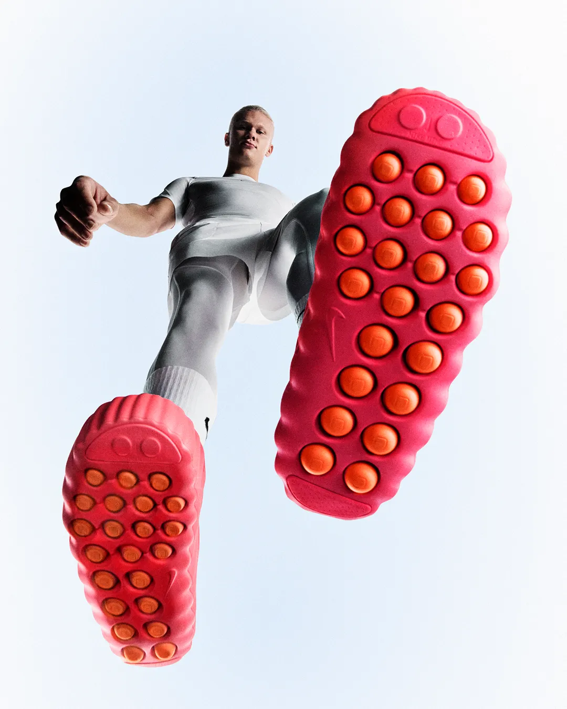
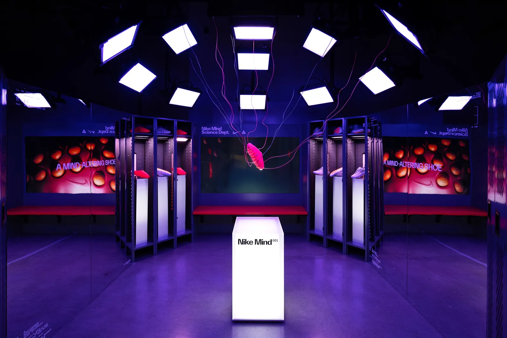
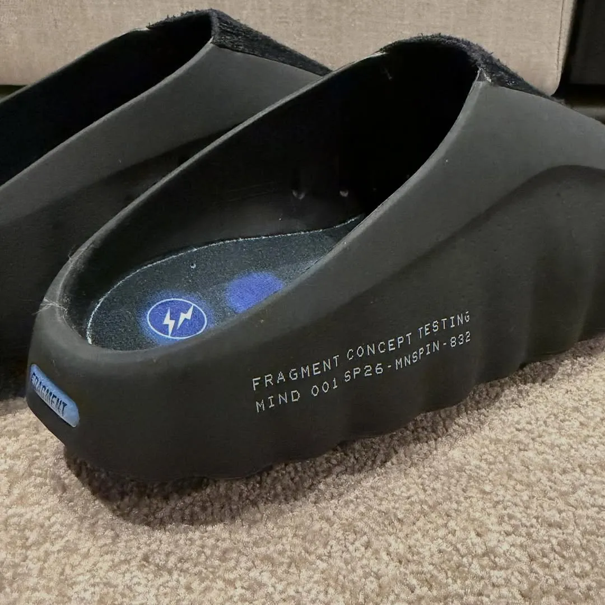

These shoes aren’t here to improve your body. They are here to unlock your brain.

Targeted at elite athletes, the goal is to reach the next level of focus. The promise is strange but simple. This shoe forces you into the “now” by distracting your feet so intensely that your brain has to zone in.

How It Works: A Circuit Breaker for Your Brain

The innovation is in the sole. It is built with 22 independent foam nodes instead of a flat rubber slab.

As you walk, these nodes move independently like piano keys. This instability creates a flood of sensory data from your feet to your brain. To process this “noise,” your brain is forced to switch off the “Default Mode Network” (anxiety and distraction) and switch on the “present moment.”

It acts as a circuit breaker for your internal chatter. It grounds you by making the act of walking just complicated enough that your subconscious cannot ignore it.

The Bigger Picture: Halo Innovation

Does Nike expect to sell millions of these? Probably not.

This is a classic “Halo Product.” Critics have argued Nike became boring and relied too much on retro releases. The Mind 001 proves they are still building the future. They even started a “Mind Science Department” to do it.

The fact that we are discussing their innovation rather than earnings means the strategy is already working.

Nike knows science alone does not sell.

Streetwear legend Hiroshi Fujiwara recently teased a Fragment Design version of the Mind 001. This ensures the shoe is viewed as futuristic industrial design, not just a medical device.

If he designs something, you can bet sneakerheads around the globe will wear it. No matter if it actually helps their brains.

Is it a medical breakthrough or a marketing masterclass? It is likely both. But for the first time in a long time, Nike is making us think.

*[Link to the officlal Nike press release](https://about.nike.com/en/newsroom/releases/nike-mind-001-mind-002-official-images)*
