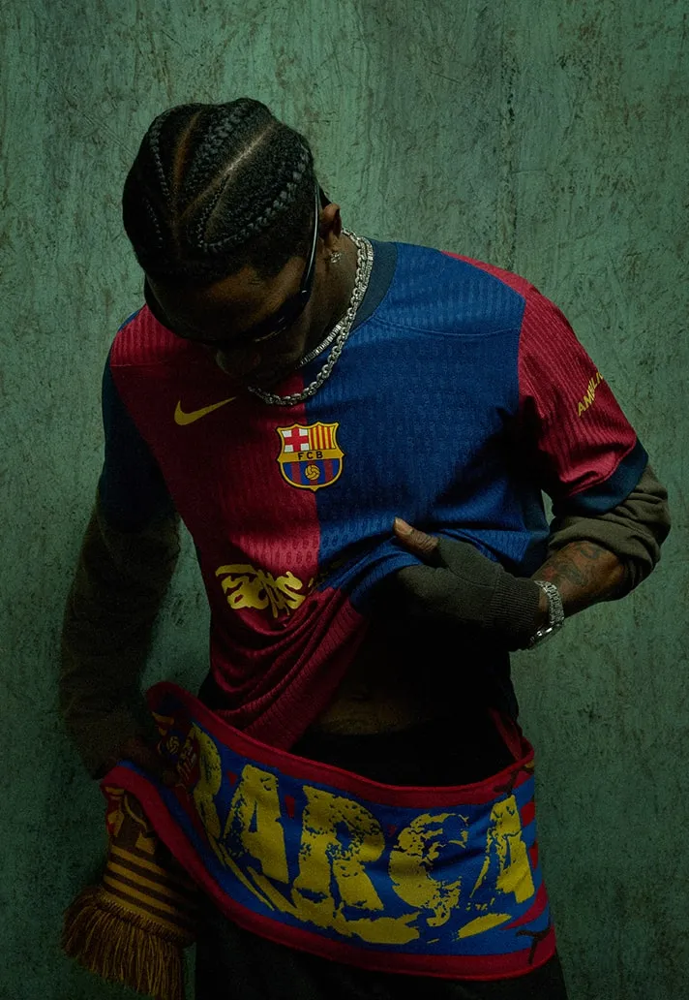
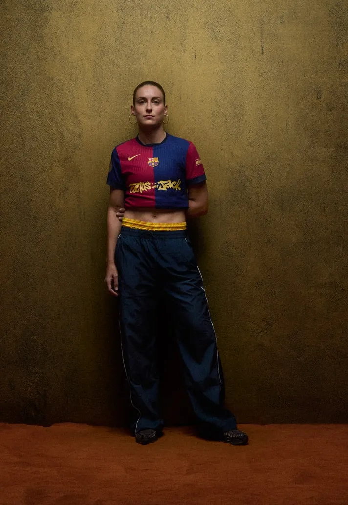

Travis is taking live performance to another level.
If you see him in a venue, it’s surreal how much energy he pulls into the room.
It’s just him, the beats, the bass, and Chase B behind the decks.
No dancers. No distractions. Just pure presence.

I’d go so far as to say: he’s the best performer alive. (Sorry, Swifties 😉).

And now, he’s turning El Clásico into his stage.

On May 11, FC Barcelona will wear a special edition jersey with the Cactus Jack logo front and center.

This is part of Spotify’s ongoing series of musical jersey takeovers.
Previous guests? Drake. Rosalía. The Rolling Stones.
But Travis doesn’t just join the list. He changes the game.

This isn’t just another collab.
It’s a moment where music, football, and culture cross paths in a way that actually makes sense. Not forced. Not flashy. Just aligned energy on a global stage.

The men’s jersey? €400. *[Already sold out.](https://store.fcbarcelona.com/de/products/fc-barcelona-artistclassic-m-limited-ed)*
(Signed edition still available for €3.000)

And to top it off, Travis will perform live in Barcelona for the first time ever. At an invite-only show the night before the match.

🎵 **[Spotify](https://www.linkedin.com/company/spotify/)** letting artistry lead
⚽ Barça opening up to new cultural lanes
🔥 Travis turning everything into a Cactus Jack universe
