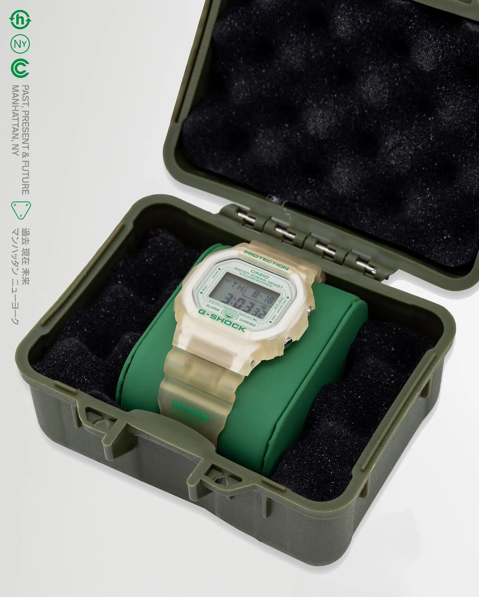
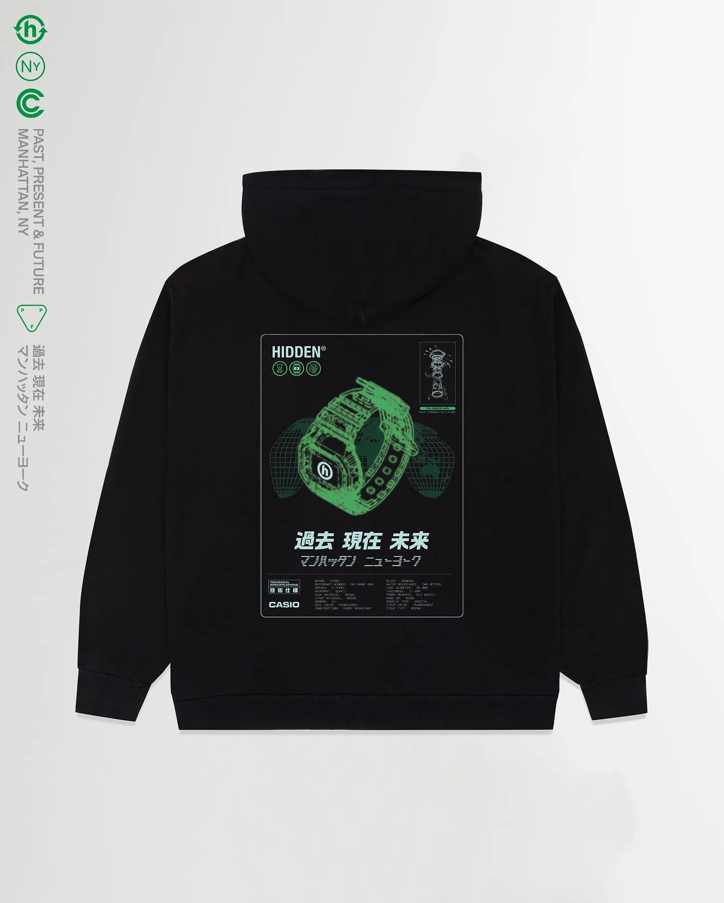

Bringing two brands together to create something new and tell a great story is an art.

*[Hidden](https://www.hiddenrsrch.com/)* is a fashion brand built on top of their newsletter. The story is super interesting, but it would need another write-up. Hidden regularly drops their own products – available to order for 24 hours, and subscribers of the newsletter get early access to their products.

G-Shock probably needs no introduction. This year G-Shock turned 40, and the story in itself is amazing. Kukuo Ibe had the idea in 1981, and it took him 2 years of a lot of trials and errors to come close to his idea: “To build a watch that would never break” – the “Gravitational Shock.” (*[There is an interview with the inventor on YouTube.](https://www.youtube.com/watch?v=pLtzo2hJw7Y)*)

Hidden has done a few great collaborations over the years. Today they are dropping their version of the G-Shock. Of course, they have written about the history, their idea, etc., in *[their latest newsletter](https://www.hiddenrsrch.com/p/shock-and-awe)* (for subscribers only).

Do I really need to get one? I am tempted, but I can’t remember when I wore a “real watch” for the last time since owning an Apple Watch …

