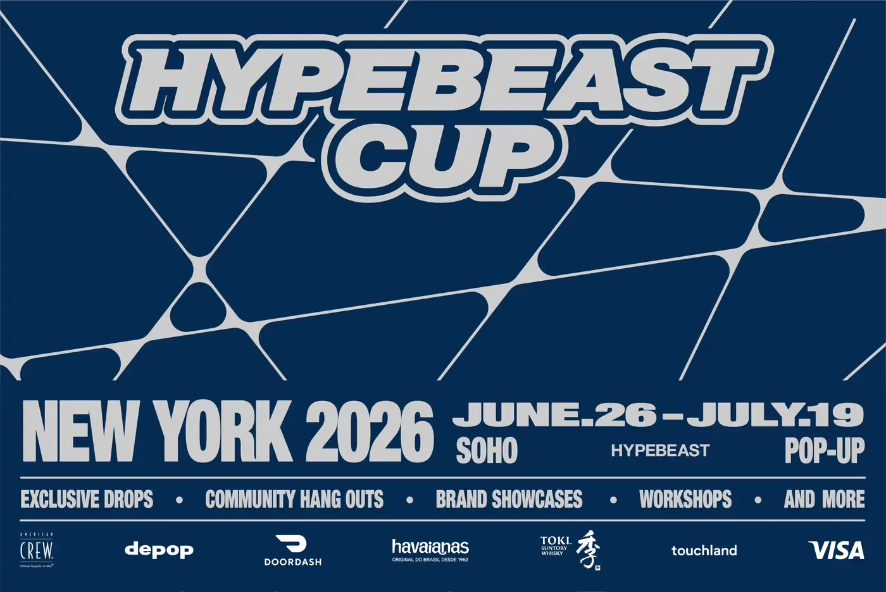
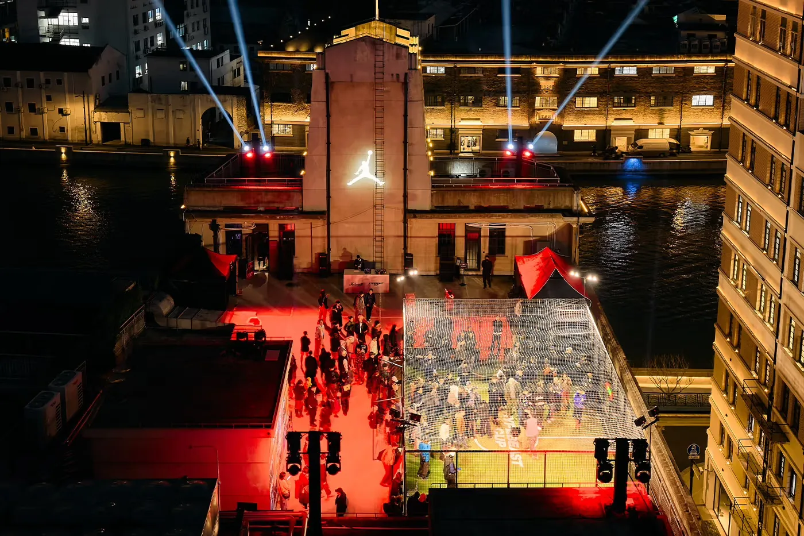
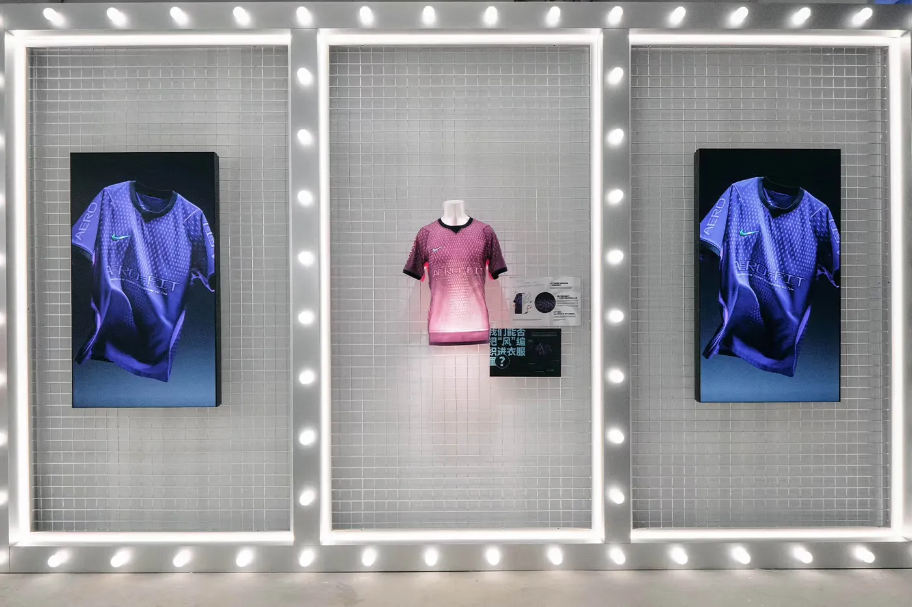
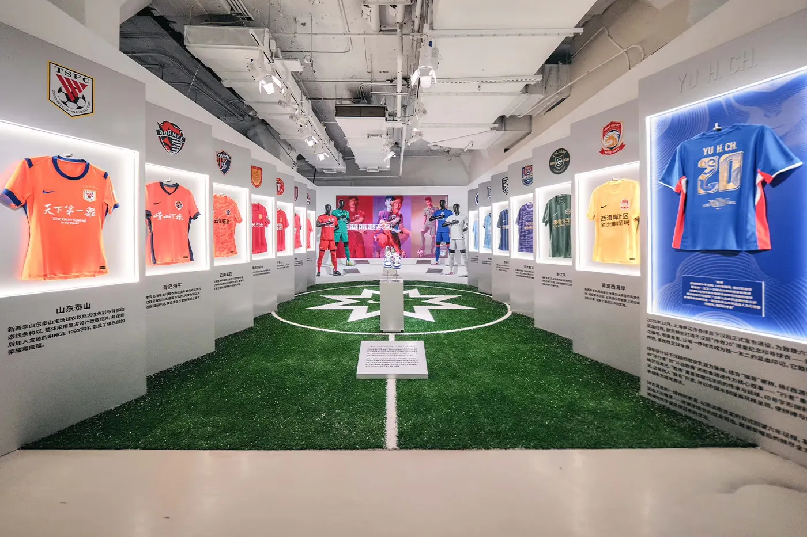
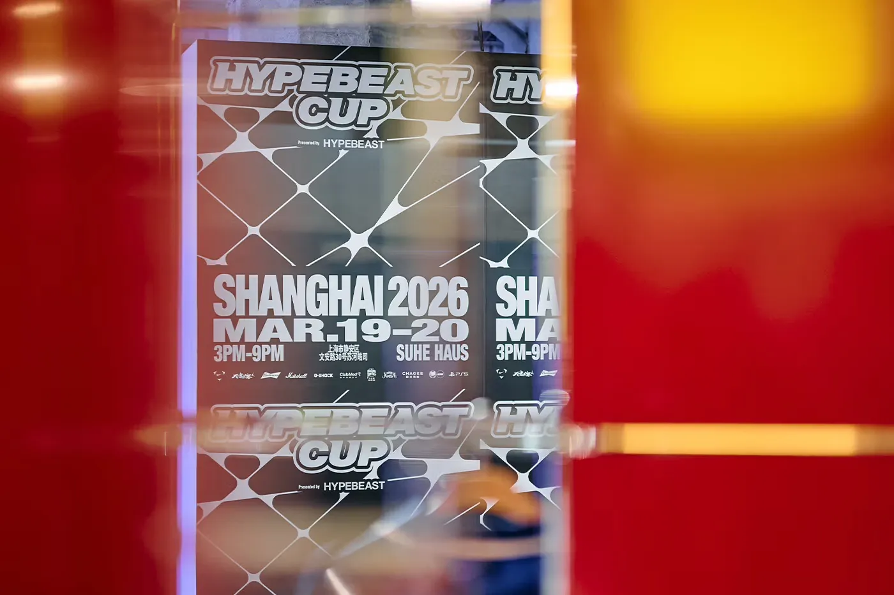
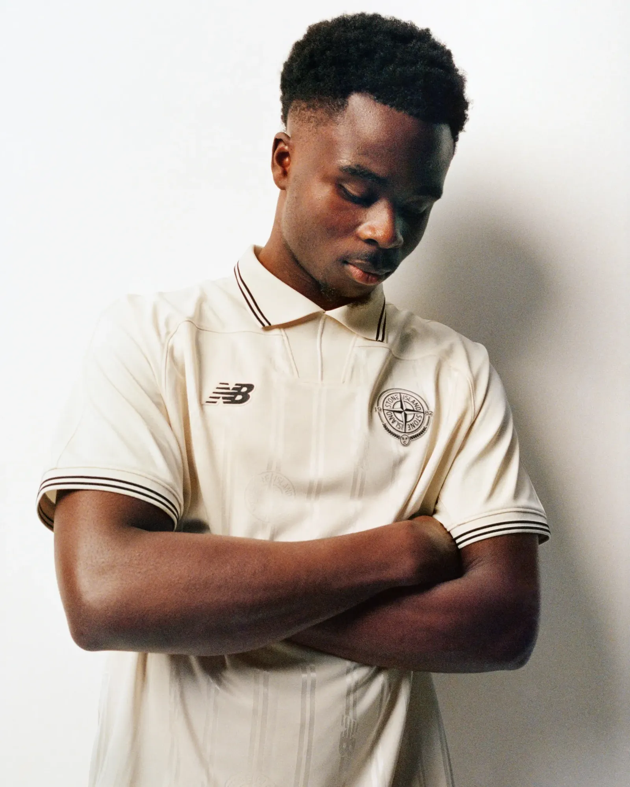
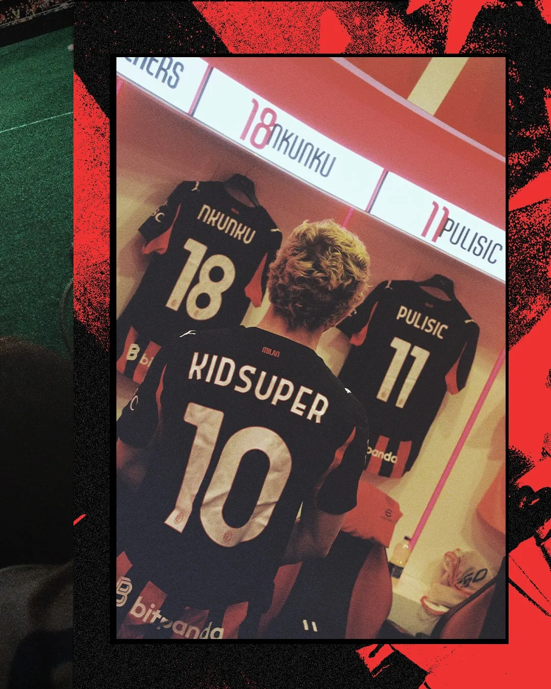

Hypebeast, the streetwear and culture publisher, just wrapped a year-long touring project called the Hypebeast Cup. It started in Shanghai in March with a small-sided street tournament, three players a side, and a Nike Football exhibition in the middle of it. It ran through Singapore and finishes in New York with a month-long hub that puts football alongside retail, gaming and craft, open while the World Cup is on.

Nike and Jordan are in the room, the jerseys everywhere. The shift is who holds the space. A media company built it and decides what the game sits next to, a publisher whose audience came in through fashion and sneakers, now treating football as one more of those scenes.

For a long time the football “product” you could buy was made by the kit and boot brands. The culture around it, the music, the way a city dresses on a match day, mostly happened on its own, off to the side.

Hypebeast is building that off-to-the-side on purpose. The game becomes the anchor in a space that also holds gaming, design and a shop. For the reader who came to football through fashion rather than results, that’s the appeal: the game shares a room with the rest of their taste.

It’s early. One brand, three cities, a tour still finding its shape. Whether the New York hub draws the people it’s built for or just the people already holding tickets is still open. But the direction is clear: the most interesting football spaces this summer are being hosted by people who don’t sell the kit.

## ALSO ON MY RADAR

*[New Balance](https://www.stoneisland.com/en-us/stone-island-new-balance-collaboration.html)* is running rolling pop-ups through Boston, Los Angeles, Miami and New York, with live podcast recordings inside them, and a New Balance x Stone Island piece that reworks 90s football style rather than just reprinting it. Another brand building a room for the game instead of only selling the shirt.

*[Loewe’s design duo](https://www.awayinstyle.com/loewe-becomes-the-official-partner-of-spains-national-football-teams/)* Jack McCollough and Lazaro Hernandez dressed Spain’s men’s and women’s squads in their travel outfits, the clothes a team wears to and from the game. The wardrobe nobody used to look at is now a fashion-house brief.

KidSuper, the New York designer who shows at Paris Fashion Week, brought his label’s world to *[Miami for the World Cup](https://www.soccerbible.com/features/2026/06/how-kidsuper-took-paris-fashion-week-to-miami-for-the-world-cup/)*, treating the tournament as a stage rather than a sponsorship slot. A fashion name walking onto football’s biggest week on its own terms.

Gareth Bale was named a partner in Juggernaut Diversified Sports, a private-equity platform going after control stakes in clubs, leagues, women’s sports and youth platforms across North America and Europe. The retired player is moving from endorsement income toward *[owning the assets](https://www.sgieurope.com/people/gareth-bale-named-partner-in-pe-sports-investment-platform/121825.article)*.

The Kings League, Gerard Piqué’s small-sided, made-for-streaming football format, says its 2026 World Cup Nations event drew more than 120 million cumulative livestream views across 40 games, with a *[US launch lined up](https://www.espn.com/soccer/story/_/id/45512487/gerard-pique-kings-league-eyes-launch-us-2026)*. The creator-led version keeps growing right next to the real thing.

That’s it for today.
