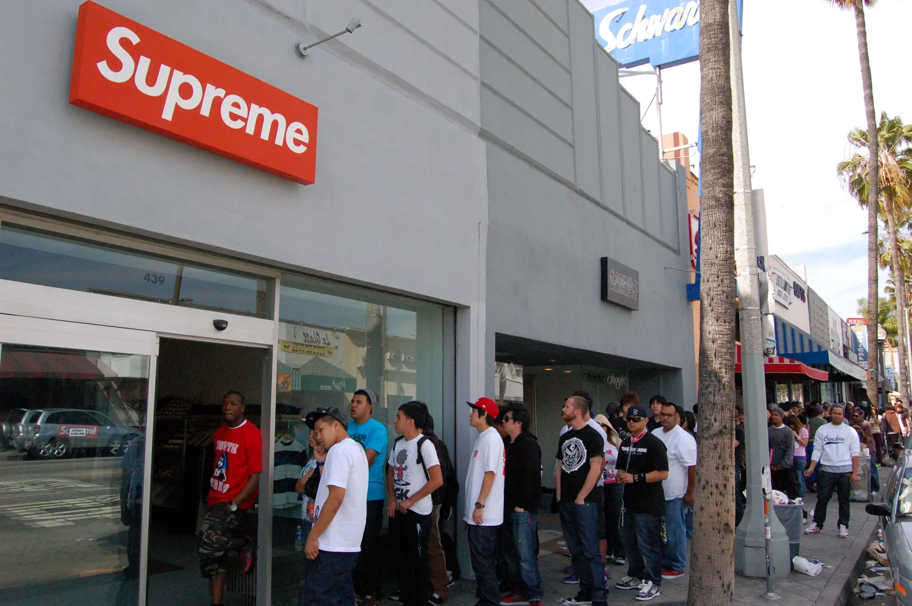
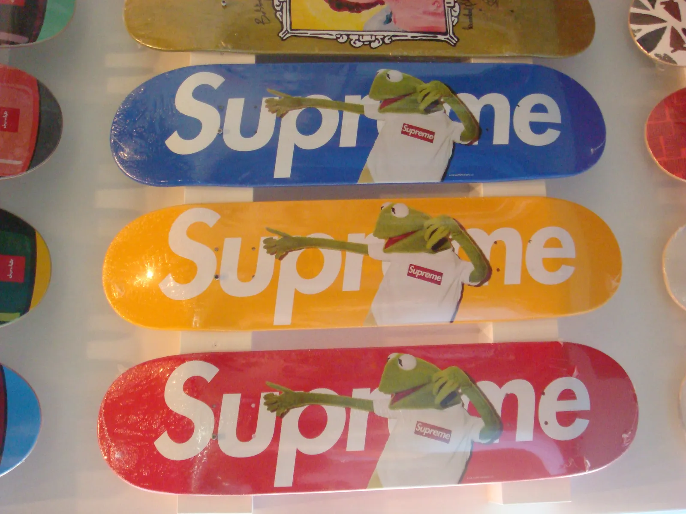
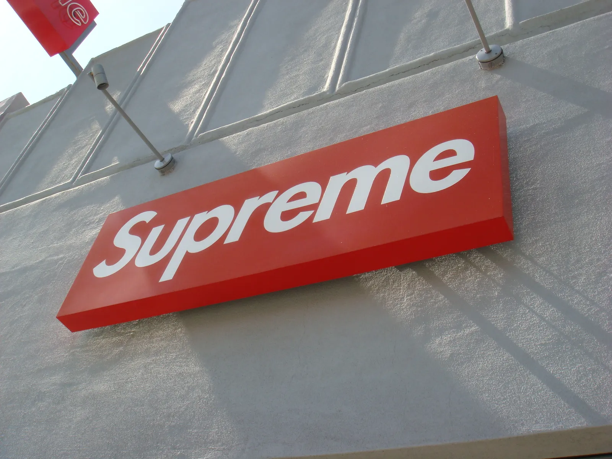

Rewind to September 2008. I found myself on the streets of Los Angeles, working on a book project for Dickies (with the amazing Brian Cross). During my month-long stay, I tried to absorb as much of the city's culture as possible. I also visited all the stores of the brands I admired: Undefeated, Stussy, Alife. And Supreme.

At the time, getting your hands on Supreme in Europe was a tough task, and staying updated on their latest releases was almost impossible.

The day I went to the Supreme store, there were crazy lines around the block. It was the day the Supreme x Kermit The Frog collab dropped!

Terry Richardson's shots of Kermit on Tees and skate decks created an unexpected and, from today's perspective iconic collaboration.

Sadly, the line was too long, and I did not get my hands on one of the items the day after the drop when I finally was able to get into the store (at least I got a sticker, which I still have).

While I was familiar with the power of collaborations — having worked with stalwarts like Michael Kopelman, Alife, and Jeff Staple for Dickies — this particular union of Supreme and Kermit was an epiphany.

The whole experience was something I had not witnessed before. I knew people would stand in line. And I knew collabs could be a great way to tell a story (back then, I was working on collabs with Michael Kopelman, Alife, Jeff Staple, and others for Dickies).

It demonstrated the potential of seemingly random partnerships, united by an unexpected execution, to create a memorable brand narrative.

Now, transitioning to the present, I recognize that these principles of brand storytelling and collaboration are not limited to traditional fashion.

 New technologies like Spatial Computing, AI, and Web3 will allow brands new ways to create memorable collaborations.

And just like Supreme's collaboration with Kermit, new technologies offer brands an opportunity to craft stories that are unexpected yet resonate deeply with their audiences.

I see a world of opportunities for businesses to reinvent their brand strategies and connect with their audience in ways previously unimagined.

.
