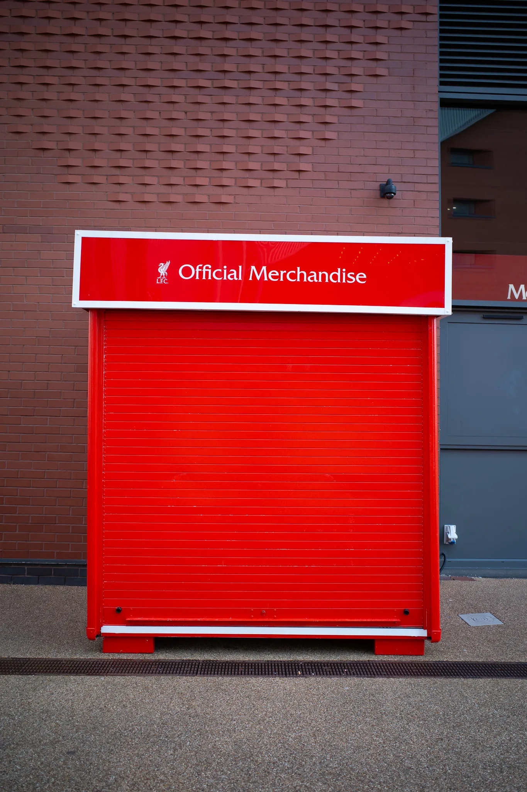
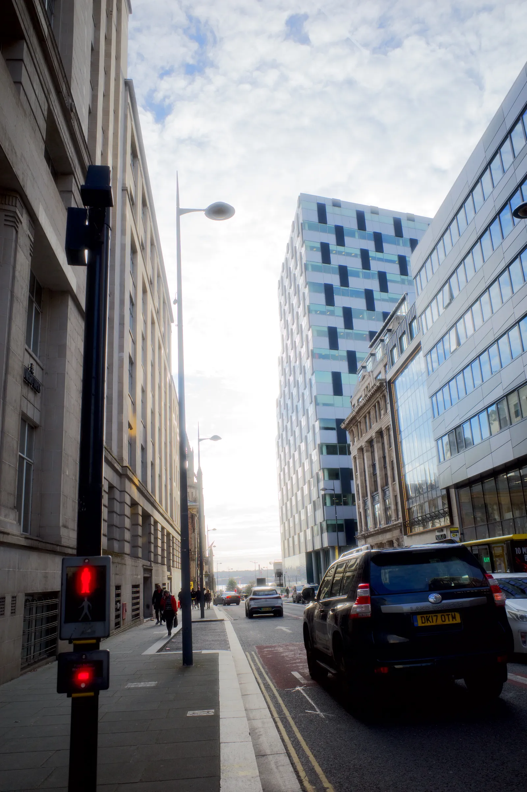
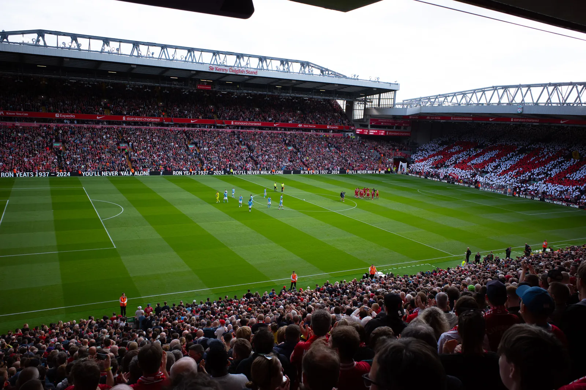
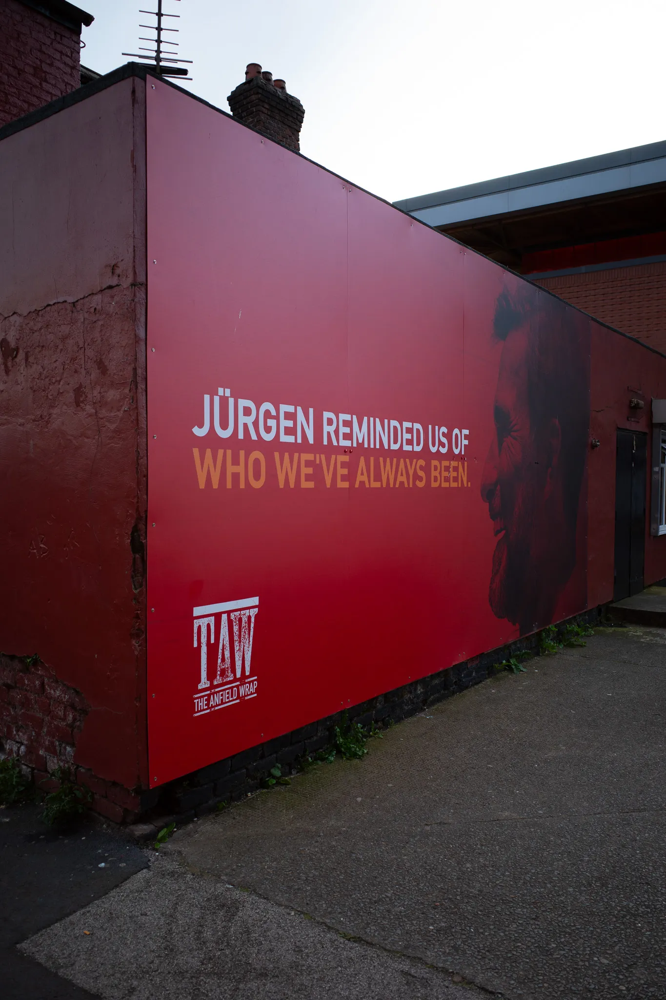

But while I was in Liverpool, I did something I always wanted to do: I wrote down a few principles that are important to me and what I expect from the people I work with.

What do you think? Would you add something else? Are they too arrogant? Or misleading?

## My Principles

**Trust is non-negotiable.**
Mutual trust is the foundation of our partnership. You can count on me to be transparent and reliable, and I expect the same in return.

**I avoid complexity.** Complicated plans often get ignored. Simple, clear strategies lead to real results.

**I get straight to the point.** No middlemen, no layers of approval. I partner with the people who can say “yes” and mean it.

**Ideas are cheap; execution is gold.** Everyone has ideas. Few turn them into reality. That’s where I come in.

**I aim for meaningful impact.** Incremental progress is valuable, but together we create significant advancements that truly matter.

**Titles don’t impress me.** Egos and hierarchies slow things down. Let’s work as equals and get things done.

**Less talk, more action.** I prefer showing you what I can do rather than making big promises. Let’s focus on achieving real results together.

**Let’s make sure to have fun along the way.** The best work happens when we’re enjoying ourselves.

