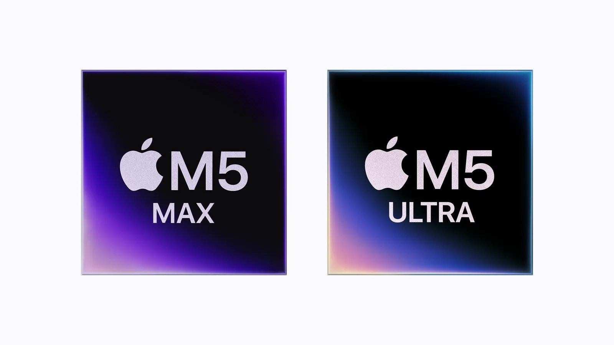

Apple has put a 512GB machine on sale and said plainly what it’s for: running large language models on your desk, with nothing leaving the room.

Not quite yet, though. The new Mac Studio ships September 22 with up to 256GB. The 512GB version follows in late October, at a price closer to €20,000, probably above.

## What actually runs on it

You will not be running Claude or ChatGPT on this machine. Both live off subscriptions, so their best models are never going to be something you download. What runs locally are open-weight models: Qwen, DeepSeek, Kimi, GLM, Mistral, Llama, Google’s Gemma. You download them and they sit on your drive.

The bet is about being close enough. On coding and reasoning benchmarks these models are now within a few percentage points of GPT and Claude. On the hardest problems the closed models still win, and probably will for a while.

## What you get, and what it costs

Going local means your data stays with you, you pay once instead of per request, and it works offline. The price is five figures up front and a bit less capability.

## Does it make sense for me?

Not today. I work alone, my subscriptions cost a fraction of that machine, and writing and strategy is exactly the work where the closed models are still ahead. But it might become relevant. Privacy concerns keep growing, and I expect more and more companies to start requiring this.

## Where this leaves Apple

Read strategically, Apple is staying out of the race for the best model and selling the hardware the winners will run on.

*By the way, these are the final two product announcements under Tim Cook. John Ternus takes over next week, and Cook is leaving him the iPhone stage. Excited to see if the foldable iPhone will be something I’d actually want to use. Not too sure about it yet.*
