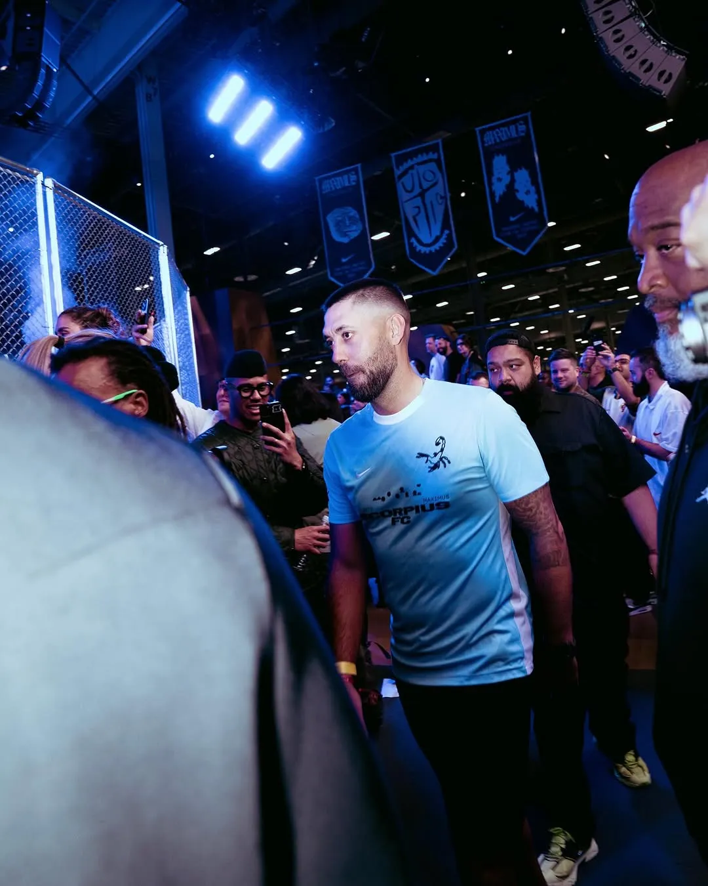
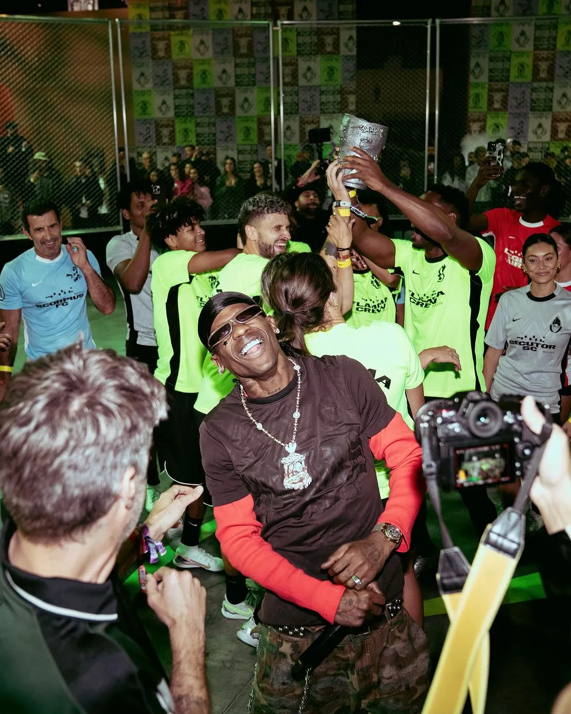
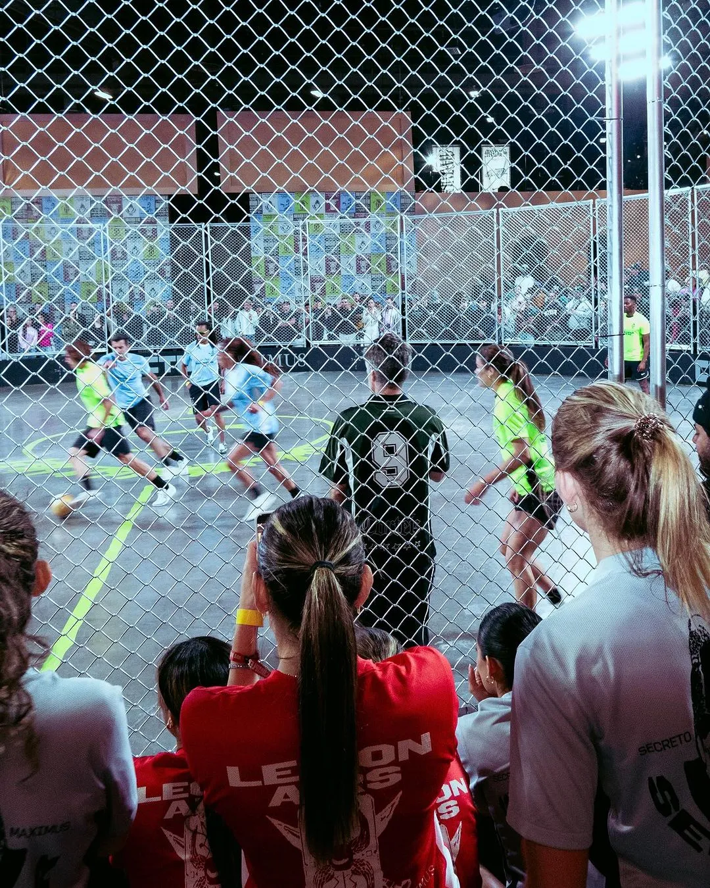
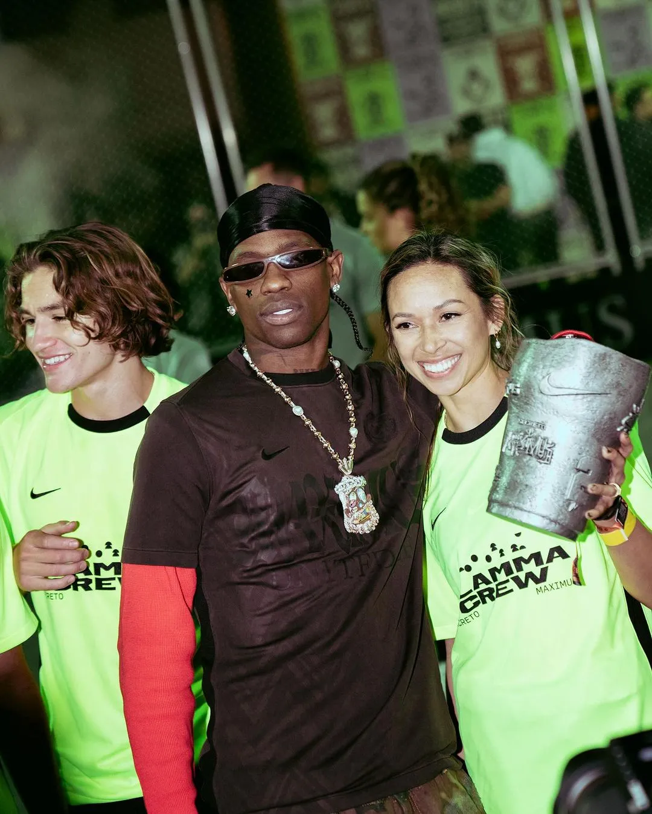
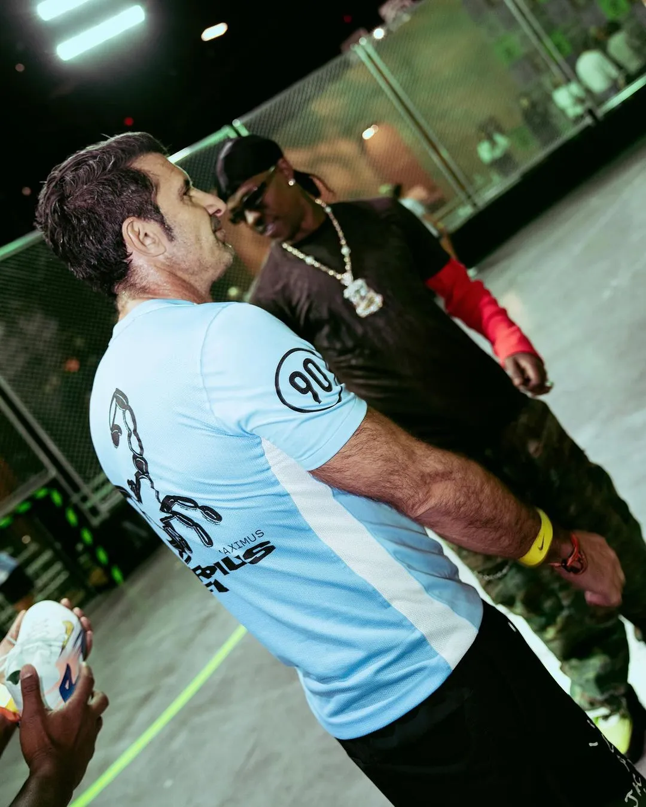
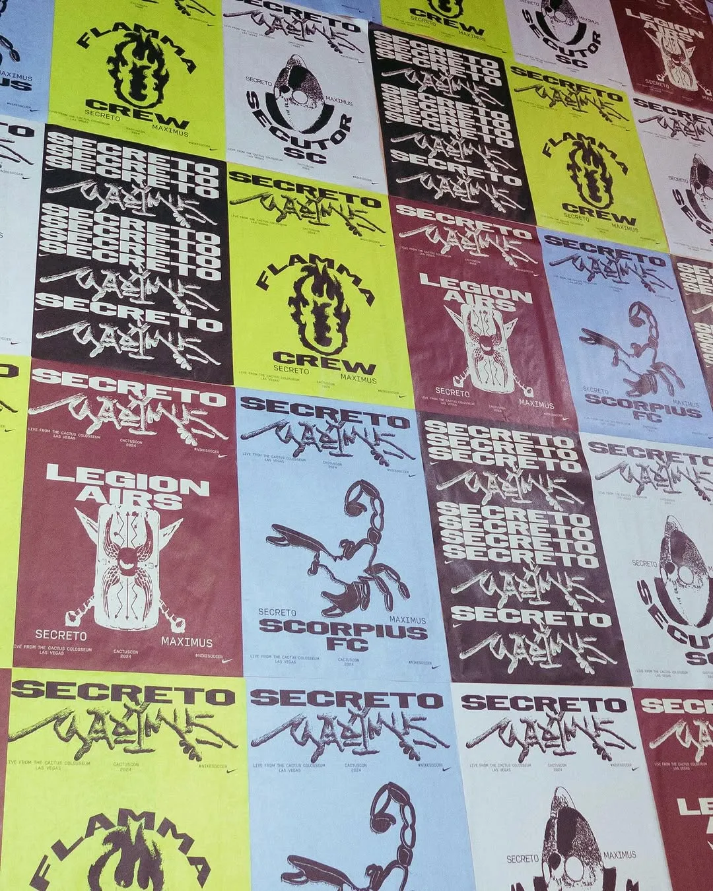
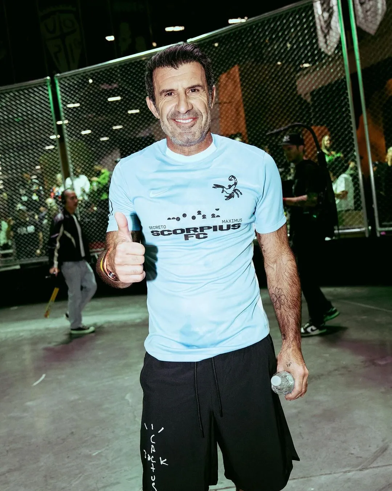

Always impressive to see what Travis and Nike pull out of their hats.

CactusCon was an event at *[ComplexCon](https://complexcon.com/)* Las Vegas, where Travis Scott unveiled the Cactus Colosseum, a street football arena created in collaboration with Nike. This innovative space paid homage to Nike’s legendary ‘Secret Tournament’ campaign from the early 2000s.

As the event’s artistic director, Scott curated a special section with hand-selected brands and produced 10 exclusive products, as well as delivering a standout Sunday night performance. Travis has a long relationship with Complexcon. He was part of the very first ComplexCon back in 2016.

The event kicked off with Secreto Maximus, showcasing the talents of the next generation in street football. A standout moment was seeing Scorpius FC in action—a team featuring legends like Luis Figo and Edgar Davids, who were part of the original campaign.

It’s amazing to see how sports, culture, and creativity can come together to create such experiences.

I wish I could have made it in person…

