We usually stay somewhere around Santanyí. One evening, we went out for dinner in town, and across from the restaurant, I noticed an old, abandoned townhouse. On the wall was a small sign: “We are working on a new turnkey project”—alongside a little rendering.

Something about it caught my attention. The design of the sign, the aesthetic of the rendering - it just felt right. Like Copenhagen meets Mallorca.

That night, back at the house, I spent quite some time scrolling through the website of the studio behind it: *[Angel Martin Studio](https://angelmartin.studio/en/)*. And I was hooked. Their projects, their vibe—it all really resonated with me.

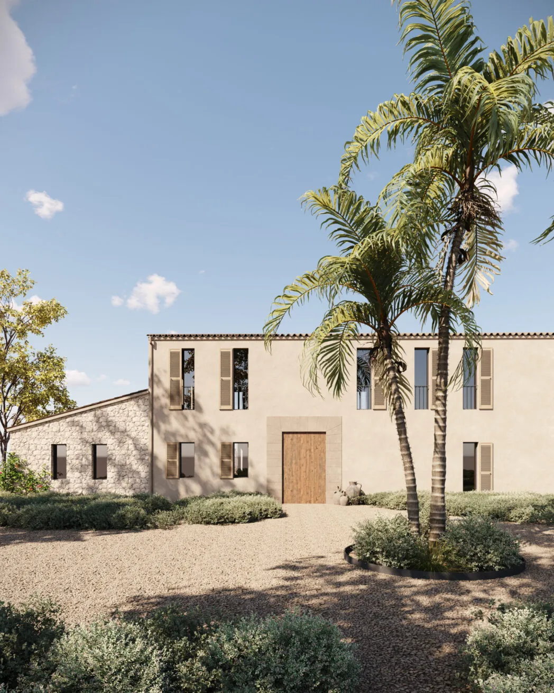
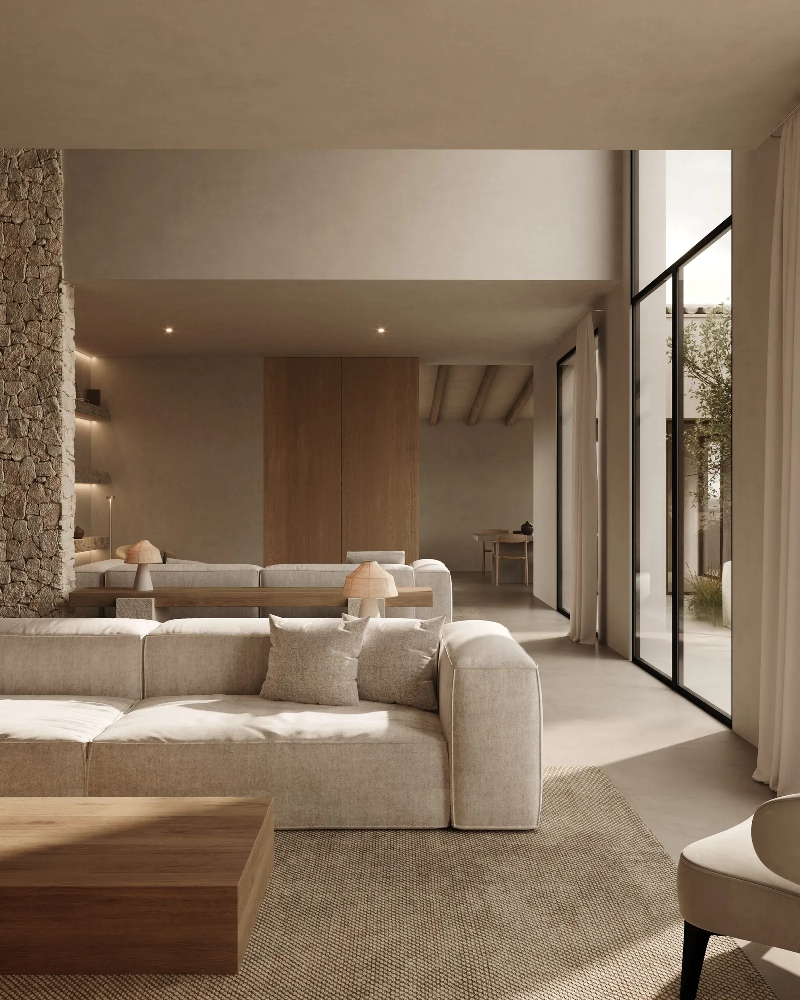
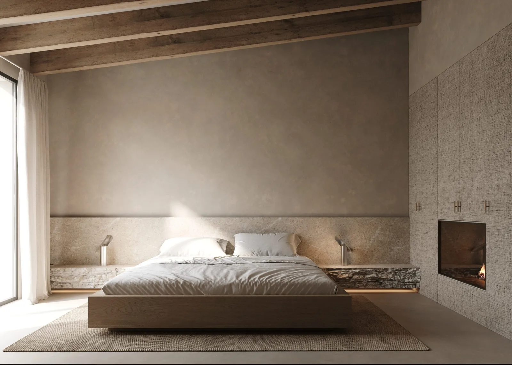
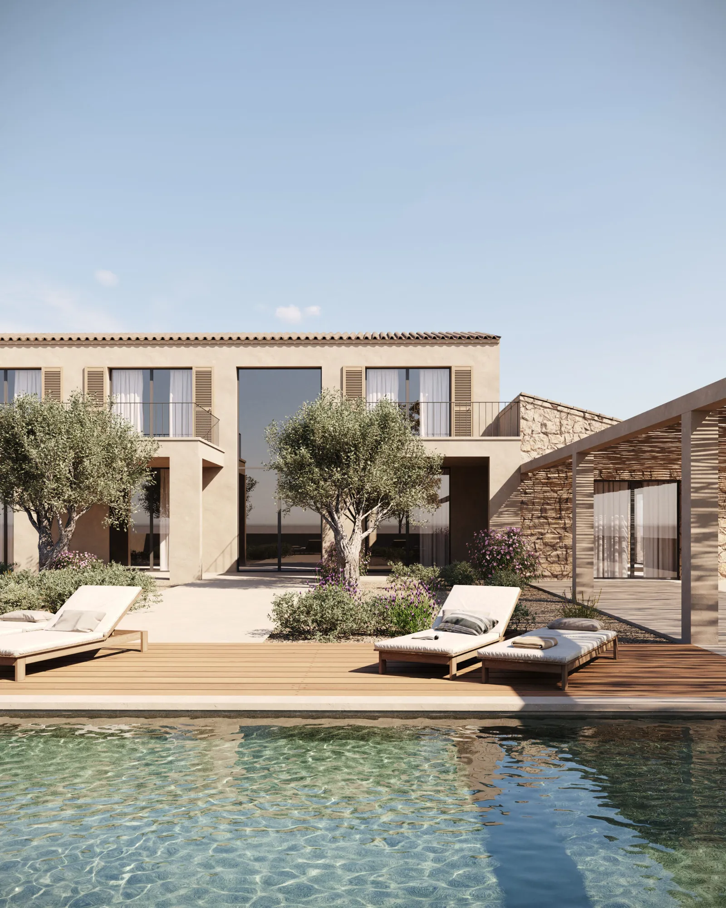

Over the following days, I kept thinking about reaching out. What would I even say?

Because honestly - I’m not in the market for a house on Mallorca. So what’s the point?

Still, when I was back in Hamburg, I wrote a long message. I told them about my love for great design. How much I admire Scandinavian influences. How their work felt like a crossover I could look at forever.

And I shared a bit about myself - what I do for a living, what I’m passionate about, and that I had this gut feeling: maybe there’s something we could explore together. I had no idea what. But I knew there was something.

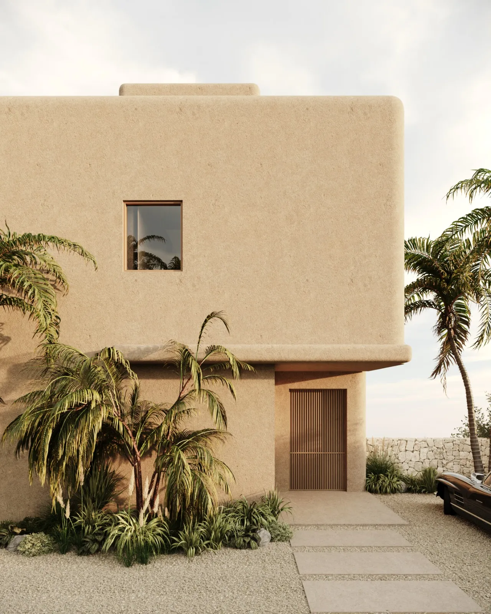
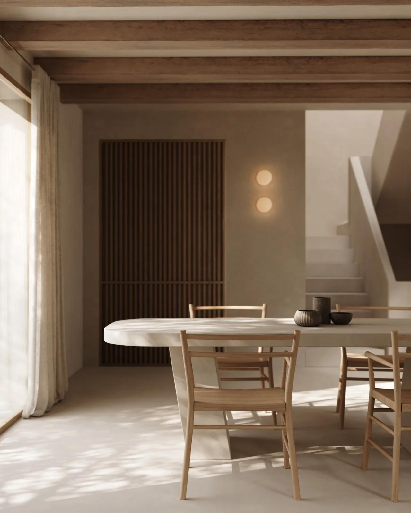
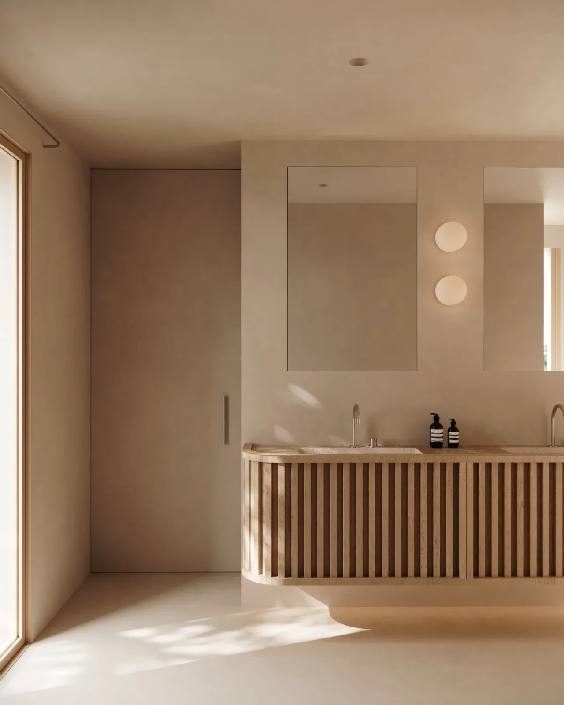
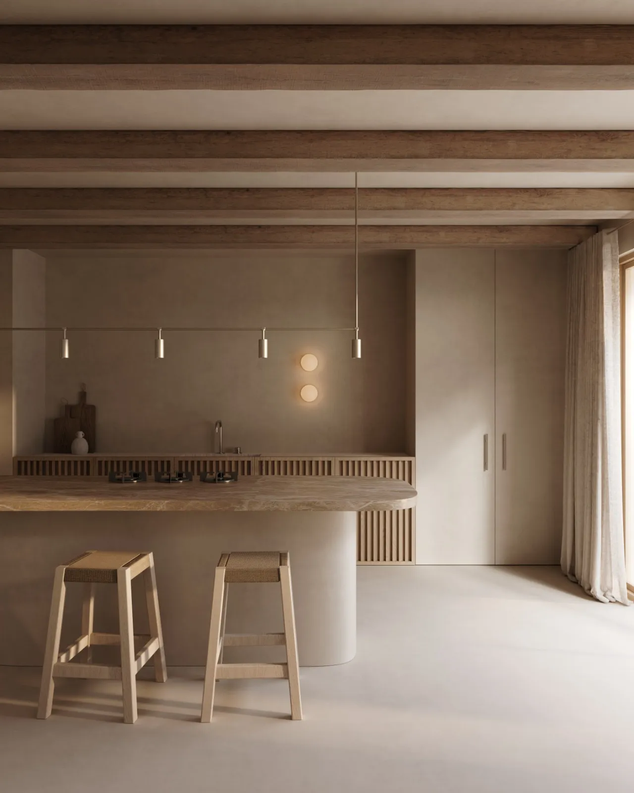
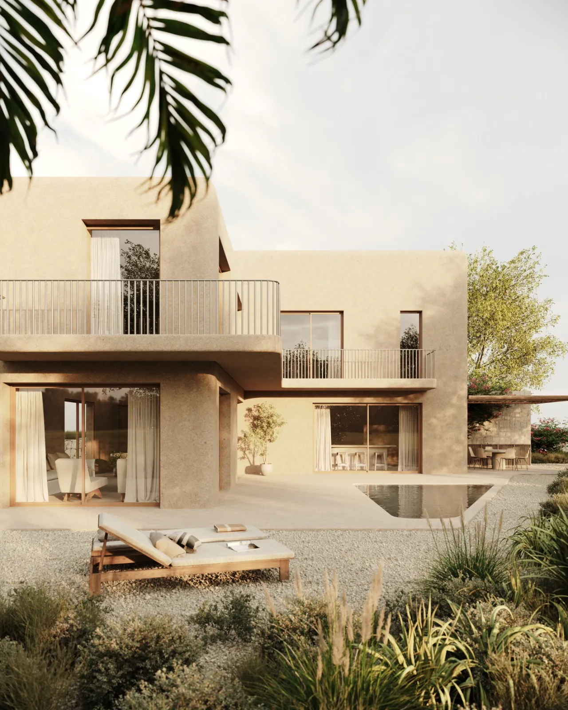

A few days later, *[Angel](https://www.linkedin.com/in/angel-martin-14b71231/)* replied. A kind message - and he invited me. Come by the studio, see his work, spend a day together. Even though he knew I wasn’t looking to buy anything.

In November, I was back on the island. We met in Palma’s old town and spent the day going through his projects, his process, and his business challenges. I also shared more about what I do for a living—how I work, what I’m passionate about, where I’m at in life.

Later, he said: “Let’s get some good food.” So we went to the fish market and had some really good seafood. Fresh, simple, perfect.

And the idea we developed that day?

An investment model for people who want to invest in Mallorca - funding beautiful projects that are then sold to people in search of their dream home. We’ve spent some time shaping the deck, and next week I’m flying back to see how we can take it further.

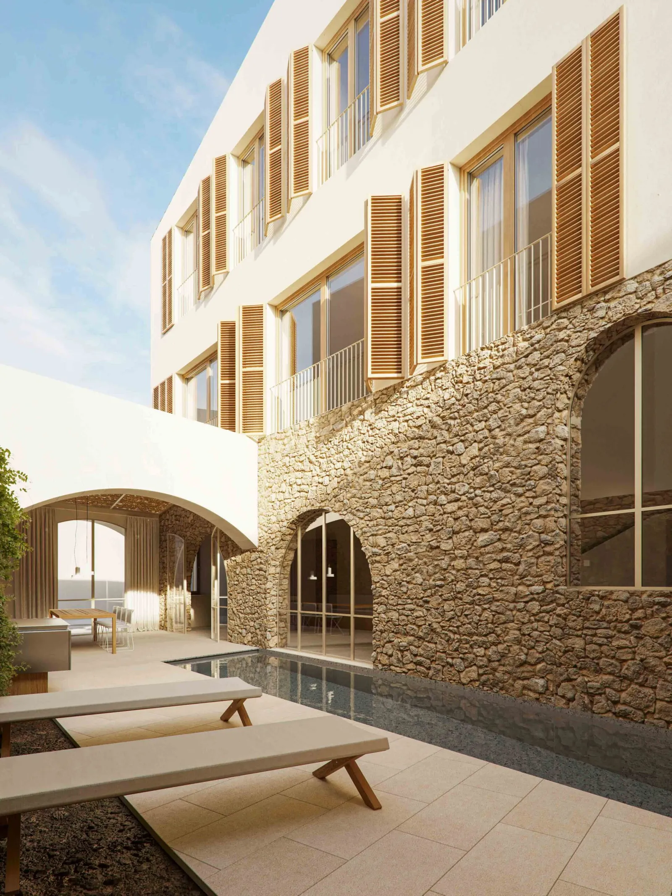
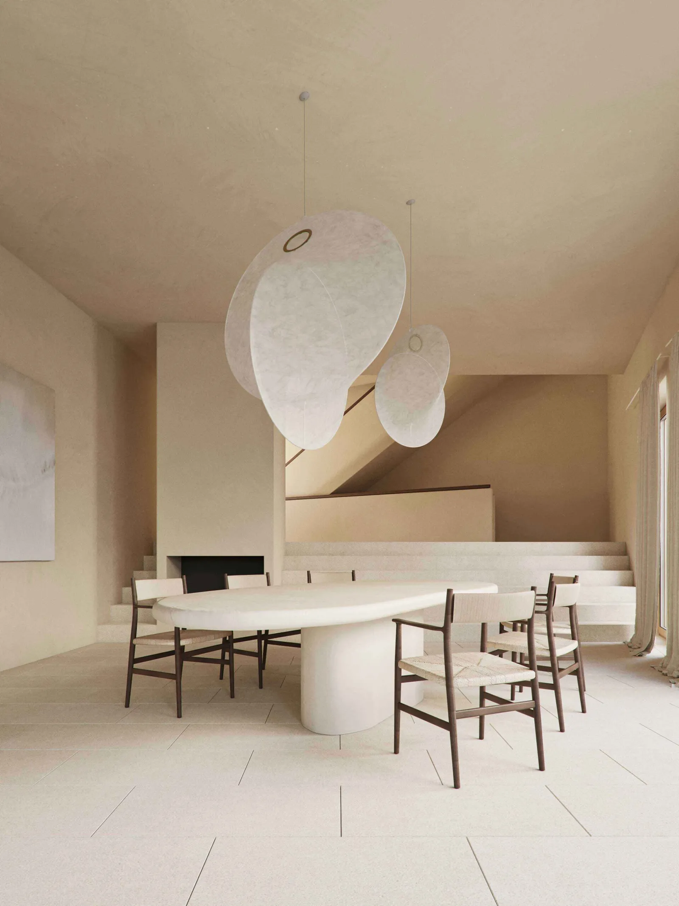
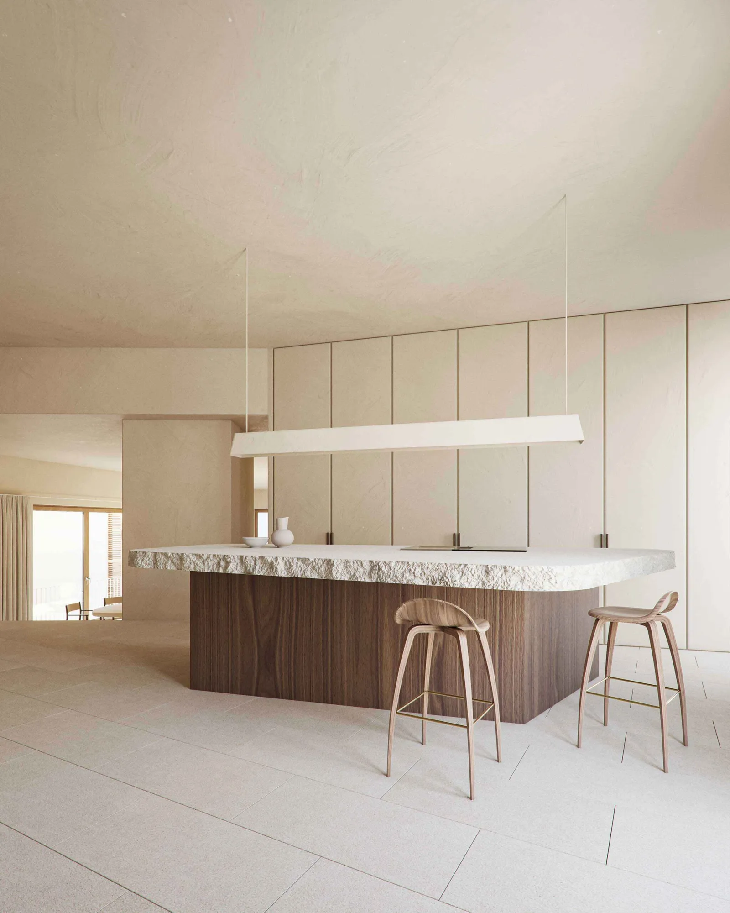
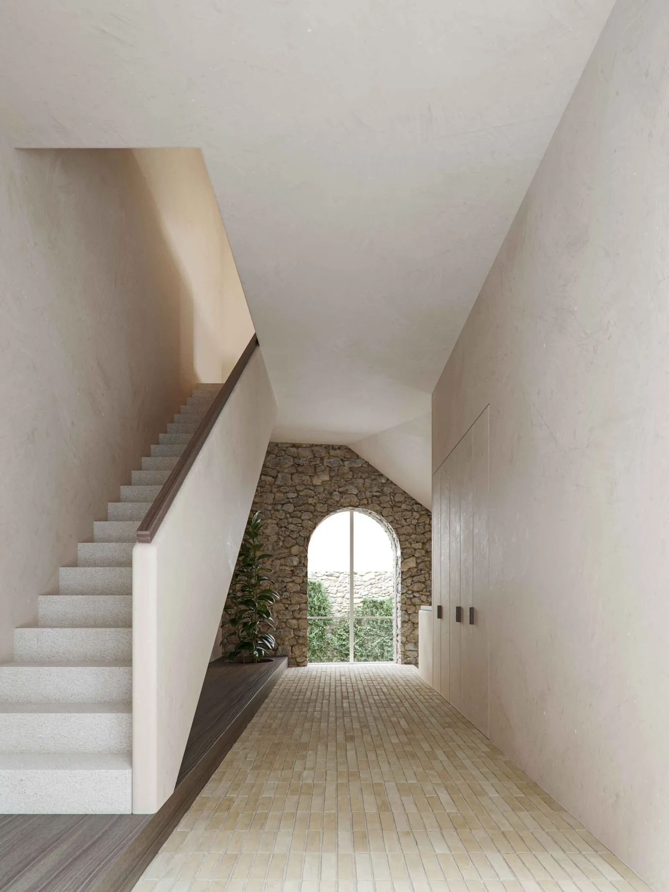

I still don’t know where this will lead. But I love developing new ideas, just based on good energy and shared curiosity.

And if it goes nowhere - I had a great few days with Angel. I learned a lot of new things, had inspiring conversations, and left with even more curiosity than before. That’s already more than enough.

Oh - and if you’re dreaming of a house on Mallorca… I know someone who can make it happen 😉
