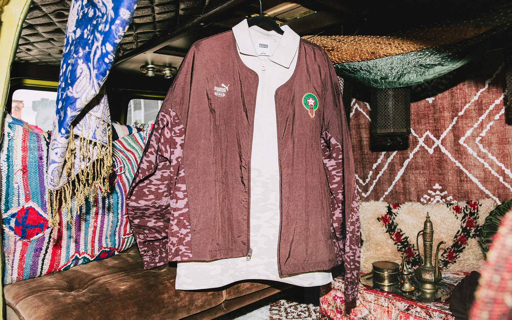
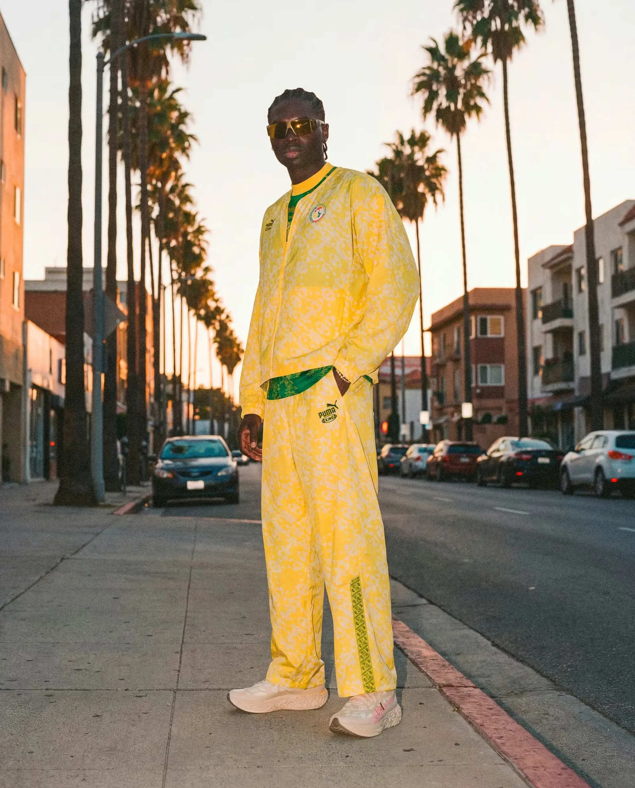
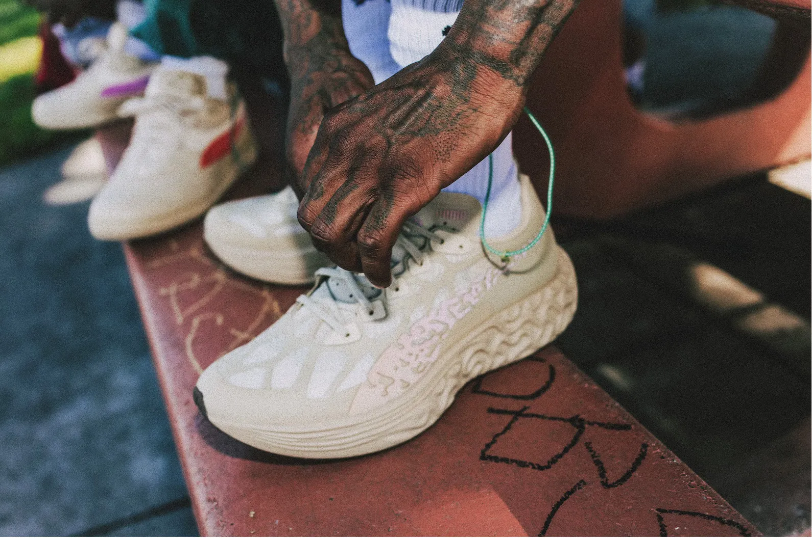
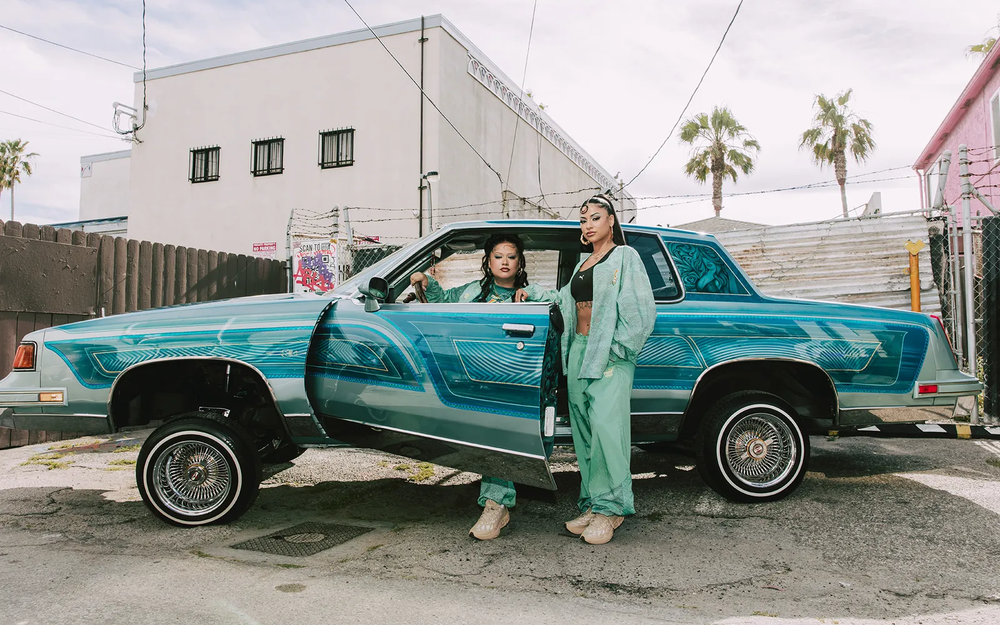
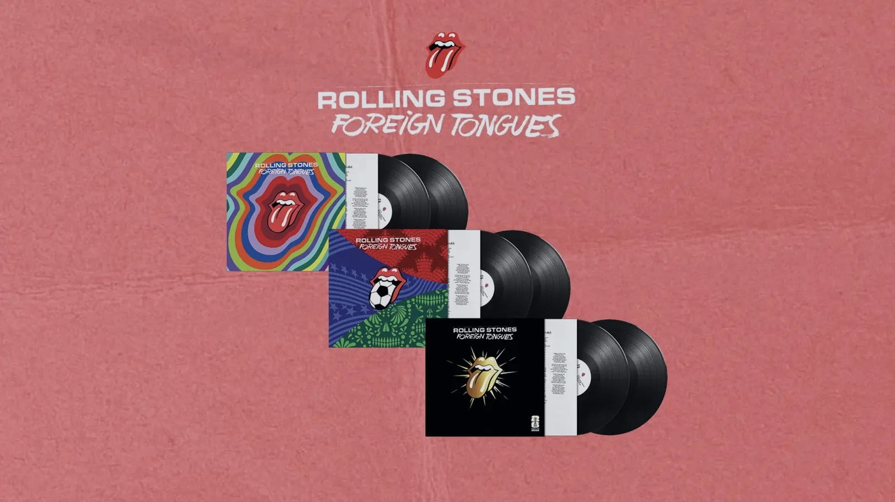
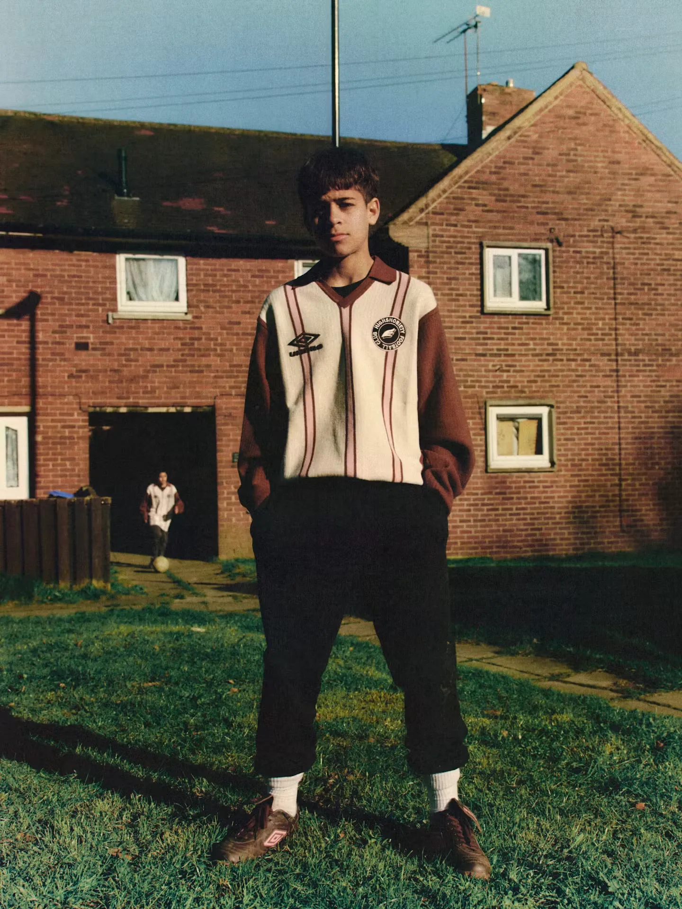
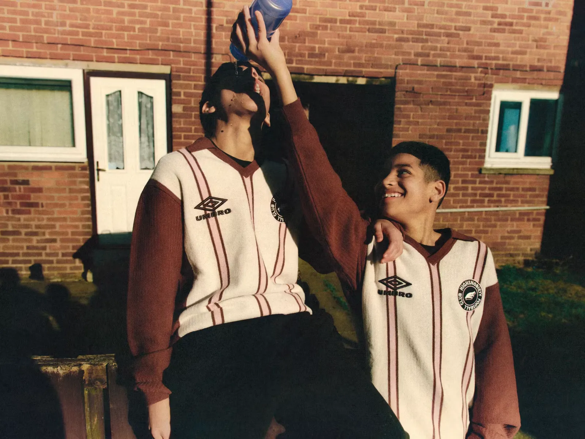
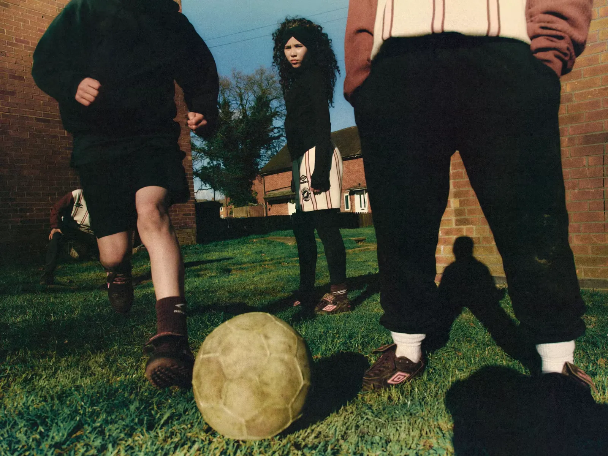
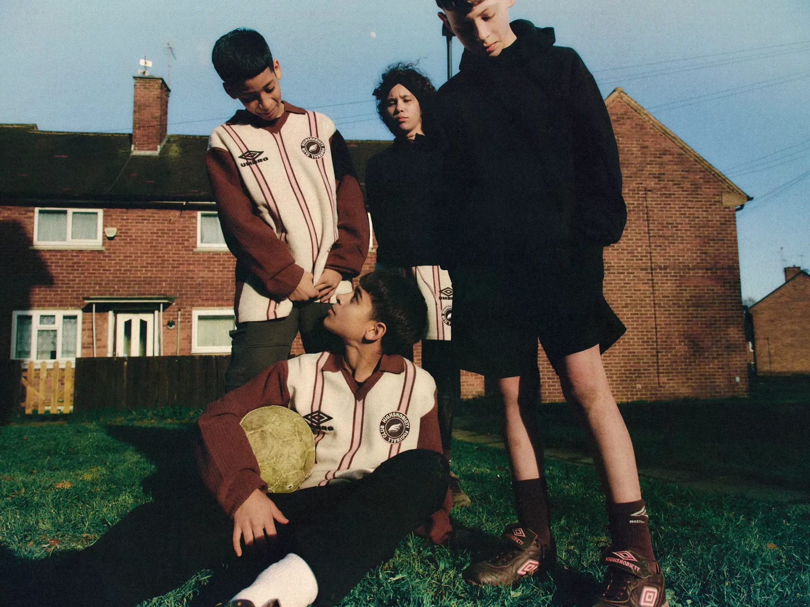

Puma’s World Cup didn’t lead with the shirt players actually play in. It arrived in chapters.

The federation kits landed in March. Then on 4 June came the part with a designer’s name on it: a collaboration with *[Salehe Bembury,](https://www.instagram.com/salehebembury/)* the man behind some of the most chased sneaker collaborations of the last few years (New Balance, Crocs, his own label), covering travel wear and goalkeeper kits for the 11 national teams Puma sponsors, among them Morocco, Senegal, Ghana, Côte d’Ivoire and Portugal.

Travel wear is the clothing players wear arriving at the tournament and moving between matches. Bembury reworked Puma’s KING line, the brand’s old football tracksuit, plus lifestyle jerseys, tees and shorts, and grounded it with a shoe, the Velum 1, finished so it changes colour in sunlight. He drew a separate visual code for each country off its landscape and architecture, so the Swiss keeper gets a grey mountain on black and Portugal gets pink covered in his swirling lines. Puma threw a launch in downtown LA the day after.

The match-shirt conversation belongs to adidas and Nike. Of the 48 teams, adidas dresses 14 and Nike 12; Puma has 11. And on the shirt a player actually wears, there’s very little daylight between any of them on look or tech. So Puma made a deliberate choice. Instead of fighting on the shirt, it went after the parts of the kit nobody guards.

The goalkeeper shirt has always been football’s odd licence, the one place loud design is allowed, going back to Jorge Campos painting himself into the 90s in Mexico. And the travel wear, the fit a player wears walking off the team bus, has turned into its own genre, photographed and picked apart like a runway. Arrival outfits get their own posts now.

Puma turned both into product. It took the margins of the kit, the keeper and the commute, and made them the design story, then hired someone the sneaker world already trusts to sign it. *[SoccerBible made the case back in May](https://www.soccerbible.com/features/2026/05/why-football-needs-salehe-bembury/)* for why football needed a designer like Bembury, someone whose instinct comes from outside kit design. This is Puma acting on it. The match shirt stays locked and federation-controlled. The clothes worth talking about moved to where the rules are loose.

Whether it sells is a separate question. Prices run from about $60 to $240, and a goalkeeper shirt is a narrow thing to hang a fashion line on. The logic still travels, though. When the headline product looks the same across all three brands, the design value leaks to the edges, and that’s where a brand without the biggest cheque can still say something.

I’d watch whether adidas and the federations start treating travel wear and keeper kits as a named-designer slot by default. Bembury’s name does something a media budget can’t, and Puma spent it on the parts of the kit everyone else leaves alone.

## Also on my radar

- *[FIFA’s music move](https://inside.fifa.com/tournament-organisation/commercial/media-releases/rolling-stones-fifa-unite-world-cup-2026-celebration-football-music-culture)* is a three limited-edition Rolling Stones vinyls and a remix on the official album. For a World Cup hosted across North America, where reggaeton and hip-hop own the host cities, the soundtrack’s headline act is a 60-year-old British rock band. Read that as a hedge.

- Sergio Ramos launched a clothing label, *[ONE](https://one-newyork.com/)*, around mid-June, limited runs with New York designers. A late-career player building an owned brand instead of renting his face to one.
- *[Highsnobiety and Umbro UK](https://www.highsnobiety.com/l/highsnobiety-umbro/)* dropped a limited collection reworking Umbro’s vintage football look, built around the debut boot of a new turf-boot line (boots made for artificial pitches) produced in Sheffield, Umbro’s first performance footwear made in England in years. A culture publisher designing the kit, and a heritage brand bringing manufacturing home.

- Eleven Premier League clubs carried betting brands on their shirt fronts last season, and a voluntary gambling ban lands this summer, *[so most are hunting replacements](https://mysteryshirtinabox.com/en-de/blogs/news/premier-league-clubs-without-shirt-sponsors-2026-27)* before August. Whoever they pick tells you which categories still think a shirt front is worth the money.

That’s it for today.
