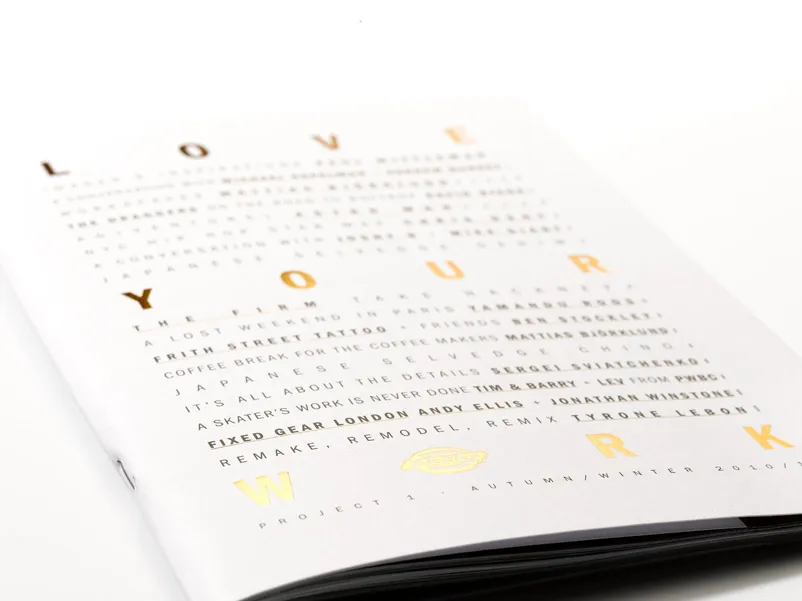
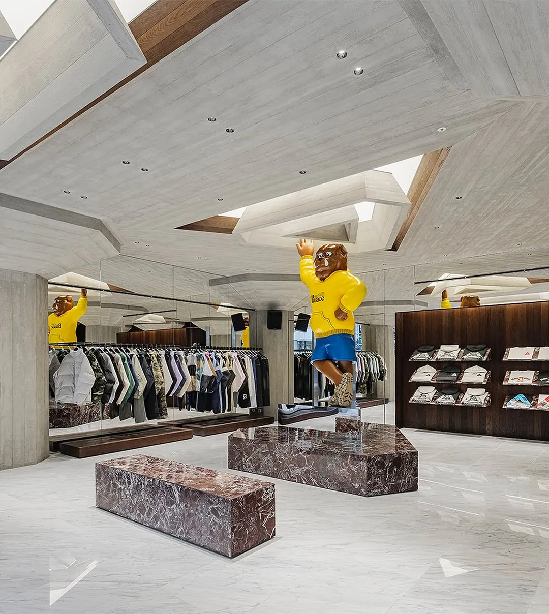
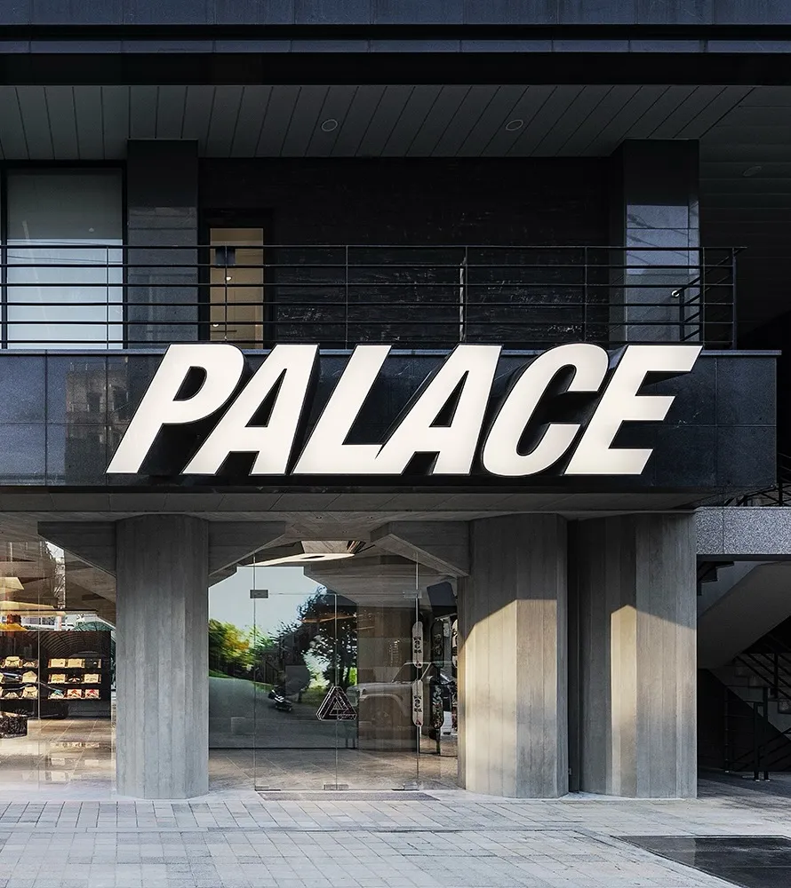
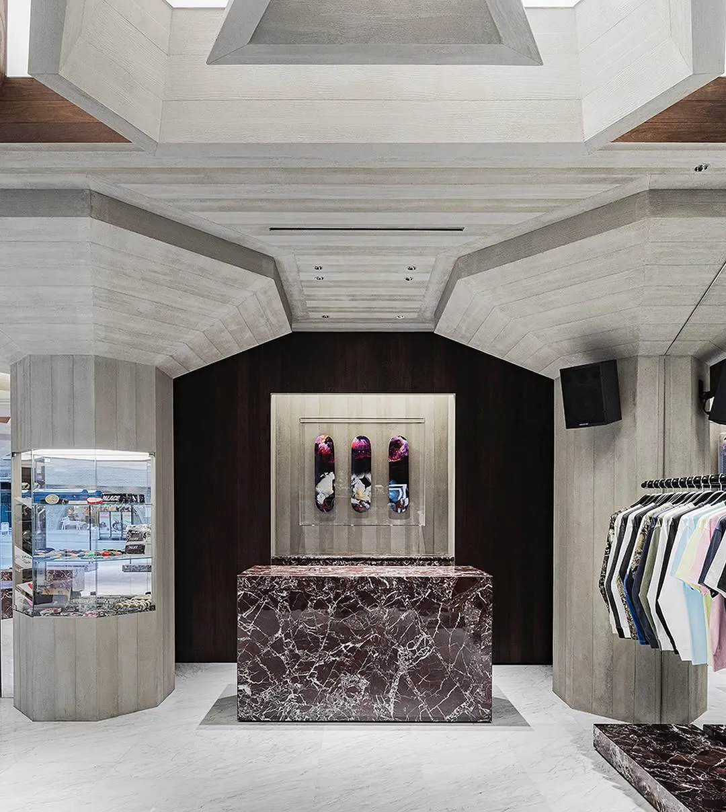
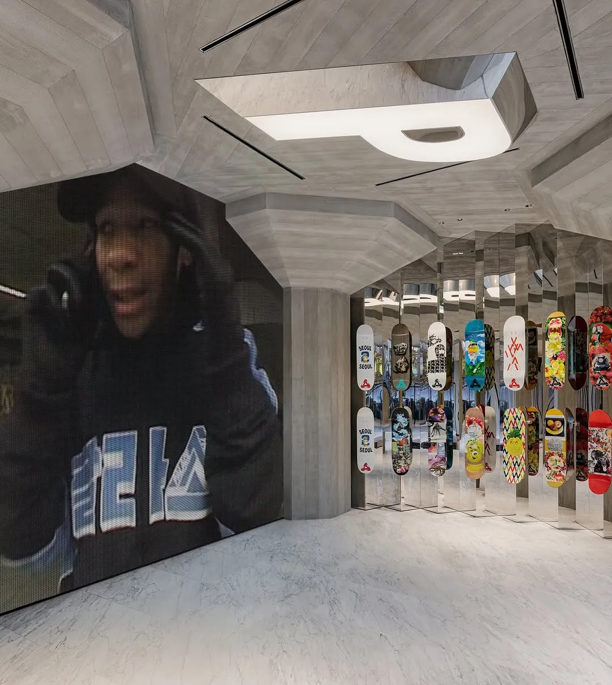
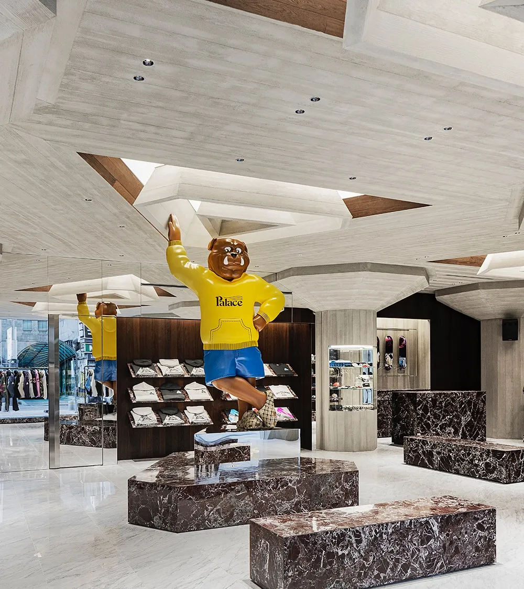
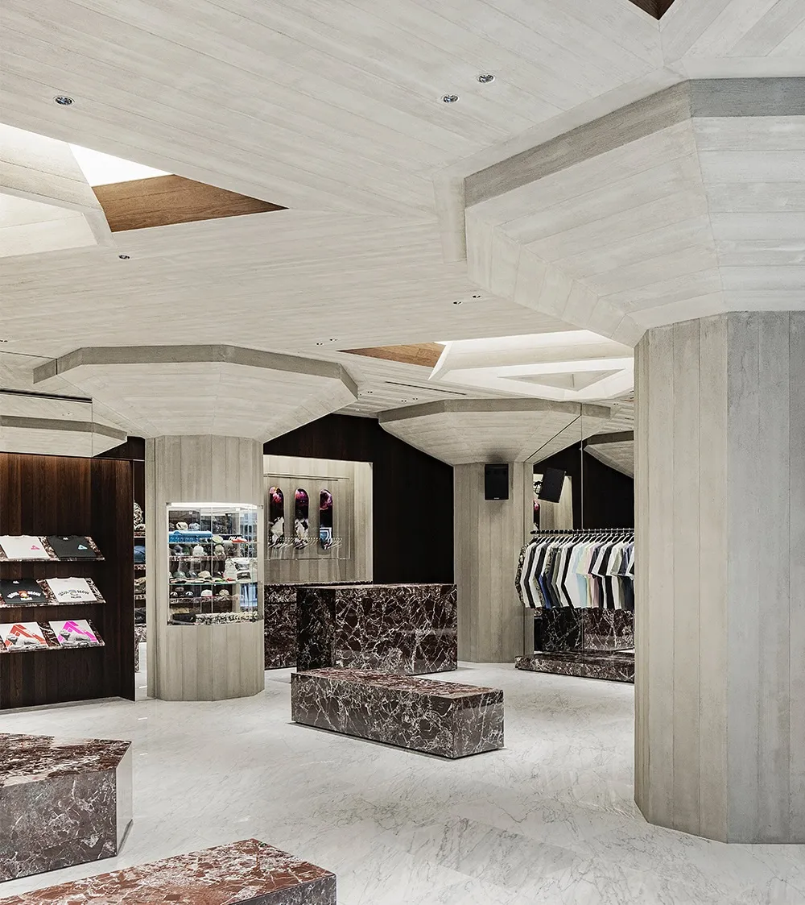
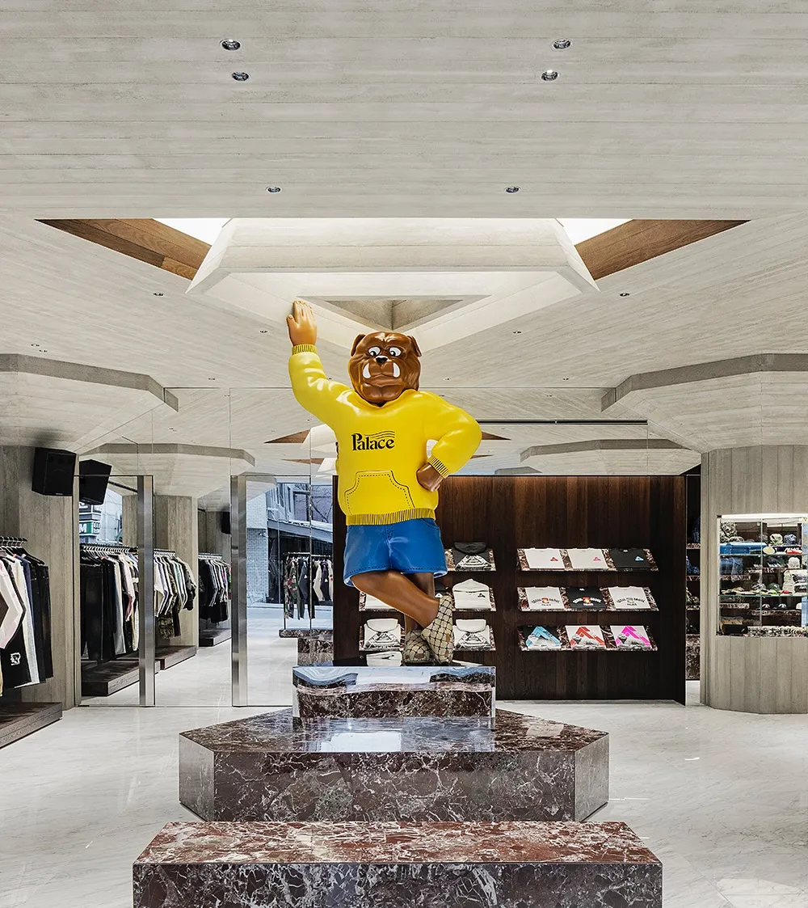
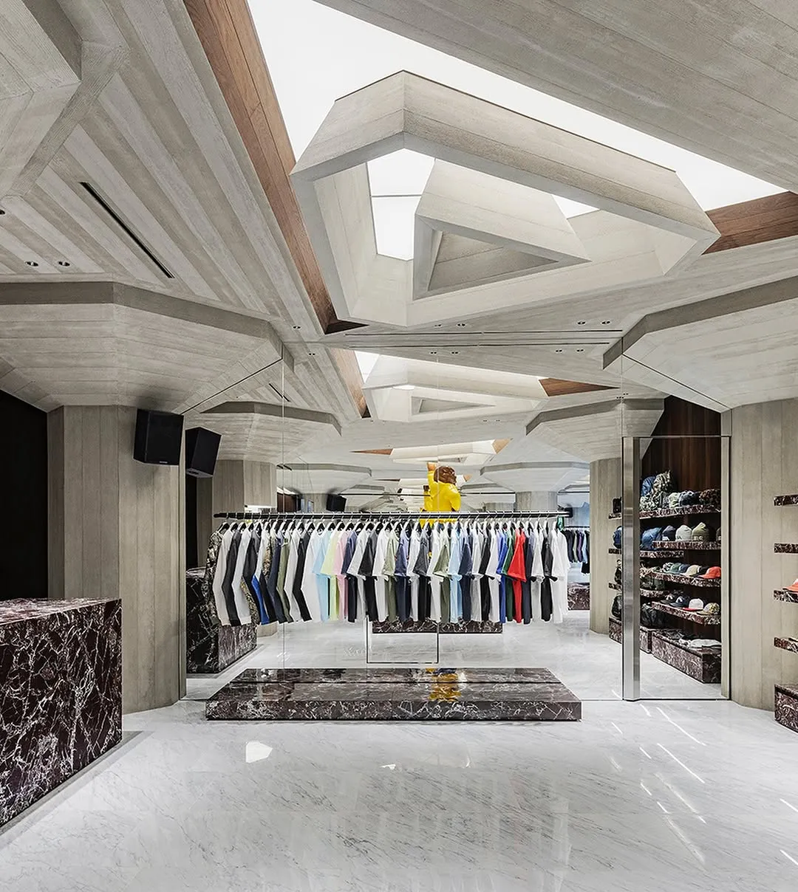

I have a long and personal history with the brand. In 2009, I was responsible for the Dickies brand in Europe, and we did a limited bookzine called ***Love Your Work***—featuring Lev Tanju and Palace. Actually, Lev even photographed a few images for it (some images of the book below): ***A Skater’s Work is Never Done.***

I also got to know Lev’s two other co-founders, Gareth and Marshall—happy to still call Marshall a friend today. The three of them met at **Slam City Skates**, the legendary skate shop that Gareth and Marshall owned.

Around the launch of the booklet, Palace had just opened their first pop-up store. No crazy lines, nothing. You could just walk in and hang out with the gang. (I bought a shirt with a parrot on the left side—will never forget that.)

Fast forward to today, and the brand is stronger than ever, opening a new store in Seoul very soon.

So happy to see how they’ve built the brand and the company—and I still don’t feel too old to wear their stuff. 😊

