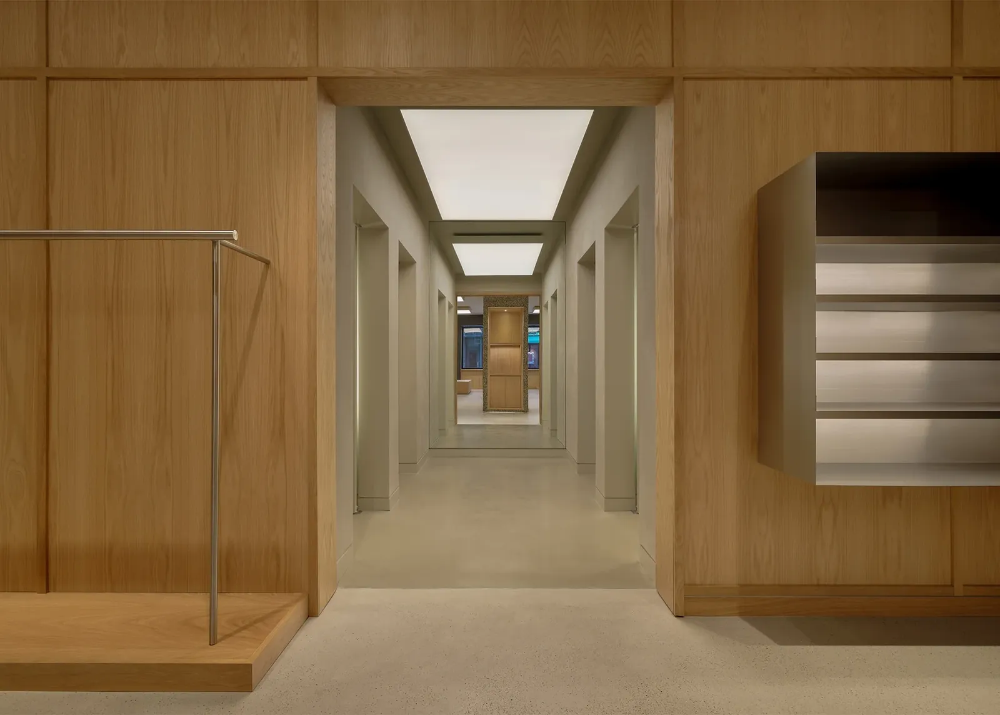

In 1995, I came to Hamburg for a job at Eastpak. My boss was also handling the distribution for Stüssy in Germany. On the ground floor, we had the Eastpak warehouse; on the first floor, we had the Stüssy stock—a few hundred square meters full of Stüssy. As employees, we only paid wholesale minus 30%—basically a third of the store price. I had nothing but Stüssy.

30 years later, kids are lining up for Stüssy again. In the meantime, Stüssy “was gone” two or three times. But now, it’s back stronger than ever—and still family-owned.

*2025 - Stüssy Store, 50 Prince St, New York*

Shawn Stüssy left the company back in 1996, with Frank Sinatra (no joke, not the one you’re thinking of) taking over his shares. The Sinatras still own it 100% today. I had the chance to talk to Shawn Stüssy a few times in 2008—something I’ll never forget.

In 1998, I visited the first Stüssy store in Soho—with a huge blue flag in front. I still have some photos somewhere, but all analogue, packed away in a box… (Side note: James Jebbia was a store manager in that store—he later founded Supreme.)

Today marks the opening of the new Stüssy store in NY, 50 Prince Street.

It looks amazing!

