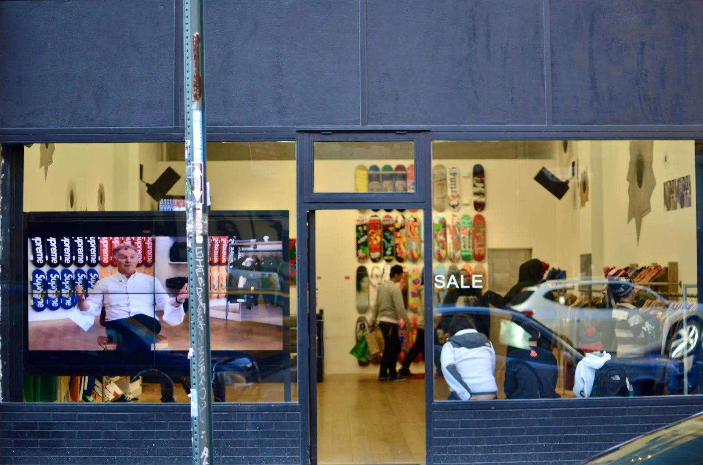
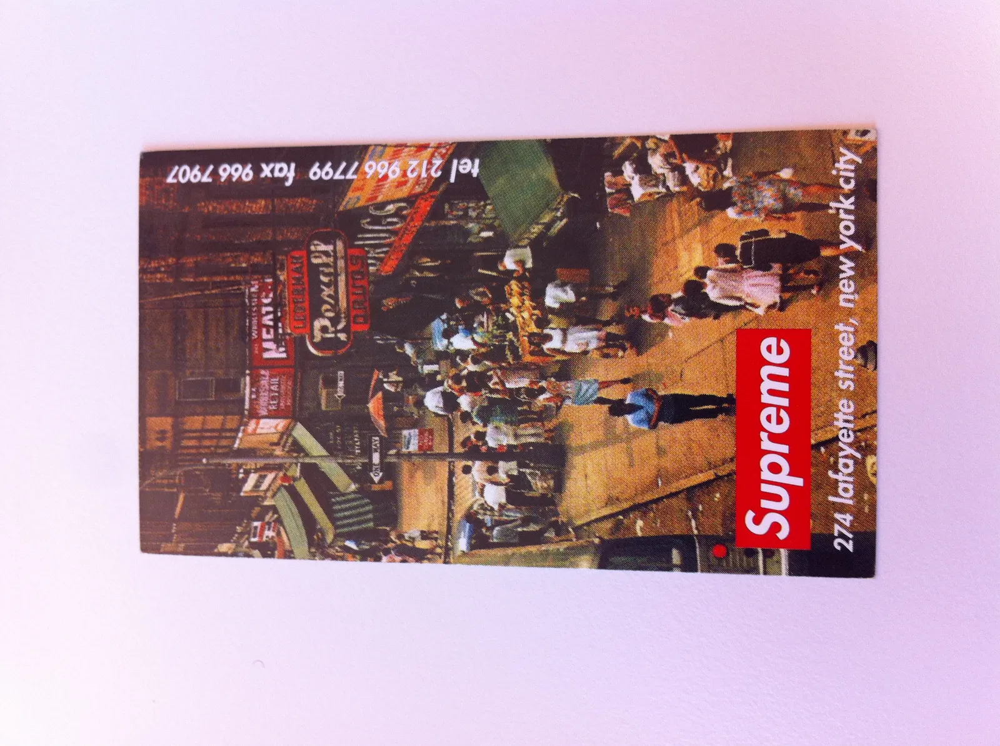
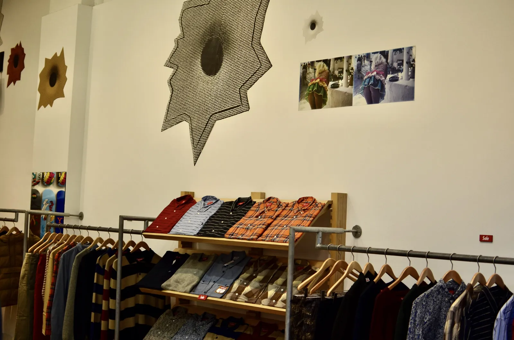
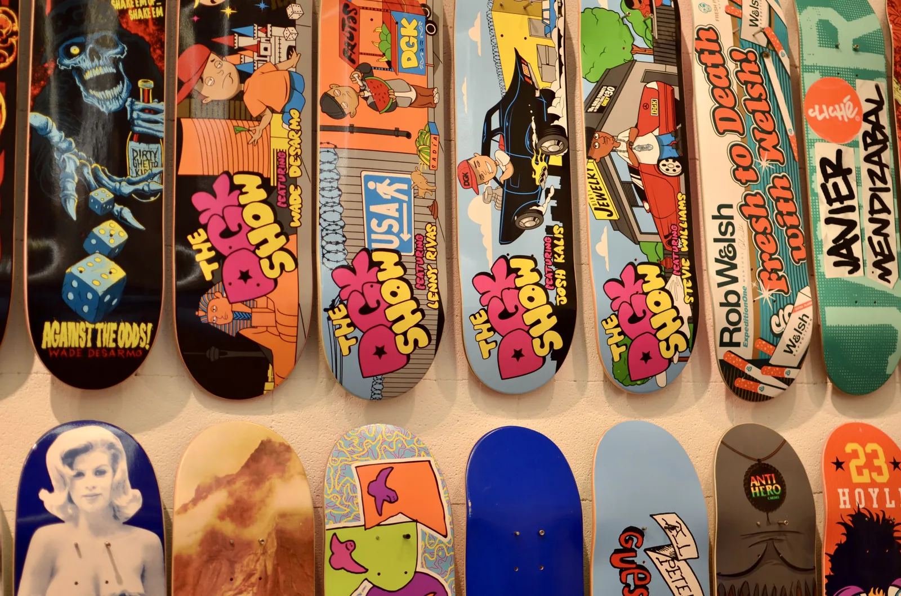

274 Lafayette Street, NY. A small store. A red sign outside. No line, nothing. Some Skate Decks on the wall. Some products left and right. Their own stuff.

It was the first time I saw a skate shop producing their own clothing.

In 2008, I saw the Kermit x Supreme launch in Los Angeles. In 2012, I returned to the original store on Lafayette Street. Not much had changed in the store (sadly, they closed the location in 2019). But in those 14 years, Supreme became a global brand, launching products that people would stand in line for hours for.

*Supreme Store NY, 2012*

Supreme was always a great example of how to build a brand and grow a business simultaneously. They could have sold 10x the products they sold, but they never did. They did the best collaborations with other brands. Who else would have partnered with Kermit the Frog? Kate Moss? Louis Vuitton? Fender? North Face? And so on.

*Business Card from 1998*

But what does a founder do with his business? Keep it "forever?" Or sell it one day?

James Jebbia decided to sell Supreme. First, a small stake, and in 2020, the VF Corporation took over and *[paid 2.1bn USD](https://www.vfc.com/investors/news-events-presentations/press-releases/detail/1741/vf-corporation-completes-acquisition-of-supreme)*.

*Supreme Store NY, 2012*

Many people wondered how VF would ever make that money back. If you grow the brand too much, it will have issues remaining as strong as it was. But usually, it is precisely what publicly traded companies need to do: return their investment quickly.

Today, we can probably say that they lost faith in their original vision, as they sold Supreme for *[1.5bn USD to EssilorLuxottica](https://www.essilorluxottica.com/en/newsroom/press-releases/essilorluxottica-to-acquire-supreme-from-vf-corporation/)*.

You probably have never heard of that company. They have a few brands in the eyewear market — Ray-Ban and Oakly — and many luxury brand licenses.

*Supreme Store NY, 2012*

I'm curious if they can give Supreme the autonomy it needs to focus on its brand again to rebuild the cultural relevance it once had.

I hope they see it as a long-term investment. If they want to squeeze out the brand, it will die pretty quickly. I'm keeping my fingers crossed that they have the right people making the right decisions now.
