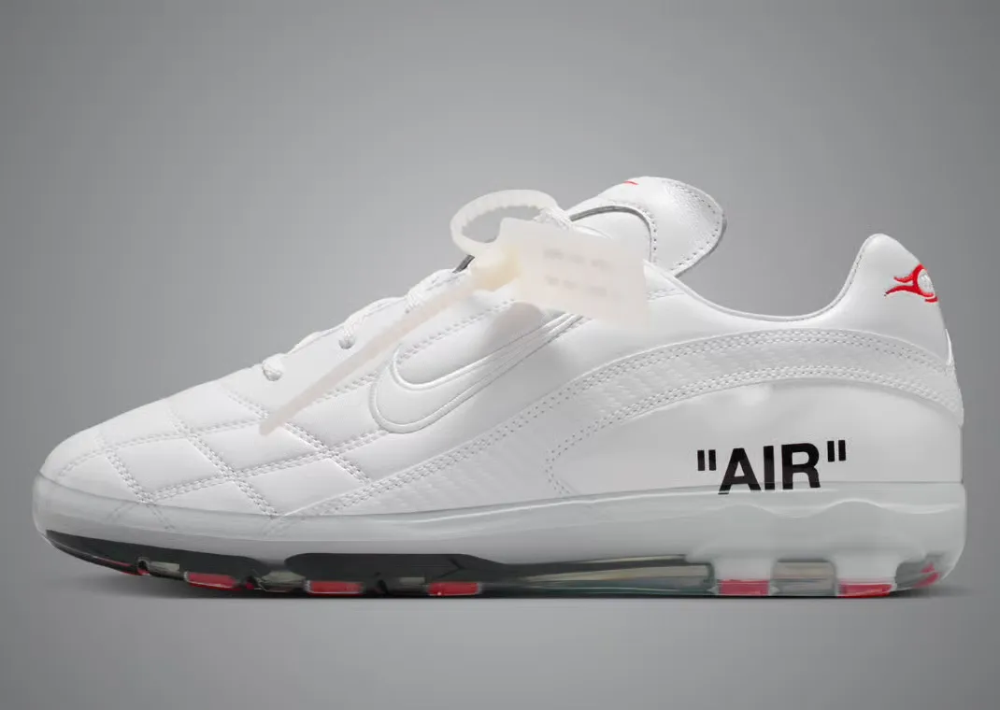
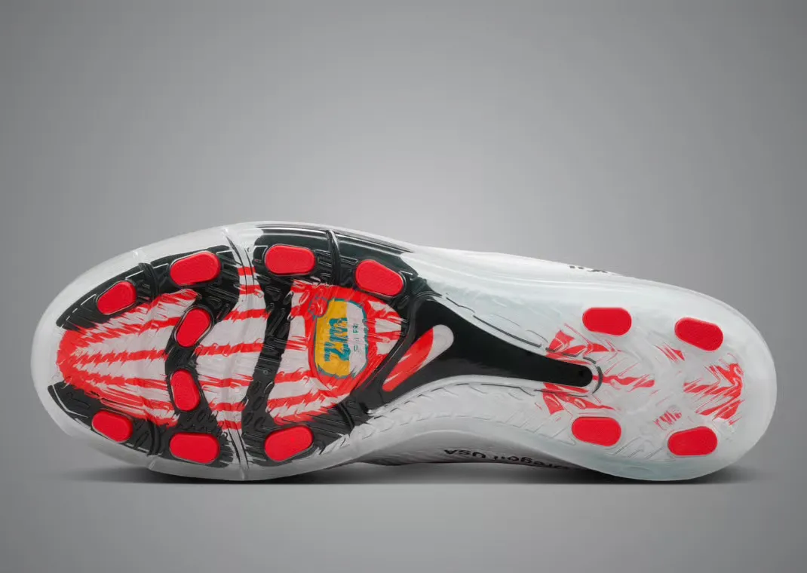
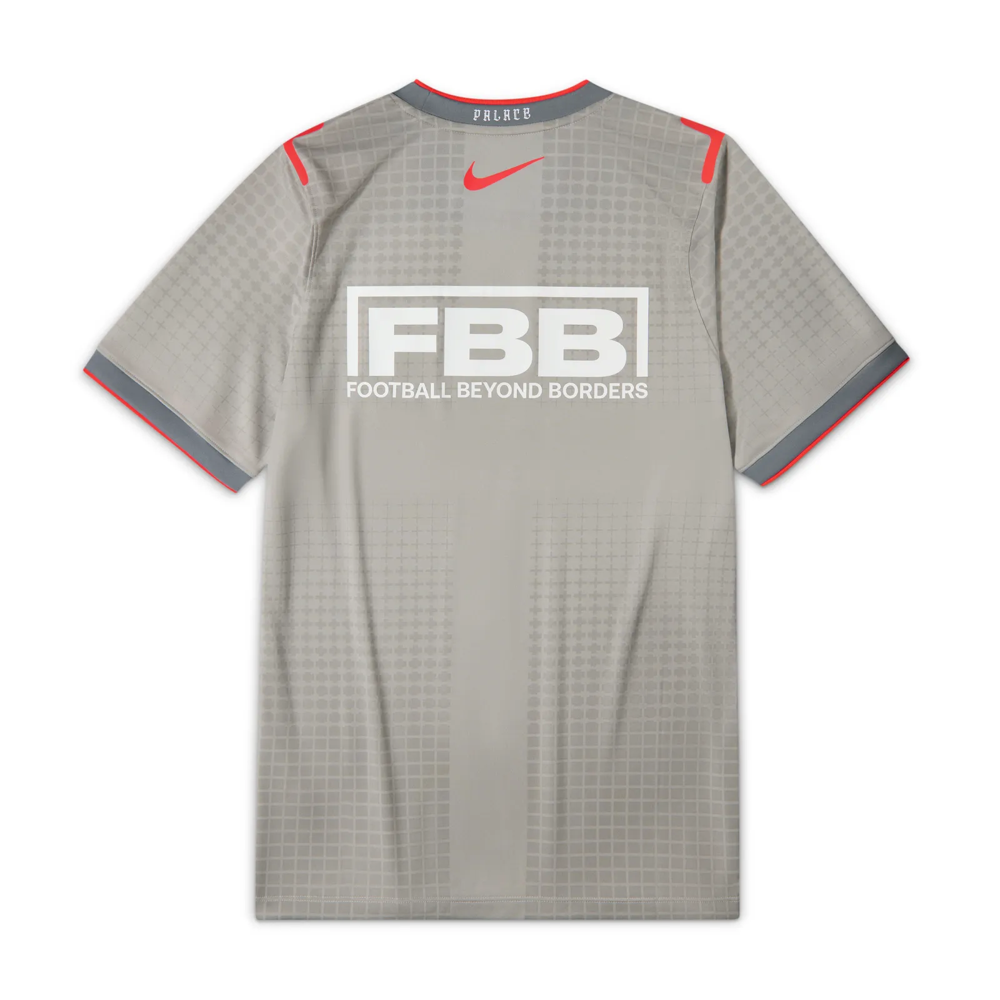
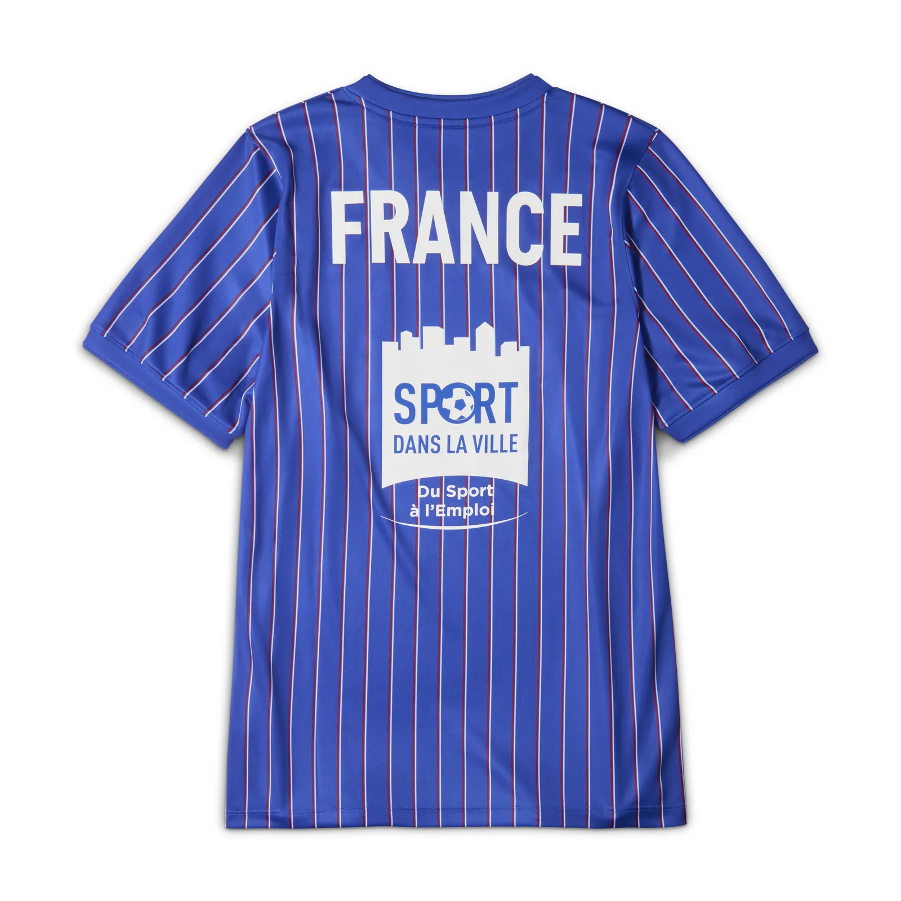
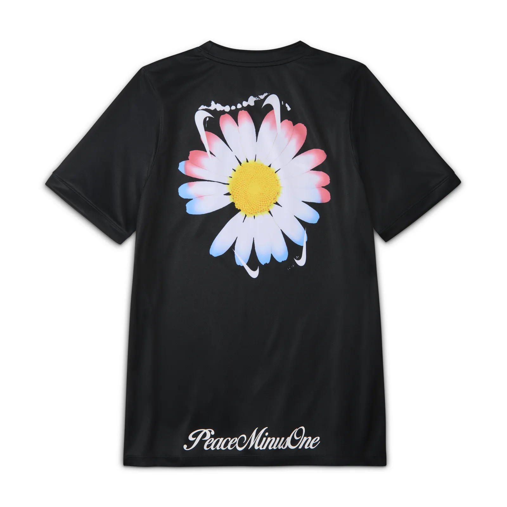
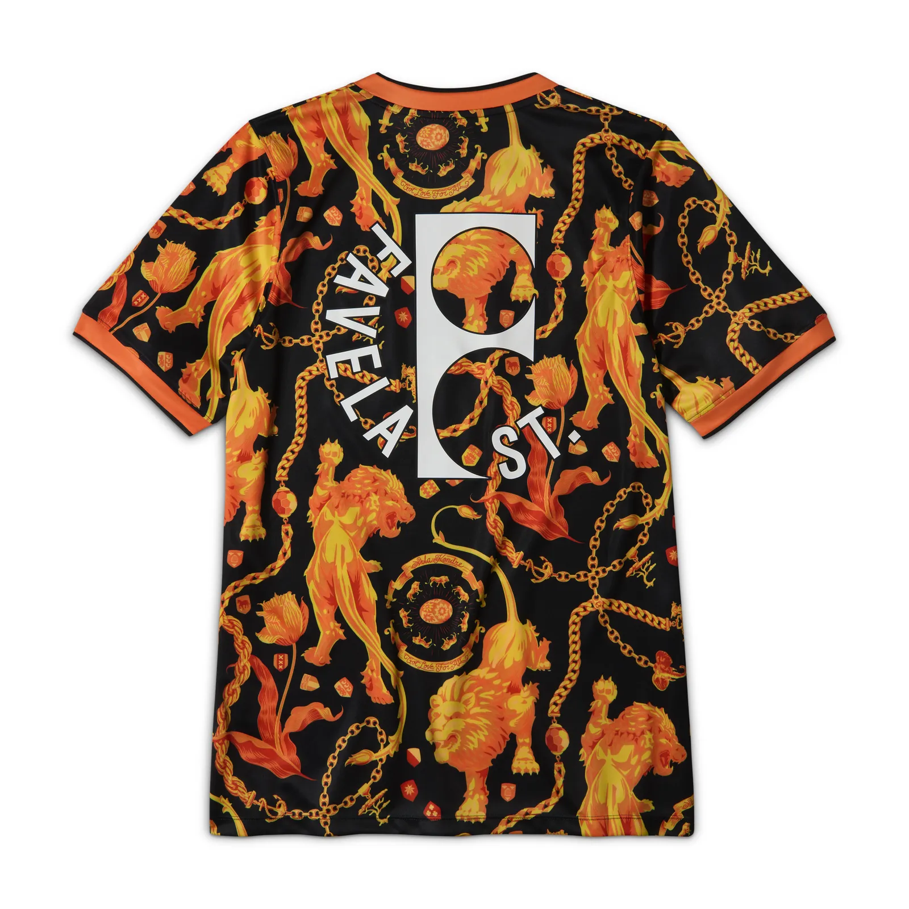
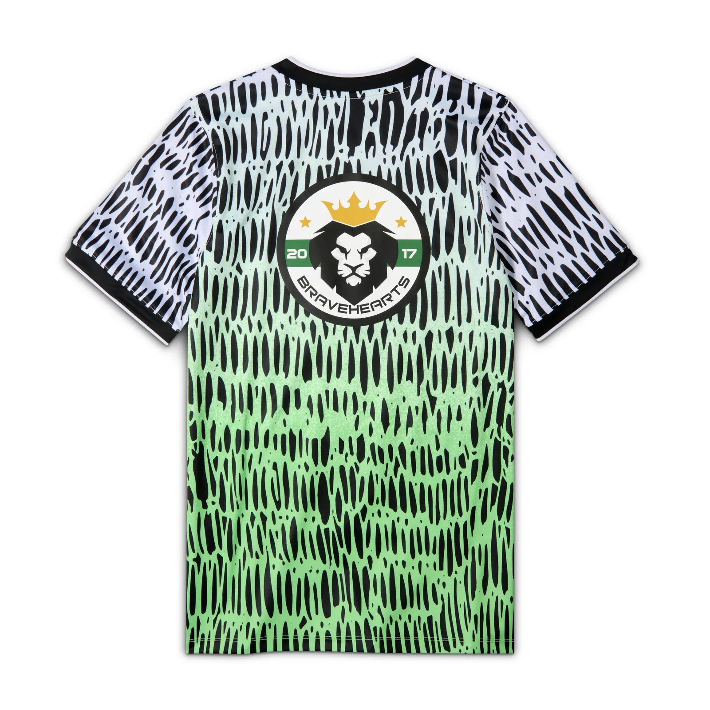
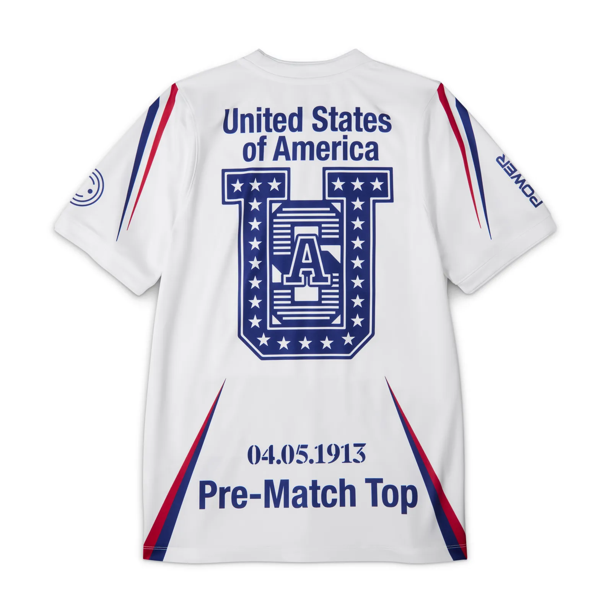
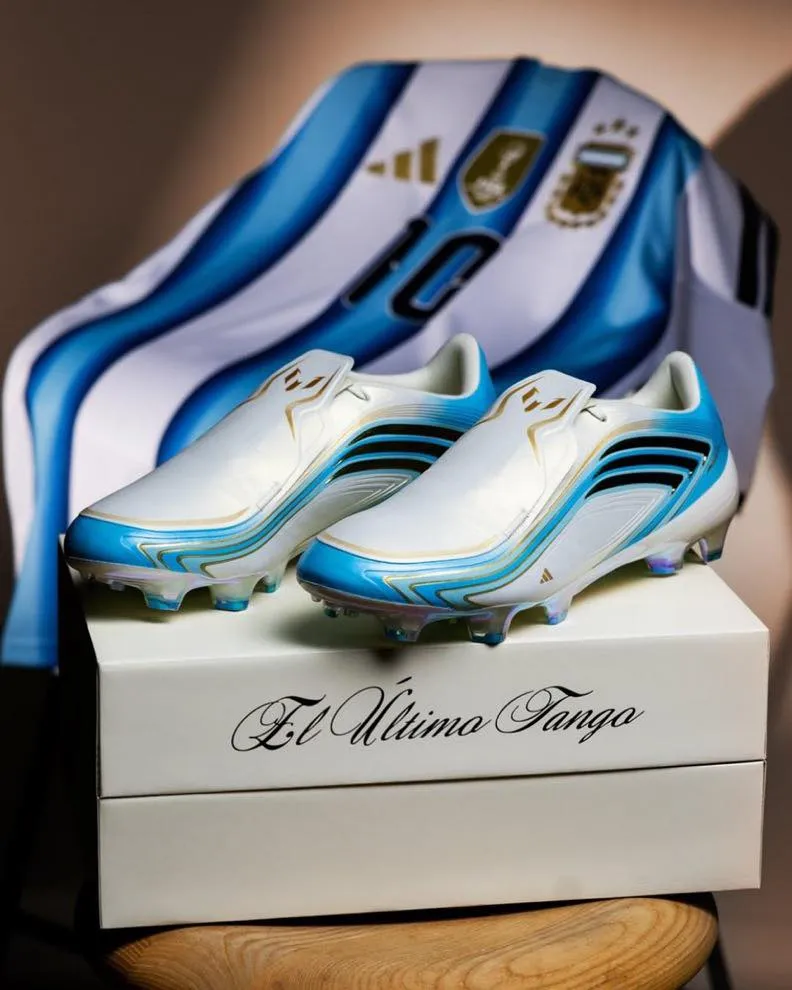
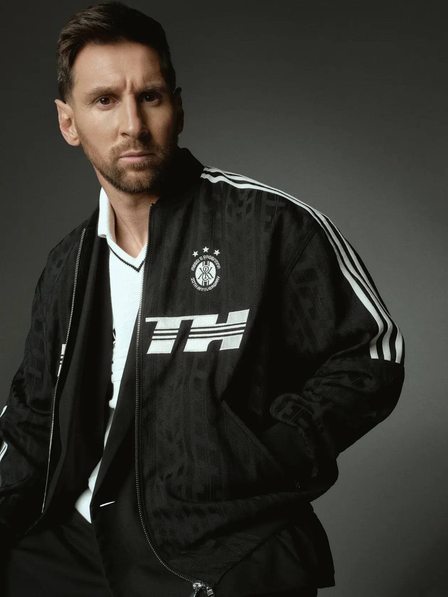

Nike’s headline launch for this World Cup is a collection called X2, and it barely touches a match. It’s a fashion line, built to be worn off the pitch: seven countries at the tournament, each paired with a fashion label from that same country.

England with Palace. France with Jacquemus. The Netherlands with Patta, Canada with Drake’s NOCTA, Nigeria with the artist Slawn, South Korea with G-Dragon’s PEACEMINUSONE, the US with the Virgil Abloh archive.

The hero piece is a sneaker called the Cryoshot. Nike pulled famous boots from its archive (the Tiempo ‘94, the Mercurial Vapor R9) and sealed the studs inside a clear sole, so a real football boot turns into a street shoe you can actually walk in. $210 a pair, already reselling for four figures before it’s even out.

It drops 11 June, the same day the tournament kicks off.

## WHAT REALLY HAPPENS

Everyone’s going to write about the designers and the resale prices. That’s the easy half. The part that matters is the charities.

Each of the seven countries is tied to a real youth sports charity: England with Football Beyond Borders, France with Sport dans la Ville, Canada with Canadian Women & Sport. And the deal goes further than a donation. The charity’s logo goes on the warm-up shirts the national teams actually wear on the pitch before kickoff, and Nike says it’s a long-term commitment, not a one-off cheque.

That matters because Nike is selling a hyped fashion launch off a tournament it doesn’t own, in the loudest brand summer of the year. The charities are how it does that without looking like it’s just cashing in.

For thirty years a brand bought its way into football by sticking a logo on a board. That still gets you seen. It doesn’t get you trusted, and trust is what makes a kid save up for the shoe and a parent feel fine about it. Tying the launch to local youth clubs is Nike trying to buy that trust.

Whether it works comes down to one thing: did they put the years in. The brands that pull this off build with these communities long before they sell anything off them. Carhartt sat inside workwear and skate culture for decades before anyone called it fashion. The ones that bolt a charity on in June, grab the quick lift and vanish in August, get found out fast. My read: this one’s mostly real, with a thin layer of World Cup opportunism on top.

## ALSO ON MY RADAR

Five more moves this week, one line of read each.

- adidas leaned on grief, launching the F50 “[El Ultimo Tango](https://www.footyheadlines.com/2026/05/nike-and-adidas-2026-world-cup-packs.html),” a Messi signature framed as his last World Cup boot. When the products converge (the Nike and adidas packs look almost identical this year), the story carries the gap: adidas is selling the end of an era while Nike sells the start of a trend.

- [Kith, adidas and Messi](https://www.soccerbible.com/lifestyle/clothing/2026/05/kith-adidas-have-built-an-entire-messi-universe/) built a whole capsule around his career, reissuing the 2006 F50 and the COPA Mundial as collectibles. Messi licensed his whole timeline here, the career as a catalogue, and every tier-one player’s agent just took a note.

- Stephen Curry signed a reported 10-year, [$400m deal with China’s Li-Ning](https://www.espn.com/nba/story/_/id/48940127/stephen-curry-signs-chinese-sportswear-company-li-ning) that lets him sign his own athletes under Curry Brand. The athlete as a sub-brand that recruits other athletes is the model footballers keep circling. Watch for the first European player to ask for roster rights, not just a signature shoe.
- Ampere projects [FIFA’s 2026 sponsorship haul near $2.4bn](https://www.sportspro.com/analysis/sponsorship-marketing/fifa-world-cup-2026-business-revenue-ticketing-broadcast-sponsorship/), up about 37% on 2022. The finance desks will all quote the number. The thing under it: $2.4bn still only buys logos, which is exactly why the smart brands are paying extra for the charity layer and the culture collab on top.
- [FIFA and Lenovo](https://www.euronews.com/next/2026/06/01/ai-avatars-and-smart-footballs-inside-fifas-high-tech-2026-world-cup) handed all 48 teams the same generative analytics tool, plus AI avatars and sensor balls. When everyone gets the same brain, the edge moves to whoever owns data nobody else has. The next moat in football is proprietary data, the stuff you collect yourself.

That’s it for today.
