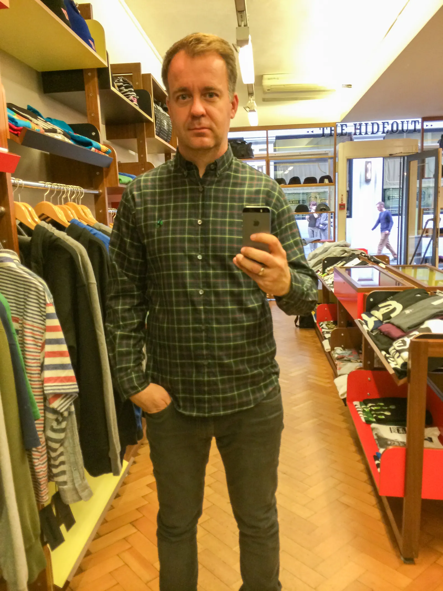

Hidden on Upper James Street in Soho, The Hideout wasn’t just a store. It was a signal. A quiet authority in a loud world. A place that didn’t chase culture but defined it.

Founded in 1999 by Michael Kopelman and originally known as Hit and Run, the shop was later renamed The Hideout. Together with Fraser Cooke, Michael built a retail space that connected London, Tokyo, and New York long before hashtags did. It was the first place in Europe where you could find brands like Supreme, A Bathing Ape, WTAPS, Neighborhood, Undercover or visvim. Not because they were hyped, but because they were good.

The interior felt like an old saloon. Aged wood, clean lines, no distractions. It was a physical manifestation of taste.

During my time at Dickies, I had the chance to work with Michael on a small capsule collection. Based on classic workwear silhouettes, sold exclusively at The Hideout. It was one of those rare collaborations where product, place, and people all made sense.

That store shaped me.

Not just in terms of taste or brand knowledge, but in understanding how a curated space can build meaning. It taught me that retail can be a point of view. That some shops don’t need big windows or big ads. They just need the right people walking through the door.

The Hideout officially closed in 2014, a victim of rising rents and the shift to online. But truth is, stores like that were never meant to scale. They were meant to be felt. Remembered. Missed.

And maybe that’s what I miss most today.

In a time of endless product and instant everything, I still believe in good curation. In people who know. In spaces that give context. In walking into a store and discovering something that wasn’t made for the algorithm but for a certain kind of person.

And I wonder. If The Hideout hadn’t closed in 2014, would it be even more relevant today?

Because people are craving real experiences again. They want to feel something. They want places that make them think, connect, belong.

Especially in a city like London, I believe a concept like this wouldn’t just work again. It could lead again.

Maybe that kind of retail isn’t dead. Maybe we just need more people like Michael.

PS: The Hideout in October 2013 and young me trying on a shirt…
