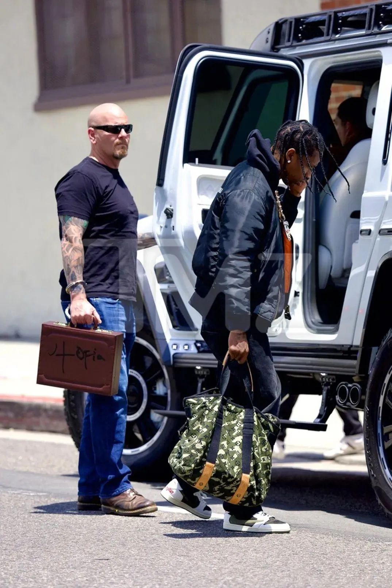
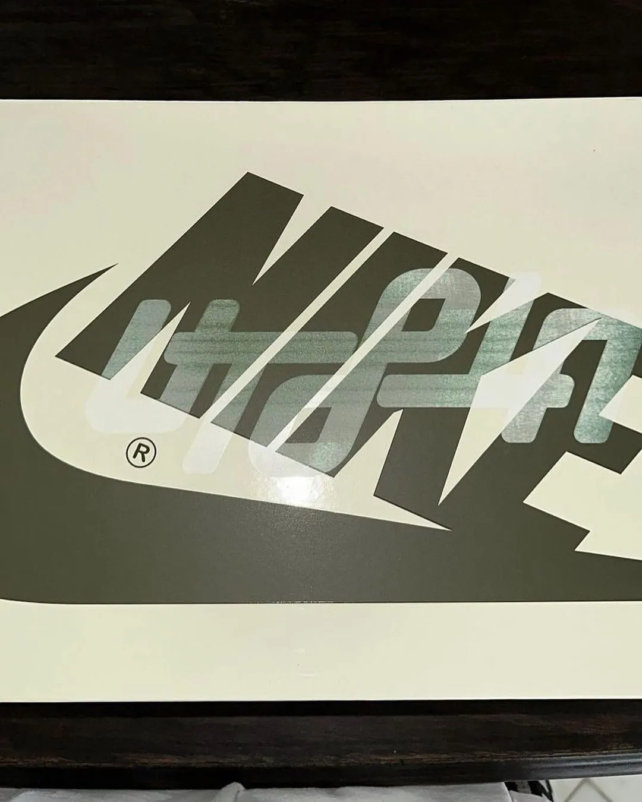
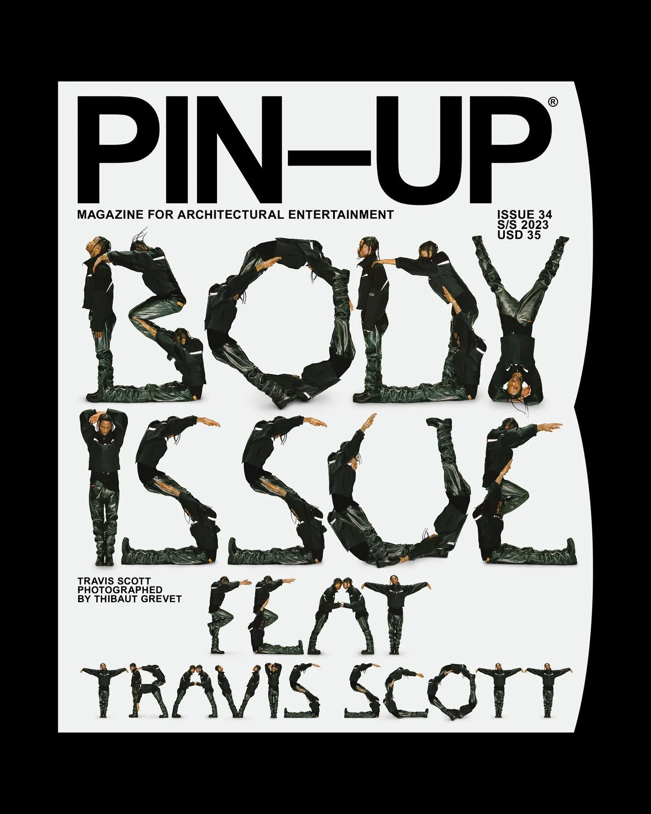
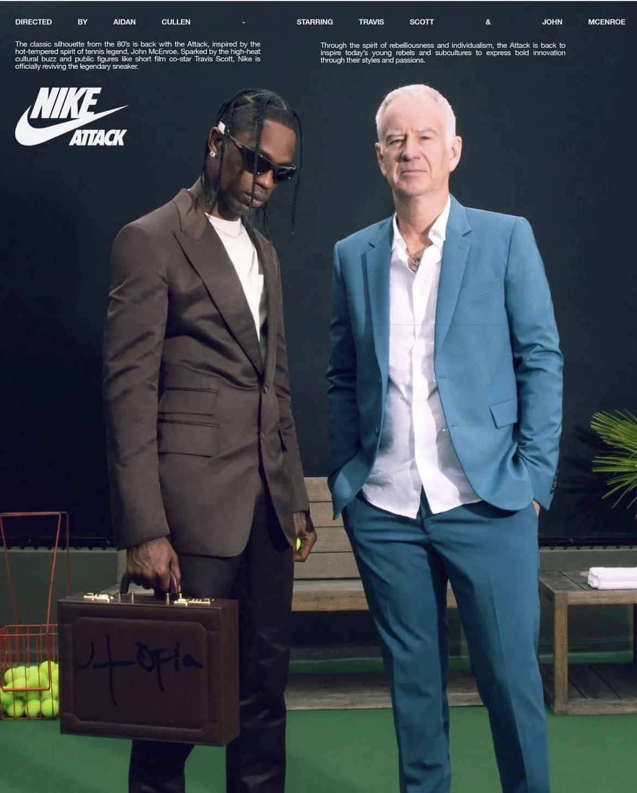
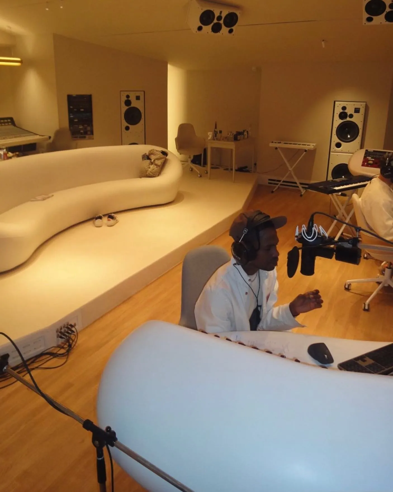
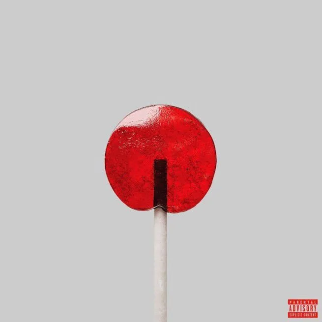
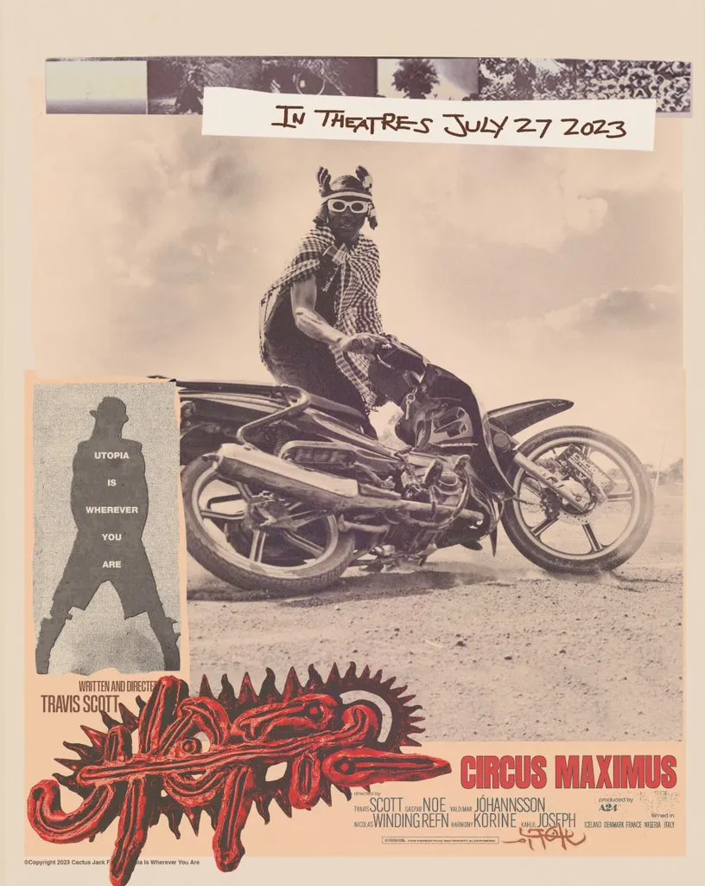
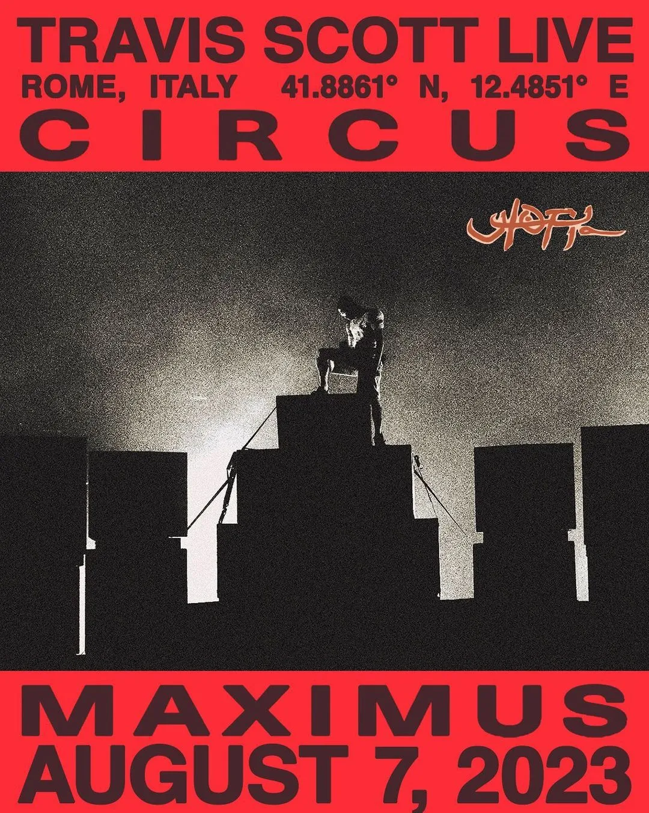
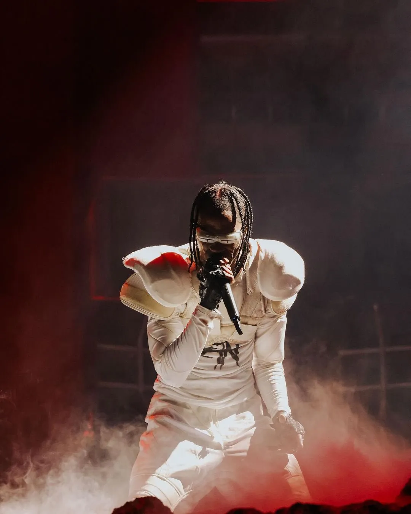
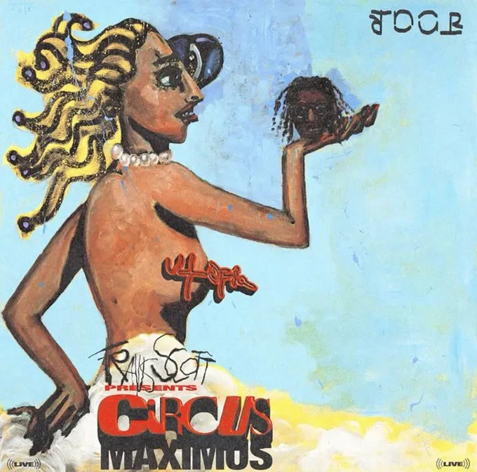

On July 21, Travis Scott's long-rumored album “Utopia” was released. The first hints have been around for a long time. But how did he build up the story around the launch? How did he make this album the most streamed album in a single day on Spotify in 2023?

There have been rumors for a long time that his new album will be called “Utopia.” But in May, things became more tangible.

The first official sighting of “Utopia” occurred on May 19, when Travis's bodyguard had a briefcase with “Utopia” on it*[handcuffed](https://twitter.com/STRAPPEDUS/status/1659319417640222720?s=20)*.

The next day, Travis showed up with another bodyguard carrying the*[briefcase](https://twitter.com/ComplexMusic/status/1659929822729060352?s=20)*.

Also, on May 20, some Travis Scott x Nike Air Jordan 1 was leaked – made exclusively for*[friends and family](https://www.instagram.com/p/CsePIAxJtS9/)*.

On May 23, Travis opened the suitcase, wearing the new*[Nike silhouette](https://www.instagram.com/p/Csj8TBbpjoM/)*.

Also, on May 23, Mike Dean, producer and audio engineer working with Travis on “Utopia,” said,*[“Utopia will be done with when Trav and I say it is done](https://twitter.com/therealmikedean/status/1661124243369742343?s=20).”*

On May 24, the new cover of “Pin-Up” was*[revealed](https://www.instagram.com/p/CsoLomgAvfJ/).*

Other artists started to show up with the briefcase. On May 24th, Dababy*[was seen with it](https://twitter.com/HipHopAllDayy/status/1661425011389759504?s=20).*

On the same day, The Weeknd’s security is seen with the “Utopia”*[briefcase](https://www.instagram.com/p/Csoe9t1I3yv/).*

Travis had the briefcase with him when visiting the*[Louis Vuitton office on May 25](https://twitter.com/dailytrvisxx/status/1661781716858548231?s=20).*

On June 5, Mike Dean, Producer and working close with Travis on “Utopia,”*[seen with a briefcase](https://www.instagram.com/p/CtF5BLpo3jc/).*

June 12, a Nike collaboration with*[John McEnroe is announced](https://twitter.com/raptalksk/status/1668314055688192011?s=20).*

June 15, Travis recreates the famous*[Abbey Road Album Cover](https://twitter.com/dondatimes/status/1669455955002572807?s=20).*

June 16, Mike Dean posts that he and Travis are working on “Utopia”*[at Abbey Road Studios](https://twitter.com/nfr_podcast/status/1669793865698517019?s=20).*

June 18, the Nike x Travis Scott x John McEnroe spot airs*[for the first time](https://twitter.com/ComplexSneakers/status/1670467112207278081).*

[Video auf YouTube](https://www.youtube.com/watch?v=aV1QQaZn6TY)

June 22, Bad Bunny is seen*[with the briefcase](https://twitter.com/ComplexMusic/status/1671983594498031616?s=20).*

June 22, Travis was seen in Iceland*[shooting the first video](https://twitter.com/RodeoTheAlbum/status/1671943916826812416?s=20).*

June 27, New Billboards with details of the briefcase appear, hinting at a*[launch date of the album on July 21](https://twitter.com/Kurrco/status/1673753175533166602?s=20).*

July 30, Travis posts himself working on “Utopia” at*[Miraval Studio](https://www.instagram.com/p/CvURLljghu1/).*

(Crazy story in itself, Miraval Studio is a legendary studio in a chalet in southern France, now*[owned by Brad Pitt](https://www.instagram.com/p/CjiVSkcLVtO/)*)

July 7, announcement that Travis will perform “Utopia” in front of the*[pyramids on July 25](https://www.instagram.com/p/CuZM41cO195/).*

July 20, the first single, “K-Pop,” featuring Bad Bunny and The Weeknd, *[is announced](https://twitter.com/Bobbalammedia/status/1681817109867945984?s=20).*

July 21, the release day of*[“K-Pop.”](https://www.youtube.com/watch?v=_kS7F4VpJa0)*

July 23, a “Utopia” trailer was played at*[Rolling Loud Miami](https://www.tiktok.com/@rollingloud/video/7258883766066695466?embed_source=121355059%2C121351166%2C121331973%2C120811592%2C120810756%3Bnull%3Bembed_pause_share&refer=embed&referer_url=www.nme.com%2Fnews%2Fmusic%2Ftravis-scott-confirms-utopia-release-date-and-accompanying-film-3472167&referer_video_id=7258883766066695466)* (which actually was a teaser for “Circus Maximus,” but that was unclear at that point).

July 25, Travis announces the release*[date of “Utopia.”](https://twitter.com/trvisXX/status/1683868541160923137?s=20)*

July 25, Travis announces a movie called*[“Circus Maximus,” launching on July 27](https://twitter.com/trvisXX/status/1683868352773783552?s=20).*

July 27, Drake leaves the briefcase*[in a club](https://twitter.com/nfr_podcast/status/1684594596205002754?s=20).*

July 28, Official Release Date of*[“Utopia.”](https://twitter.com/trvisXX/status/1684731239951900672?s=20)*

July 28, Travis shows up in a cinema running his*[movie “Circus Maximus.”](https://twitter.com/PortalTravisBRA/status/1684763610222850050?s=20)*

July 28, the concert in front of the pyramids*[is canceled](https://twitter.com/kzk_101/status/1684743475240034305?s=20).*

July 29, “Utopia” is the most streamed album in a*[single day of 2023 on Spotify](https://twitter.com/RapCaviar/status/1685380211364311040?s=20)* (all 19 tracks hold the first 19 spots!).

July 30, a lot of merchandise is available*[on his site](https://twitter.com/HYPEBEAST/status/1685841630581153792?s=20).*

August 1, the first “Utopia” concert is announced. On June 7 in Rome, at*[Circus Maximus](https://www.instagram.com/p/CvaWejPJhij/).*

August 5, a new colorway of his new*[Nike silhouette is leaked](https://www.instagram.com/p/CviErfCJzog/?img_index=2).*

August 7, “Utopia” is #1 on the*[Billboard charts](https://twitter.com/nfr_podcast/status/1688652975030284288?s=20).*

August 7, Concert at Circus Maximus*[in Rome](https://twitter.com/XXL/status/1688649406659072000?s=20).*

August 7, LiveStream of the concert for*[15$ on his site](https://twitter.com/trvisXX/status/1688562061599559680?s=20).*

August 7, 9.30pm, Travis*[hits the stage in Circus Maximus](https://twitter.com/laflamescott/status/1688663629996933120?s=43&t=l33XlmhygaQc6s5XlzFBzg).* And 60.000 people distribute the content to millions of people.

Just one impression*[from the concert](https://twitter.com/LaflameScott/status/1688650531055476736?s=20).*

[Video auf YouTube](https://www.youtube.com/watch?v=t_PsABsmkdk)

August 7, minutes after the concert closed, the movie “Circus Maximus” launched [on](https://music.apple.com/de/playlist/travis-scotts-circus-maximus/pl.19270afb6a12492b94f47c818c14973b) *[Apple Music](https://music.apple.com/de/playlist/travis-scotts-circus-maximus/pl.19270afb6a12492b94f47c818c14973b).*

[Video auf YouTube](https://www.youtube.com/watch?v=KvLg2LAg5kQ)

August 8, Utopia had*[331 Mio streams](https://allhiphop.com/news/travis-scotts-utopia-opens-at-no-1-with-nearly-500k-first-week-units/)* in the first week and sold*[79.000 Vinyls](https://www.nytimes.com/2023/08/08/arts/music/travis-scott-utopia-billboard-chart.html)* (which is the highest number of Vinyls ever sold in a week since data was captured in 1991).

August 8, the “Utopia” World tour was announced. Ticket sales [start August 9](https://twitter.com/TraviscoxtDaily/status/1688923094147371008?s=20)!

I think this is what you call a successful product launch. I will keep an eye on what he will do in the future.

This is a successful product launch. It is a great case study on how to build and market a product in 2023. You need a great product at the core – if your product sucks, nobody cares.

**But Travis and his team played it great. They fully own the story. They create content that is shared millions of times. They make occasions where fans create the content and take care of the distribution (e.g. concerts). All of it channels the leads into their funnel: to stream or download the album, to watch the movie, to sell merchandise or tickets.**

**I guess 95% of the story is told through their owned media channels, without any media budget spent (maybe a few % for the billboards or similar ads). All built on a product and a great story told.**

Let me know your thoughts and if you are interested in articles like this one. I could go even further just with Travis's story.

Or ask my son, *[Junus Alker](https://www.linkedin.com/in/junus-a-95469a226/)*, the real Travis Scott expert.

Oh, and by the way, you can buy the briefcase (and a lot of other merchandise)*[on his site](https://shop.travisscott.com/products/utopia-briefcase).*
