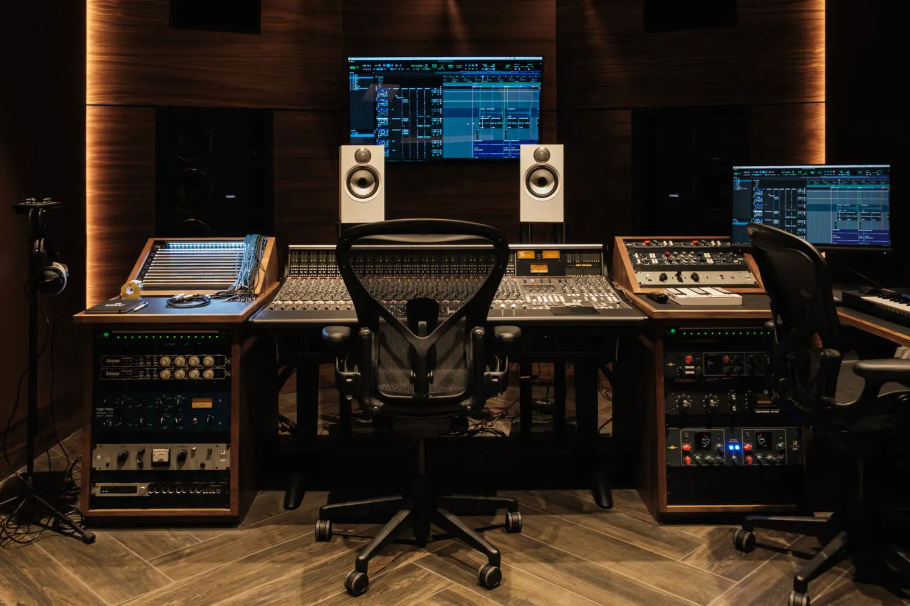
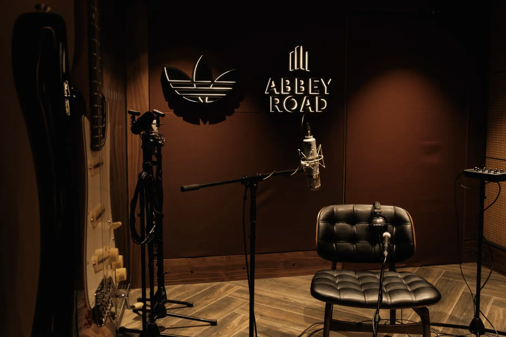
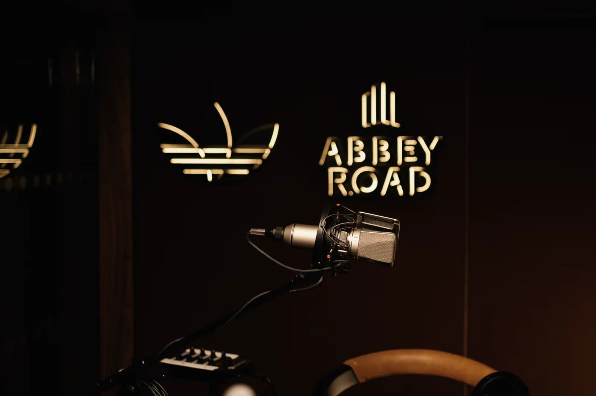
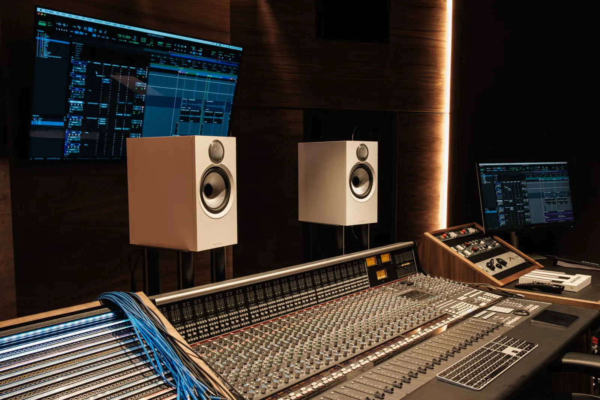

Why this matters (beyond sneaker culture):

- Platform > Campaign. Instead of another “drop”, adidas is investing in infrastructure that will be used long after the headlines fade. Think of it as owned media you can actually record in.
- Community as a real advantage. The studio launches alongside Abbey Road’s diversity‑focused Amplify & Equalise programmes—giving local creators mentorship, resources and a stage. That’s genuine value creation, not borrowed interest.
- Experience‑led brand building. Housing the studio inside Co‑op Live ties it to a constant flow of gigs, fans and cultural moments, turning every show night into a potential brand touchpoint.

Strategic take‑aways:

1. Extend the product. Your brand equity lives in the experiences you enable, not just the items you sell.
2. Co‑create IP. Partnerships that combine cultural heritage (sneakers + music) create new storytelling surface area neither party could own alone.
3. Invest where your audience is headed. Emerging artists value access over assets; a free, world-class studio beats another billboard.

The studio opens to emerging artists this August – a great example of how adidas is building meaningful connections with music culture in an authentic and lasting way. A smart move that doesn’t scream for attention, but earns it over time.
