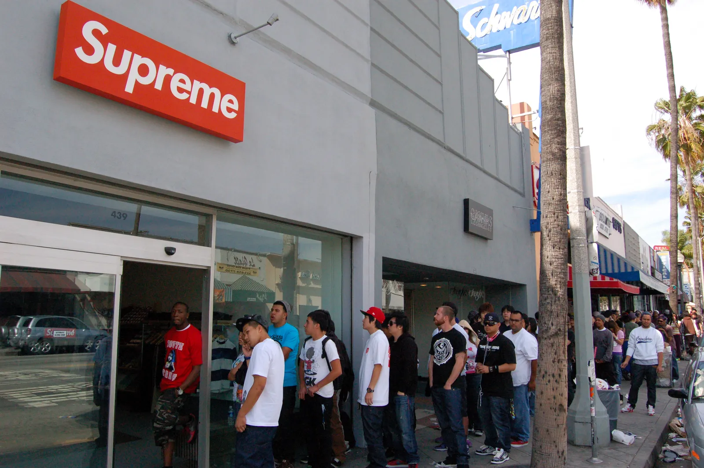
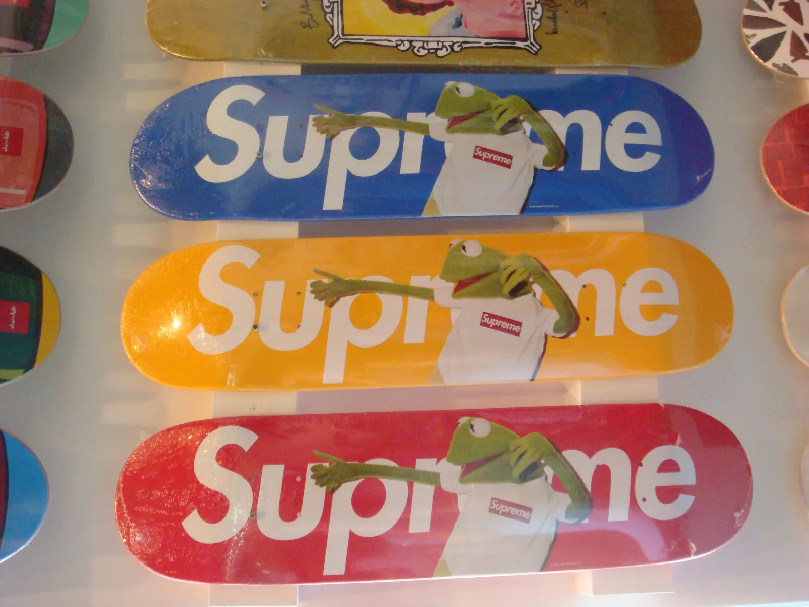
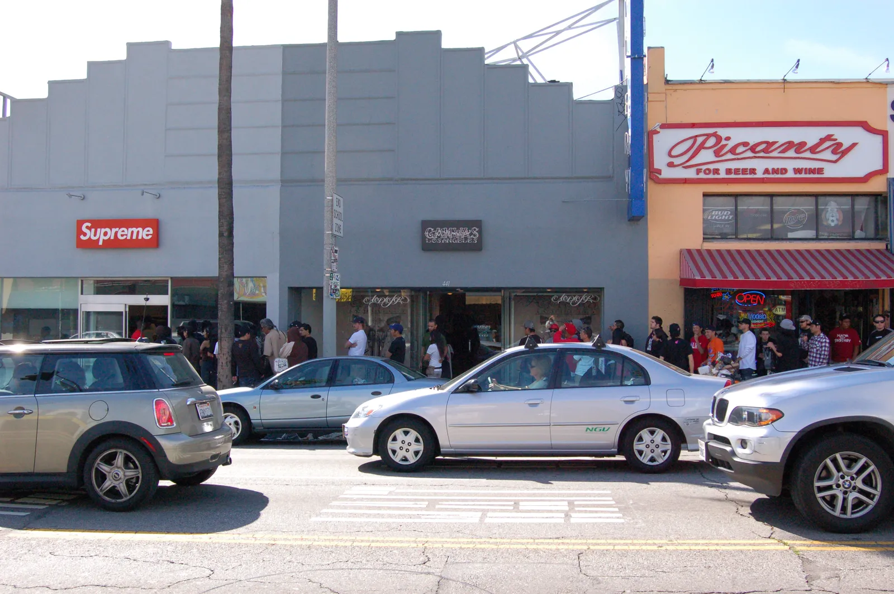
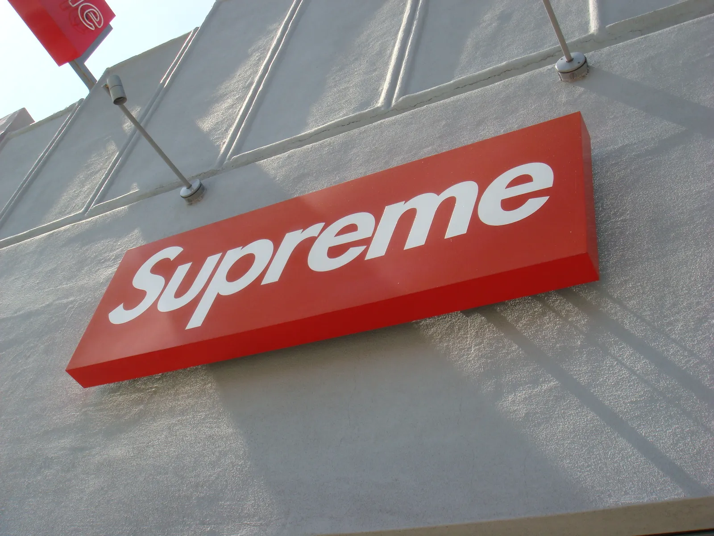

The first time I walked into Supreme was in New York in 1998. A small store on Lafayette Street, a few skate decks on the wall, clothes they made themselves. I liked it. To me it was a good skate brand, and not much more than that.

Ten years later I was in Los Angeles for a Dickies book project with Brian Cross. On March 6, 2008, I went to the Supreme store on Fairfax, and there was a line down the block. The spring collection dropped that day, and what people were waiting for was Kermit the Frog. Kermit in a small white box logo tee, printed on T-shirts in five colours and on skate decks, plus a tiny Kermit figure made by Medicom in Japan. The same photo was on posters all over town.

My first reaction was: what is this? A skate brand from New York and a puppet from children's television. Who needs that?

At Dickies we were doing collaborations ourselves back then, with Michael Kopelman, Alife and Jeff Staple. They followed a logic I understood: two brands with a shared audience and a product that made sense for both. Kermit didn't fit that logic at all.

It's easy to forget how different things were in 2008. Collaborations were still rare enough that people talked about each one. Brands didn't team up with every other brand, and a new pairing could still surprise you.

I still thought it was cool, and I took photos of the posters.

Later I read how it had started. In February the posters had appeared on walls in Soho, wheatpasted, with no explanation. Hypebeast wasn't sure whether it was a real collaboration or "just the work of somebody with too much time on their hands." Supreme had photographed the actual puppet, and for the shoot they had a box logo tee made in Kermit's size.

Standing in that line, I started to understand how much of Supreme was about the story. They had taken the friendliest face on television, put it into their own world, and it still felt completely like Supreme. The photo on the posters was the same photo on the shirts, so the campaign and the product were one thing.

Until then I had thought of Supreme as a skate brand with good product. After Kermit I paid attention to how they stage the brand, and how often they do it with partners nobody else would have put next to them. For me it's still the mother of all collabs.

Today there are more collaborations than anyone can follow. Last October, Palace x Nike, Wales Bonner x Adidas and H&M x Glenn Martens all came out in the same week, and Puck wrote about collab fatigue. A lot of these partnerships look like a trade, where one side brings reach and the other brings credibility.

What made Kermit work in 2008 would have been hard to put in a brief. It came as a surprise, and it said something about the people behind Supreme and what they found funny.

I didn't get one of the shirts that day. By the time I made it into the store, everything was sold out. At least I got a sticker.
