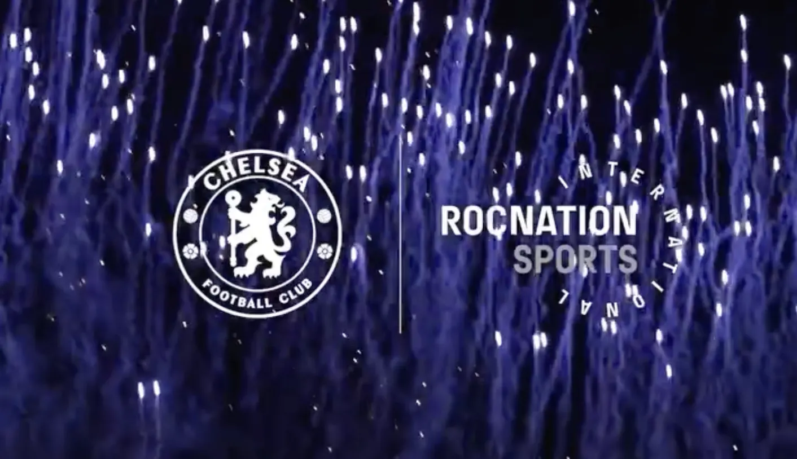
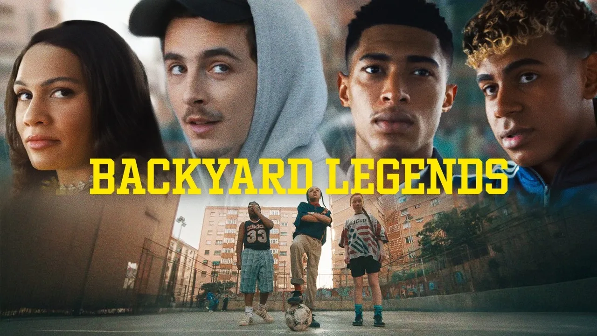
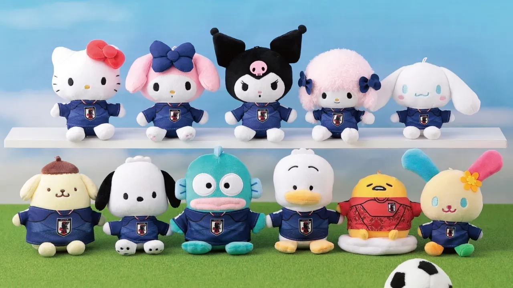
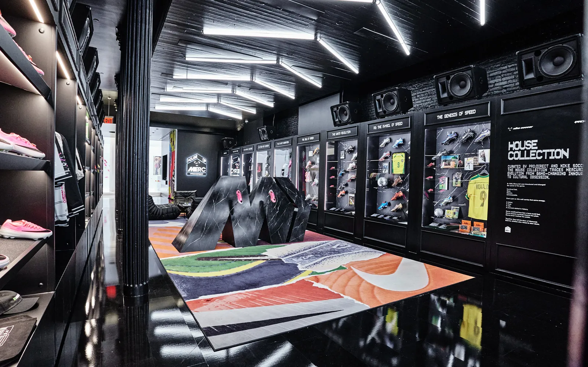

Chelsea signed a partnership with Roc Nation, Jay-Z’s entertainment company, to grow the club in the United States. The first visible piece was the 2026/27 kit launch, run more like a music release than a normal reveal: celebrity teasers in the run-up, and a one-off shirt co-branded with Roc Nation and signed by DJ Khaled.

The timing isn’t an accident. The World Cup is in the US this summer, and Chelsea wants more American attention before it arrives.

The deal itself is fairly simple. Chelsea wants more American fans, and Roc Nation is good at reaching them, so the club is leaning on a music and culture company to do the part it isn’t built for.

The interesting bit is the method. For years a club grew abroad by winning, getting on TV in more markets, and selling shirts off the back of it. That still works at home. In the US, a lot of sports attention runs through music, celebrity and social feeds, and that’s the room Roc Nation works in. The DJ Khaled shirt and the celebrity teasers are Chelsea borrowing those tools.

It’s easy to overstate this, so I won’t. Chelsea is still a football club. It’s renting some cultural reach for one market at one moment, with the World Cup about to put American eyes on the game. A few other clubs are circling the same idea.

The part to watch is whether it feels real or bolted on. Borrowed culture can land, or it can read as a logo dropped onto someone else’s moment.

## ALSO ON MY RADAR

Five more moves this week:

- adidas and Nike both dropped their World Cup films this week. adidas, which paid to be the official sponsor, answered with a polished, star-packed film *[(”Backyard Legends”)](https://www.youtube.com/watch?v=mJJY53qhJe0)*. Nike, on only 12 of the 48 teams and not a tournament sponsor, *[ran a looser campaign](https://www.youtube.com/watch?v=IyZ1WIua_1s)* and drew more of the conversation. The brand paying least for official status is getting the most talked about.

- Japan put *[Hello Kitty](https://essential-japan.com/news/sanrio-reveals-new-japan-world-cup-collab-merch-collection-ahead-of-release/)* on a World Cup collection, with a pop-up running 12 to 25 June. Character licensing is a steady money line in football, and Japan does it better than most.

- Just Women’s Sports *[raised a fresh round](https://www.insideworldfootball.com/2026/05/31/jws-raises-new-money-to-expands-its-womens-sports-media-platform)* led by David Blitzer’s family office. Money’s moving into women’s sports media while the audience is still being priced in, which is usually the calmer time to move.
- Salesforce became an *[Official Tournament Supporter](https://www.salesforce.com/news/press-releases/2026/06/05/salesforce-transforms-fifa-world-cup-engagement-and-operations/)* of the men’s 2026 and women’s 2027 World Cups, putting its AI tools and Slack behind tournament operations across the host cities and part of fan engagement. Worth noticing who runs the back-end of a World Cup now: the same enterprise software that runs big corporations.
- Pro:Direct and Nike turned 21 Mercer Street, the old NikeLab in New York, into *[House of Merc](https://www.soccerbible.com/news/2026/06/inside-house-of-merc-prodirects-world-cup-pop-up/)*, a football space built around the Mercurial line with two months of product drops and community events through the World Cup. It’s a store used as a campaign that runs all summer, not a one-week stunt.

That’s it for today.
